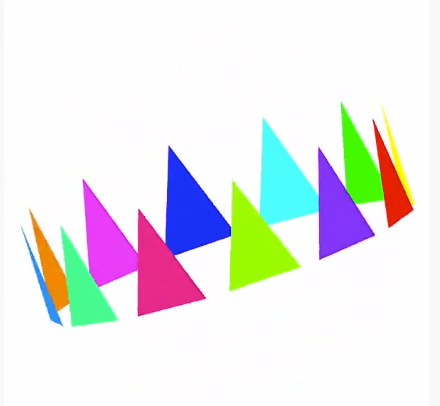
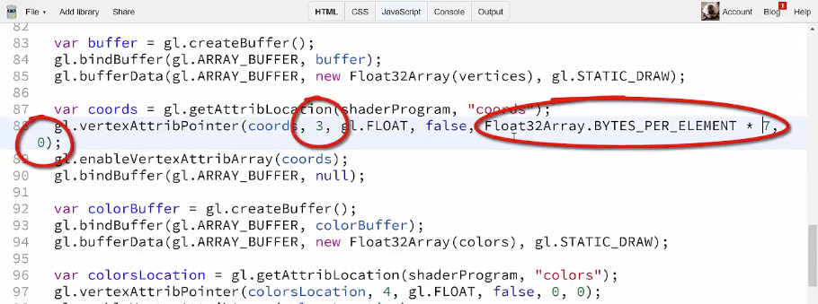

We've seen how to pass an array of `vertices` to the `vertex` shader, and how to pass another array of `colors` in a way that each color is assigned to a single `vertex`, and then interpolated across the surface by the fragment shader. But the way we've been doing it is very precarious. We have two completely separate arrays holding two different sets of data, and we're relying on them to match up based on the relative positions of each element.

```javascript
function createVertices() {
    vertices = [];
    var colors = [];
    for(var i = 0; i < vertexCount; i++) {
        vertices.push(Math.random() * 2 - 1);
        vertices.push(Math.random() * 2 - 1);
        vertices.push(Math.random() * 2 - 1);
        colors.push(Math.random());
        colors.push(Math.random());
        colors.push(Math.random());
        colors.push(1);
    }

    ...
}
```

It's fine now because we're using completely random positions and random `colors`, so if something went wrong we probably wouldn't even notice it. But let's look at what happens when we have something more exact. I've removed all the code that makes the random `vertices` and `colors`, and I've been setting up the project with a new set of predefined `vertices`, and I'll change the `vertexCount` to 36, because that's how many points are in this dataset.

```javascript
var gl, 
    shaderProgram,
    vertices,
    matrix = mat4.create(),
    vertexCount = 36;
```

I'm also going to comment out the lines that set the `vertex` `colors`. 

```javascript
//  var colorBuffer = gl.createBuffer();
//  gl.bindBuffer(gl.ARRAY_BUFFER, colorBuffer);
//  gl.bufferData(gl.ARRAY_BUFFER, new Float32Array(colors), gl.STATIC_DRAW);
//  
//  var colorsLocation = gl.getAttribLocation(shaderProgram, "colors");
//  gl.vertexAttribPointer(colorsLocation, 4, gl.FLOAT, false, 0, 0);
//  gl.enableVertexAttribArray(colorsLocation);
//  gl.bindBuffer(gl.ARRAY_BUFFER, null);
```

Our drawing mode is triangles, so let's see what this gives us. We have a ring of triangles going around in a circle, kind of like a crown. Because we removed the color data, they're all black right now. Now I'll paste in a `colors` array here. You should notice that the `vertices` are grouped in sets of three to create those individual triangles, and the `colors` are also grouped in three, with each group having the same color.

```javascript
vertices = [
    0.88, -0.25, -0.18,
    0.9, 0.25, 0,
    0.88, -0.25, 0.18,

    0.85, -0.25, 0.29,
    0.78, 0.25, 0.45,
    0.67, -0.25, 0.6,

    ...  
];

var colors = [
    1, 0, 0, 1,
    1, 0, 0, 1,
    1, 0, 0, 1,

    1, 1, 0, 1,
    1, 1, 0, 1,
    1, 1, 0, 1,

    ...
];
```

Thus each triangle will have all three of its `vertices` colored the same. 
I'm going to uncomment out the lines that set the `vertex` `colors`.

```javascript
var colorBuffer = gl.createBuffer();
gl.bindBuffer(gl.ARRAY_BUFFER, colorBuffer);
gl.bufferData(gl.ARRAY_BUFFER, new Float32Array(colors), gl.STATIC_DRAW);
  
var colorsLocation = gl.getAttribLocation(shaderProgram, "colors");
gl.vertexAttribPointer(colorsLocation, 4, gl.FLOAT, false, 0, 0);
gl.enableVertexAttribArray(colorsLocation);
gl.bindBuffer(gl.ARRAY_BUFFER, null);
```

We run that, and yep, that's what we get. 



So hopefully you can see how non-optimum this setup is. If I add a triangle, or remove one, or want to change the color at a specific `vertex`, I'm jumping back and forth between two arrays, trying to keep them in sync, and I can't even see both arrays on one screen without a lot of scrolling. One mistake and it all breaks, and it's really hard to see where the error is.

Add to this the fact that we'll eventually be adding additional per-`vertex` data for lighting and textures, now you have four sets of data to try to keep in sync. Ideally, all the data for a single `vertex` could be grouped together, so let me get rid of this mess and paste in a new `vertices` array.

```javascript
function createVertices() {
  vertices = [
    0.88, -0.25, -0.18,     1, 0, 0, 1,
    0.9, 0.25, 0,           1, 0, 0, 1,
    0.88, -0.25, 0.18,      1, 0, 0, 1,

    0.85, -0.25, 0.29,      1, 1, 0, 1,
    0.78, 0.25, 0.45,       1, 1, 0, 1,
    0.67, -0.25, 0.6,       1, 1, 0, 1,

    ...
```

Now this looks better already, you see that we have groups of three `vertices`, each with three coordinate values, and four color values, all right in a row. If I were to add a triangle without adding in a color, for example, it would stick out like a sore thumb.

If I wanted to change a color on a specific `vertex` of a specific triangle, I know exactly where that color is defined. When we go to add in additional information, it can all be put right in the same place. But, now we need a way to use a single array of data to feed two different attributes. Fortunately, **WebGL** has us covered. Remember back when we first looked at the `gl.getAttriPointer` method, and we just left those last two parameters as `0`? Well, those are the key.

```javascript
var coords = gl.getAttribLocation(shaderProgram, "coords");
gl.vertexAttribPointer(coords, 3, gl.FLOAT, false, 0, 0);
gl.enableVertexAttribArray(coords);
gl.bindBuffer(gl.ARRAY_BUFFER, null);
```

Those parameters let us slice up the data and take out just the chunks we need for each buffer. The fifth parameter is called `stride`, and the sixth is `offset`. The `stride` parameter lets WebGL know how many pieces of data to skip over to get to the beginning of a new set of data, in other words, the size of each row. Here we have three values for position, and four for color, so we're going to need to tell it to stride over seven elements. The `offset` says within those seven elements, start getting your data at this point.

The position data is at the start of each row, so that'll be 0 for position. Now actually seven is not going to work here, this method does not want an integer, it wants a number of bytes to skip over, so we need to know how many bites are in each element of a **float32** array. We're lucky because a float32 array has a property telling us just that. Here we can say `Float32Array.BYTES_PER_ELEMENT * 7`. So to recap webgl grabs seven elements out of the buffer, skip zero, and take the next three for the first position.



It will then take the next seven elements and do the same for all the elements in the buffer. That works. Now we need to do the same thing for `colors`. We can actually get rid of this code that creates the `colorBuffer` because we no longer need a separate buffer, all of our data is in a single buffer. We'll have to make sure that we don't unbind it here though.

```javascript
var coords = gl.getAttribLocation(shaderProgram, "coords");
gl.vertexAttribPointer(coords, 3, gl.FLOAT, false, 0, 0);
gl.enableVertexAttribArray(coords);
// vvv REMOVED vvv
gl.bindBuffer(gl.ARRAY_BUFFER, null);

var colorBuffer = gl.createBuffer();
gl.bindBuffer(gl.ARRAY_BUFFER, colorBuffer);
gl.bufferData(gl.ARRAY_BUFFER, new Float32Array(colors), gl.STATIC_DRAW);
// ^^^ REMOVED ^^^
```

For this one, we're still going to take seven elements, but we want to skip the first three coordinate values to get to the color data, so we pass in `Float32Array.BYTES_PER_ELEMENT * 3`, and we take the next four elements in the list which is our red, green, blue, and alpha data, all good. 

```javascript
colorsLocation = gl.getAttribLocation(shaderProgram, "colors");
gl.vertexAttribPointer(colorsLocation, 4, g.FLOAT, false,
Float32Array.BYTES_PER_ELEMENT * 7, Float32Array.BYTES_PER_ELEMENT * 3);
gl.enableVertexAttribArray(colorLocation);
gl.bindBuffer(gl.ARRAY_BUFFER, null);
```

Run it, and yes we still have our colored triangles just where we left them. 


Now I can manipulate this data much easier. Say I wanted to give this triangle here a yellow top, I just go to the middle point and change that color to yellow.

Run it again, and sure enough, the blue triangle has a yellow top. If wanted to remove one of these triangles, I just cut out the whole three rows that define it and change the `vertexCount`. No need to worry about synching multiple arrays, and it's gone. We could actually make that `vertexCount`dynamic as well, which would make things even easier.