I'm going back to the example where we created a multicolored cube with Draw elements. I'm going to simplify this a bit, here.

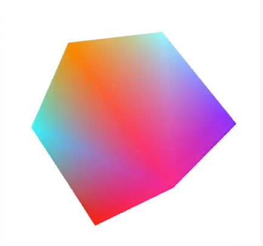

In `createVertices()`, I'm going to remove all the color data, so we're just passing in the vertices, 

```javascript
vertices = [
    -1, -1, -1, //0
     1, -1, -1, //1
    -1,  1, -1, //2
     1,  1, -1, //3
    -1,  1,  1, //4
     1,  1,  1, //5
    -1, -1,  1, //6
     1, -1,  1  //7
]
```

and this code that deals with color and the `pointSize` stuff, too. 

```javascript
// vvv REMOVED vvv
colorsLocation = gl.getAttribLocation(shaderProgram, "colors");
gl.vertexAttribPointer(colorsLocation, 4, g.FLOAT, false,
Float32Array.BYTES_PER_ELEMENT * 7, Float32Array.BYTES_PER_ELEMENT * 3);

gl.enableVertexAttribArray(colorLocation);
gl.bindBuffer(gl.ARRAY_BUFFER, null);

var pointSize = gl.getAttribLocation(shaderProgram, "pointSize");
gl.vertexAttrib1f(pointSize, 20);
// ^^^ REMOVED ^^^ 
```

This makes `vertexCount = vertices.length / 3;`, because there are only three elements per vertex. This also means we can get rid of this `stride` value.

```javascript
var coords = gl.getAttribLocation(shaderProgram, "coords");
gl.vertexAttribPointer(coords, 3, gl.FLOAT, false, 0);
```

Let's clean up the shaders, too. We're not using `pointSize` or `varyingColors` right now, so I'll get rid of some of that. We'll use `varyingColors` later, though, so I'll leave that one in there. I'll set the `gl_FragColor` to a hard-coded value of a `vec4` that creates a yellow color.

```html
<script id="shader-vs" type="x-shader/x-vertex">
attribute vec4 coords;
uniform mat4 transformMatrix; 
varying vec4 varyingColors;
uniform mat4 perspectiveMatrix;
void main(void) {
    gl_Position = perspectiveMatrix * transformMatrix * coords;
}
</script>

<script id="shader-fs" type="x-shader/x-fragment">
precision mediump float;
varying vec4 varyingColors;
void main(void) {
    gl_FragColor = vec4(1, 1, 0, 1);
}
</script>
```

Back in the code, I'll also change the `gl.clearColor` to black, because this is going to look better on a black background. This gives us a single-colored cube.

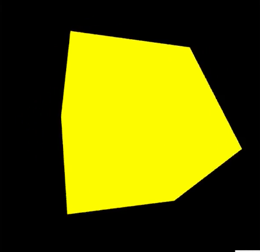

Because all of the sides of the cube is the same color, a lot of the 3D effect is lost, but in the real world, there are objects that are all the same color and yet still appear in 3D. This is because the different angles of lighting hitting different angled surfaces shade them differently.

There are different types of lighting in WebGL. **Directional Lighting** represents a simple light source coming from a particular direction, such as the sun. It's considered to be infinitely far away, and its rays are parallel.

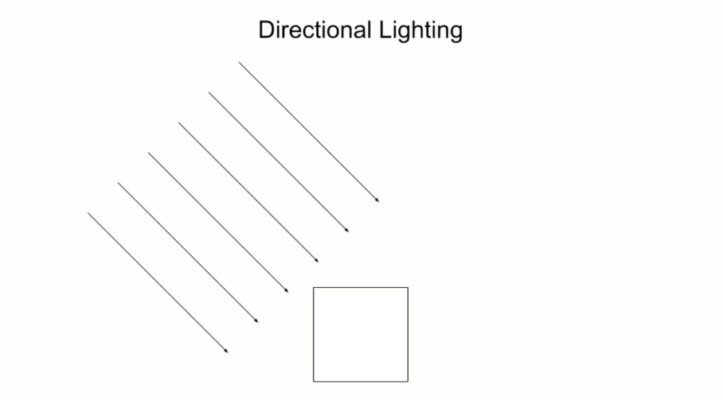

**Point Lighting** is more like a light bulb. It has a specific location in space, and the angles of the rays will be different for each object, depending on the object's location in relation to the light.


Finally, there's **Ambient Lighting**. This is light that is reflected off all the surfaces in a space, and accounts for the fact that even things in shadows are not completely dark.

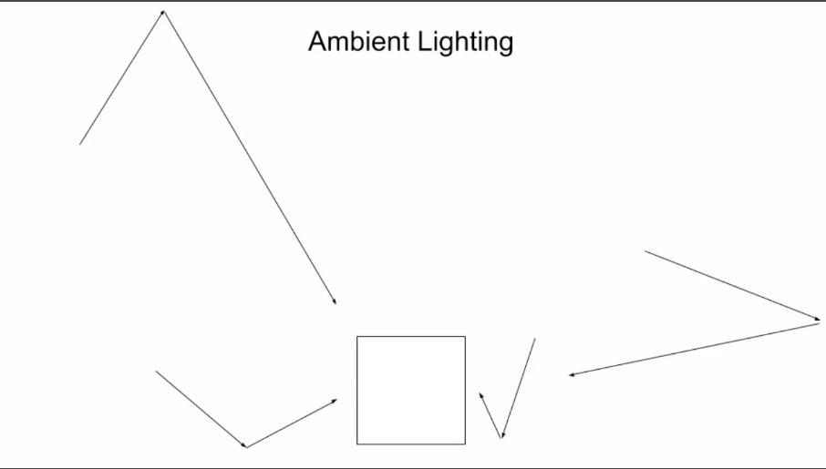

In this lesson, we'll just use directional lighting. Obviously, a surface will get more or less light depending on its angle to the light source. A surface directly in line with the light source will be fully lit. 

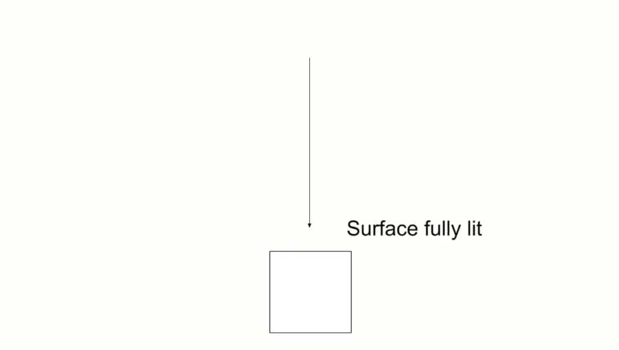

Surfaces at varying angles to the light source will be more or less lit, depending on their angle, 

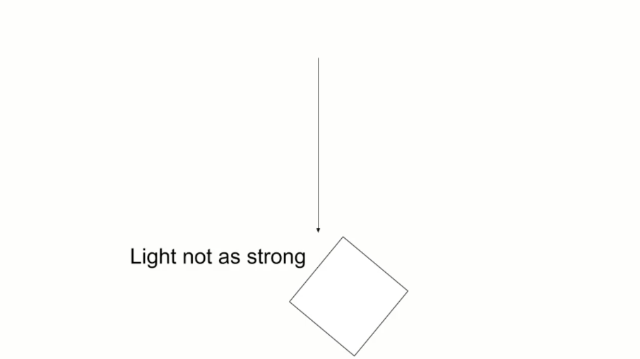

and surfaces facing away from the light source will be in darkness.

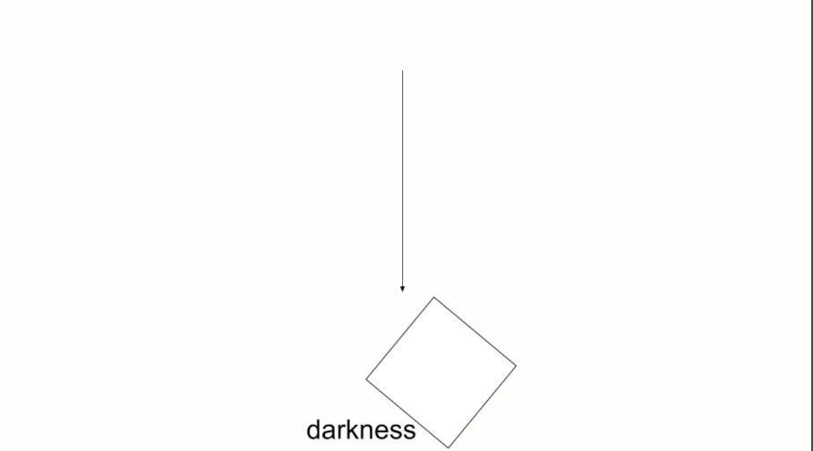

We need a way to know which way surfaces are facing. We do this with something called **Normals**. A normal is a 3D vector that points directly away from a particular surface of an object, so for a tabletop or floor, the normal would be pointing straight up. For a wall, it would be pointing straight out from the wall, and a ceiling's normal would be pointing straight down.

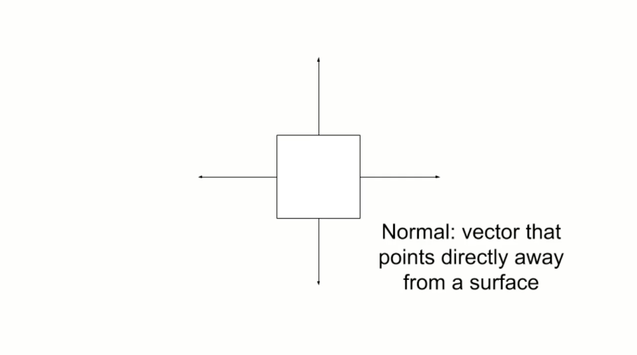

What we do is provide a normal for each vertex. That normal would be a set of three xyz values that indicate the direction of that normal.

In `createVertices()`, I'll add an array called `normals`. This is going to hold four sets of xyz values for each surface. Let me explain it visually.


Here we have our cube. Imagine we're looking at this cube head on. The normals of the first four vertices will be pointing straight at us, so they'll have a positive z value, zero for x and y.

The next four vertices are the top surface, so its normals point straight up. Positive y, zero for x and z. We just go all the way around like that.

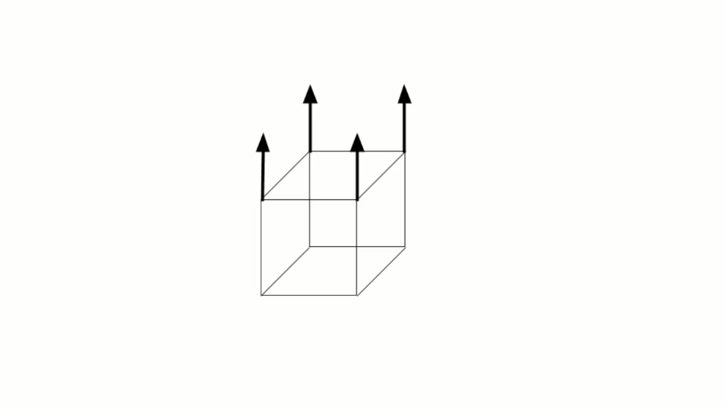

Back in our code, we add our first four normals as x, y, z points. Each will be `0, 0, 1` That's our first two triangles. 

```javascript
var normals = [
    0, 0, 1,    0, 0, 1,    0, 0, 1,    0, 0, 1,
];
```

As we just saw, the next four normals have a positive y normal. 

```javascript
var normals = [
    0, 0, 1,    0, 0, 1,    0, 0, 1,    0, 0, 1,
    0, 1, 0,    0, 1, 0,    0, 1, 0,    0, 1, 0,
];
```

The next set would be facing away from us, so they have a negative z, and the bottom face will have normals of a negative y.

```javascript
var normals = [
    0,  0,  1,    0,  0,  1,    0,  0,  1,    0,  0,  1,
    0,  1,  0,    0,  1,  0,    0,  1,  0,    0,  1,  0,
    0,  0, -1,    0,  0, -1,    0,  0, -1,    0,  0, -1,
    0, -1,  0,    0, -1,  0,    0, -1,  0,    0, -1,  0,
];
```

The way the drawing indices is set up, the next two faces are on the left-hand side, so their `normals` will be negative x. The final two triangles would be on the right side with a positive x.

```javascript
var normals = [
     0,  0,  1,     0,  0,  1,     0,  0,  1,     0,  0,  1,
     0,  1,  0,     0,  1,  0,     0,  1,  0,     0,  1,  0,
     0,  0, -1,     0,  0, -1,     0,  0, -1,     0,  0, -1,
     0, -1,  0,     0, -1,  0,     0, -1,  0,     0, -1,  0,
    -1,  0,  0,    -1,  0,  0,    -1,  0,  0,    -1,  0,  0,
     1,  0,  0,     1,  0,  0,     1,  0,  0,     1,  0,  0
];
```

We need to pass these `normals` over to the vertex shader, so we'll need to create a buffer and all that. I'll copy over the `coords` code, change `buffer` to `normalBuffer`, bind the buffer, put the data into it, and get an attribute location for normal. We'll create that attribute later.


```javascript
var normalBuffer = gl.createBuffer();
gl.bindBuffer(gl.ARRAY_BUFFER, normalBuffer);
gl.bufferData(gl.ARRAY_BUFFER, new Float32Array(normals), gl.STATIC_DRAW);
```

We'll use `gl.vertexAttribPointer` to pass the buffer to that attribute and enable it. Note that we do have to do this as a separate buffer. We can't interleave the data like we did with the colors. That's because we're reusing the vertices. Each time they're used, they may have a different normal.

```javascript
var normalLocation = gl.getAttribLocation(shaderProgram, "normal");
gl.vertexAttribPointer(normalLocation, 3, gl.FLOAT, false, 0, 0);
gl.enableVertexAttribArray(normalLocation);
```

For example, vertex number two, which is the top left front corner, is used to create a front-facing triangle, a top-facing triangle, and a left-facing triangle. Each time, it has a different normal, so we need to have the normals in a separate buffer.

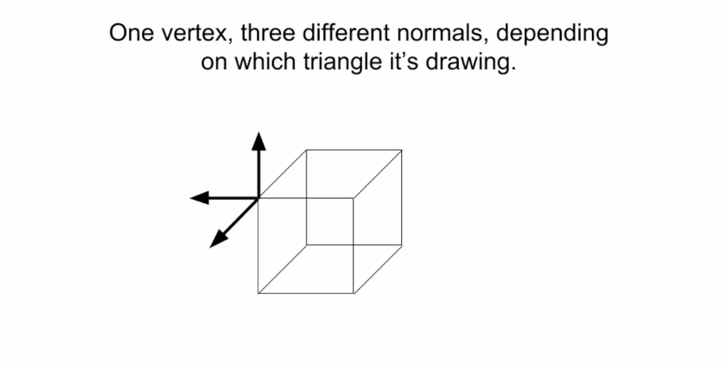

Now we need a light source. As a directional light source, we just need a vector to use for the directional light and one to use as its color. These will both be `vec3`. We usually use `vec4` for color, but in the case of a light source, the alpha channel doesn't make much sense, so we can use a `vec3`.

```javascript
var lightColor = gl.getUniformLocation(shaderProgram, "lightColor");
```

We'll get the uniform location for a `lightColor`, which we'll also create shortly, and pass in values `1, 1, 1` for a white light. For direction, we'll get the uniform location for a `lightDirection`, and pass in some values for that.

```javascript
var lightColor = gl.getUniformLocation(shaderProgram, "lightColor");
gl.uniform3f(lightColor, 1, 1, 1);

var lightDirection = gl.getUniformLocation(shaderProgram, "lightDirection");
gl.uniform3f(lightDirection, 0.5, 1, 0);
```

At this stage, it's not super important what values go in there. Different numbers will just light the cube differently. Before we move on, let's clean up by unbinding that `normalBuffer`.

```javascript
var normalLocation = gl.getAttribLocation(shaderProgram, "normal");
gl.vertexAttribPointer(normalLocation, 3, gl.FLOAT, false, 0, 0);
gl.enableVertexAttribArray(normalLocation);
gl.bindBuffer(gl.ARRAY_BUFFER, null);
```

We're passing in our normal data and our light source data. Time to jump over to the shaders. I'll create an `attribute vec3` for the normals, a `uniform vec3` for the `lightColor`, and one for the direction. Now comes the tricky stuff.

```html
<script id="shader-vs" type="x-shader/x-vertex">
attribute vec4 coords;
uniform mat4 transformMatrix;
attribute vec3 normal;
uniform vec3 lightColor;
uniform vec3 lightDirection; 
varying vec4 varyingColors;
uniform mat4 perspectiveMatrix;
void main(void) {
    gl_Position = perspectiveMatrix * transformMatrix * coords;
}
</script>
```

First, we want to `normalize` the `normal`, which ensures that it has an overall `length` of one. Actually, the way we've set things up here, all of the normals will have a `length` of one, but once we start making more complex shapes with surfaces that point in different directions, this will be more important.

```html
<script id="shader-vs" type="x-shader/x-vertex">
attribute vec4 coords;
uniform mat4 transformMatrix;
attribute vec3 normal;
uniform vec3 lightColor;
uniform vec3 lightDirection; 
varying vec4 varyingColors;
uniform mat4 perspectiveMatrix;
void main(void) {
    vec3 norm = normalize(normal);
    vec3 ld = normalize(lightDirection);
    gl_Position = perspectiveMatrix * transformMatrix * coords;
}
</script>
```

We also want to `normalize` the `lightDirection`, then we want to get the `dotProduct` of the `lightDirection` and the current `normal`. We don't have time to dive in deeply to what a `dotProduct` is, but basically, it's the relationship between two vectors that represents how they are oriented to each other.

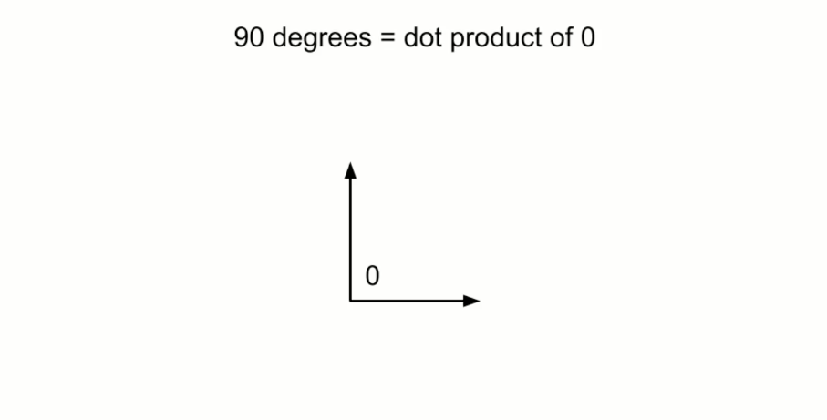

If two vectors are at 90 degrees to each other, the dot product will be `0`. It will increase as that angle goes less than 90, and will go negative as the angle is greater than 90.

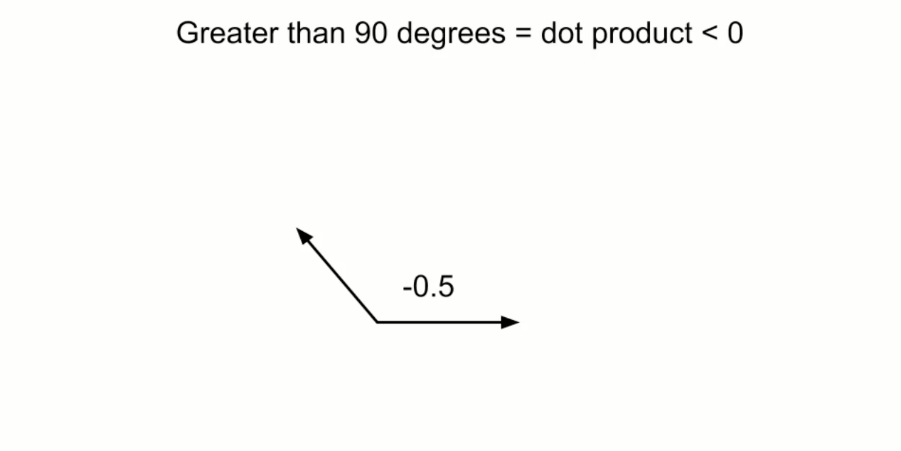

You can see that the dot product would be at its maximum when the normal and the light direction are the same angle. 

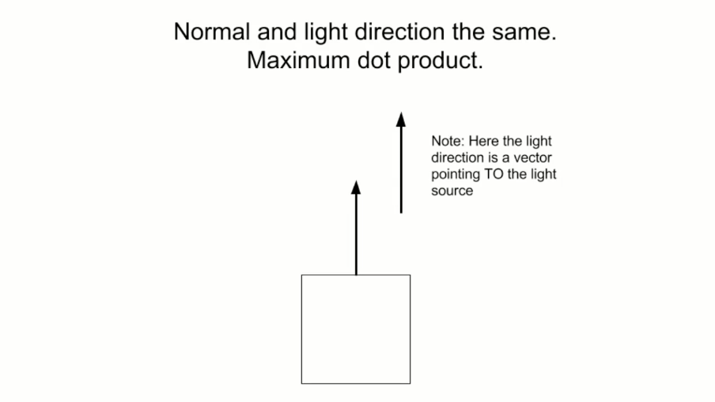

When the normal is 90 degrees from the light, no light will hit it, 

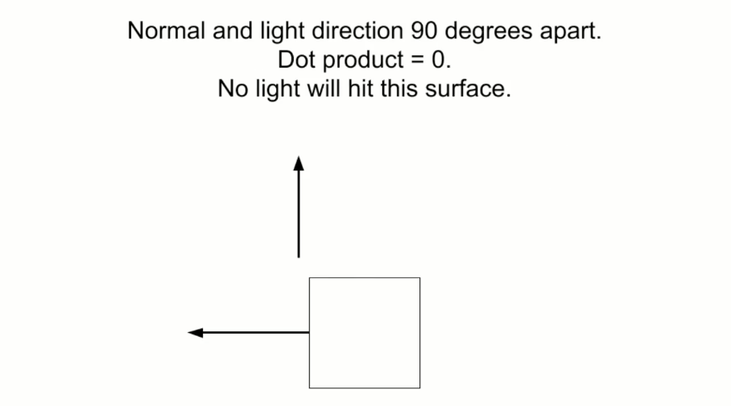

and the same if it's more than 90 degrees.


We don't really want a negative light factor, so we take the maximum of that `dotProduct` and `0`. We wind up with `max(dot(norm, ld), 0.0); `. We can use that `lightColor`, the material color, and the `dotProduct` to calculate an overall color for this vertex. It'll be light color, times a hard-coded `vec3` for yellow, times the `dotProduct`.

```html
<script id="shader-vs" type="x-shader/x-vertex">
attribute vec4 coords;
uniform mat4 transformMatrix;
attribute vec3 normal;
uniform vec3 lightColor;
uniform vec3 lightDirection; 
varying vec4 varyingColors;
uniform mat4 perspectiveMatrix;
void main(void) {
    vec3 norm = normalize(normal);
    vec3 ld = normalize(lightDirection);
    float dotProduct = max(dot(norm, ld), 0.0);
    vec3 vertexColor = lightColor * vec3(1, 1, 0) * dotProduct;
    varyingColors = vec4(vertexColor, 1);
    gl_Position = perspectiveMatrix * transformMatrix * coords;
}
</script>
```

Finally, we can transform this `vec3` into a `vec4`, and assign it to `varyingColors`. Then, in the fragment shader, all we need to do is assign `varyingColors` to `gl.FragColor`, and we're done! 

```html
<script id="shader-fs" type="x-shader/x-fragment">
precision mediump float;
varying vec4 varyingColors;
void main(void) {
    gl_FragColor = varyingColor;
}
</script>
```

Let's see what we've created!

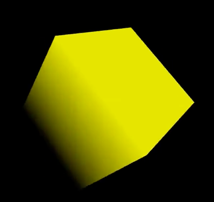

This may not be exactly what you expected. The cube is definitely shaded, but that shading isn't changing as the cube rotates.

That's because the transformation matrix we're applying applies to everything in the scene, including the light source. It's rotating around, the same as the cube. When we get into the advanced series, we'll look at setting up cameras and transforming individual objects, which will allow for more dynamic lighting.

But, you've gone through all the lessons in the series, and you should have enough knowledge to start looking into this on your own. Also, you might want to try changing the light's color and direction, and the material color that we hard-coded in the shader to see how all these things interact to create realistic lighting effects.