At the beginning of this series, I introduced some of the different modes for drawing arrays in webgl. We touched on drawing `gl.POINTS`, `gl.LINES`, `gl.LINE_STRIP`, `gl.LINE_LOOP`, and `gl.TRIANGLES`. 

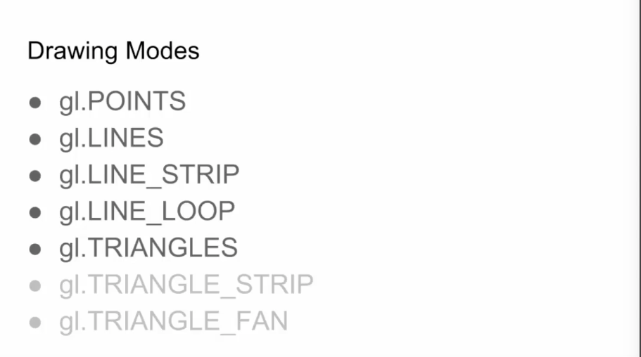

Let's take a look at the last two now, `gl.TRIANGLE_STRIP` and `gl.TRIANGLE_FAN`. These are both very useful for drawing large, more complex surfaces in forms. In this lesson, we'll deal with `gl.TRIANGLE_STRIP`, and `gl.TRIANGLE_FAN` in another lesson. Imagine we have a bunch of vertices laid out like so, right now they're rendered as points.


Just to recap here they are again as lines. Remember that `gl.LINES` take successive pairs of points and renders a single line with each pair. 

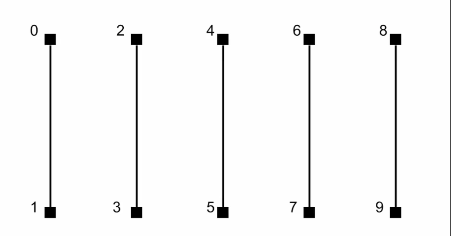

Then `gl.LINE_STRIP`, 


and `gl.LINE_LOOP` which is the same but looks back to the starting point, 


then we jump over to `gl.TRIANGLES` which takes groups of three points and renders a single triangle with each group. So we have one triangle with points 0, 1, and 2, and a totally separate triangle with 3, 4, and 5, etc.

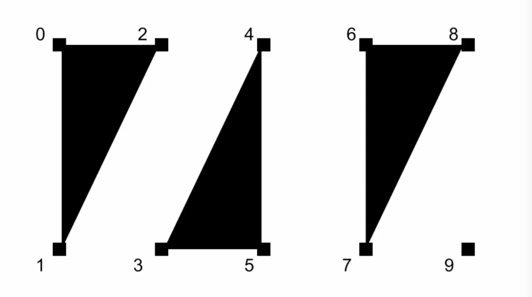

Now we hit `gl.TRIANGLE_FAN`, this starts out the same as `gl.TRIANGLES`, 

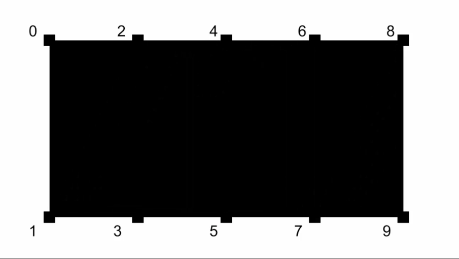

it takes the first three points, 0, 1, and 2, and creates a triangle. 

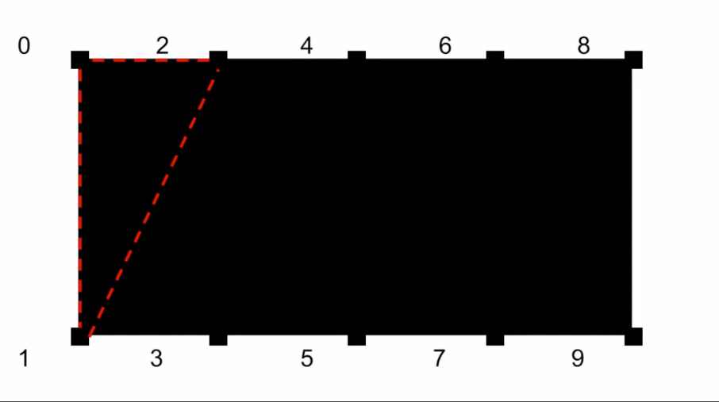

Then it takes 1, 2, and 3, and creates the next triangle, then 2,3,4; 3,4,5, and so on. 

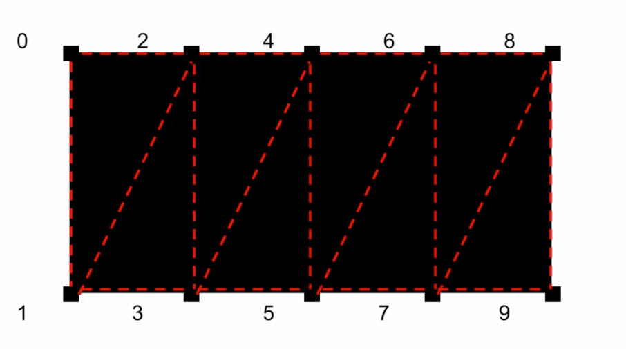

The result is that each successive triangle shares one edge with the last triangle. This allows you to build up surfaces with complex 2-3D contours. Let's see it in action. I'm working where we left off in a previous lesson.

This code has a pre-defined vertex array that I'll get rid of, but we'll keep all the code that parses the vertex colors and creates a perspective matrix. I'm going to keep an empty array here and set up a `for` loop that goes from `0` to `2`, incrementing by `0.1`. In that, I'll push a point onto the array. The `x` will be i-1, this will wind up creating a series of points that go from `-1` to `+1` in `0.1` increments on the x-axis. Y will be `-0.3`, and z will be `0`.

```javascript
vertices = [];
for(var i = 0; i < 2; i += 0.1) {
    vertices.push(i - 1);
    vertices.push(-0.3);
    vertices.push(0);
}
```

Now remember the way we have this set up now, we need to specify the RGB color right after each x, y, z coordinate, so I'll add those right in here, giving it a random red, green, and blue, and `1` for alpha. 

```javascript
vertices = [];
for(var i = 0; i < 2; i += 0.1) {
    vertices.push(i - 1);
    vertices.push(-0.3);
    vertices.push(0);
    vertices.push(Math.random());
    vertices.push(Math.random());
    vertices.push(Math.random());
    vertices.push(1);
}
```

Now I'm going to copy that whole block and paste it in again. This will create another point at the same location, but this time I'm going to change y to positive `0.3`. Now we're creating pairs of points from the left to the right.

```javascript
vertices = [];
for(var i = 0; i < 2; i += 0.1) {
    vertices.push(i - 1);
    vertices.push(-0.3);
    vertices.push(0);
    vertices.push(Math.random());
    vertices.push(Math.random());
    vertices.push(Math.random());
    vertices.push(1);

    vertices.push(i - 1);
    vertices.push(0.3);
    vertices.push(0);
    vertices.push(Math.random());
    vertices.push(Math.random());
    vertices.push(Math.random());
    vertices.push(1);
}
```

To make this nice and dynamic, I'm going to go up and remove the initial `vertexCount` hard-coded value, then come back down and set it to `vertices.length / 7;`, because each vertex is now defined by seven data points, this will calculate how many vertices are in the array without needing to manually change the value each time. We're good there. I'll jump down to the draw function and change mode to `gl.POINTS`, just so we can see what we created.

```javascript
function draw() {
  ...

  gl.clear(gl.COLOR_BUFFER_BIT);
  gl.drawArrays(gl.POINTS, 0, vertexCount);
  requestAnimationFrame(draw);
}
```

Run it, and there's our array of points. Pretty close to what I do earlier.

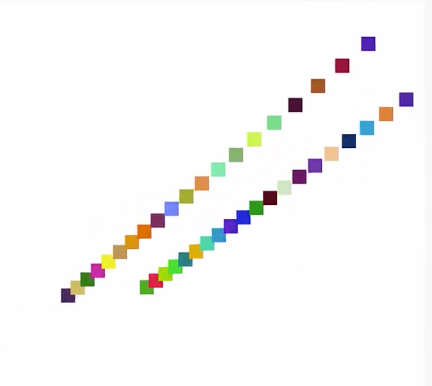

Note that the perspective seems odd here, because points do not scale with perspective, the point size that we gave it as absolute. Now with `gl.LINES`. 

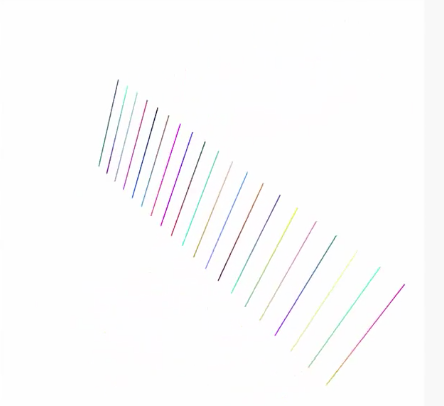

This makes sense. `gl.LINESTRIP`, yep. 

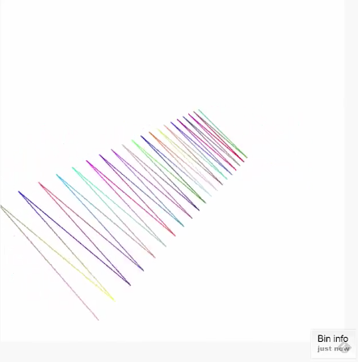

`gl.LINE_LOOP`, OK. 


`gl.TRIANGLES`, so far so good. 


Now into new territory, `gl.TRIANGLE_STRIP`, and we have one large surface. Note how all the random colors blend smoothly into each other. 

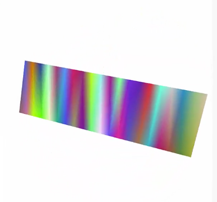

Now there's no need for all these vertices to be on the same plane, let's vary them by changing their z value.

I'll use a `sin` wave based on `i`. `vertices.push(Math.sin(i * 10) * 0.2);`, and I'll do that for both pairs of points. 

```javascript
vertices = [];
for(var i = 0; i < 2; i += 0.1) {
    vertices.push(i - 1);
    vertices.push(-0.3);
    vertices.push(Math.sin(i * 10) * 0.2);
    vertices.push(Math.random());
    vertices.push(Math.random());
    vertices.push(Math.random());
    vertices.push(1);

    vertices.push(i - 1);
    vertices.push(0.3);
    vertices.push(Math.sin(i * 10) * 0.2);
    vertices.push(Math.random());
    vertices.push(Math.random());
    vertices.push(Math.random());
    vertices.push(1);
}
```

Now we have a real somewhat complex mathematical 3D form, randomly colored, with perspective, spinning around in 3D space. Pretty cool if you ask me. 

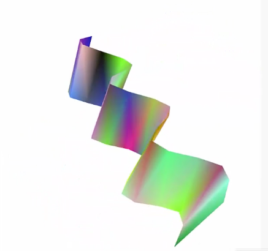

We can do more. Rather than random colors, let's programmatically blend the colors. In the first point I'll set red to `vertices.push(i / 2);` which will make a range from 0 to 1 across the length of the form. For blue, I'll set to `vertices.push(1 - i / 2);` which will make it go from 1 to 0. Green I'll set to `vertices.push(0);`.

For the second point, I'll do the exact same thing, but switch up which channels I'm applying each method to, 

```javascript
vertices = [];
for(var i = 0; i < 2; i += 0.1) {
    vertices.push(i - 1);
    vertices.push(-0.3);
    vertices.push(Math.sin(i * 10) * 0.2);
    vertices.push(i / 2);
    vertices.push(1 - i / 2);
    vertices.push(0);
    vertices.push(1);

    vertices.push(i - 1);
    vertices.push(0.3);
    vertices.push(Math.sin(i * 10) * 0.2);
    vertices.push(0);
    vertices.push(1 - i / 2);
    vertices.push(i / 2);
    vertices.push(1);
}
```

and now we have a nice blend of colors going across the shape, pretty cool. But maybe this looks a little bit chunky. 

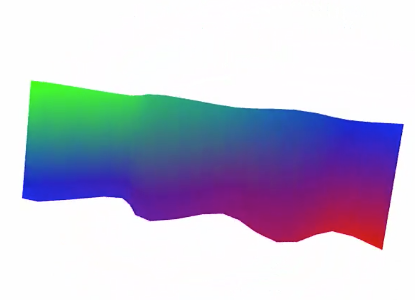

We can increase the resolution just by changing the increment in the `for` loop to `0.01`. This will break that 0 to 2 range into smaller steps making many more points, 10 times as many points. Now it's nice in smooth.

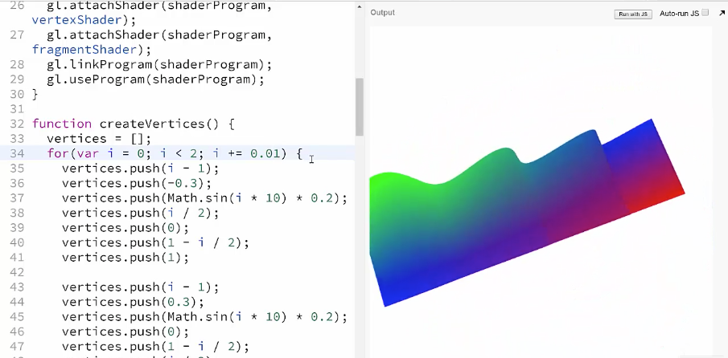

Note that because vertex count is dynamic, it all just works. So mess with these formulas and see what other kinds of shapes you can come up with.