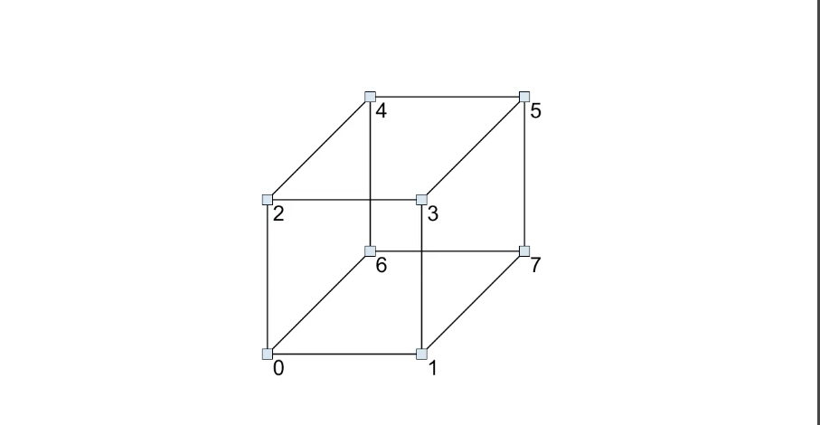
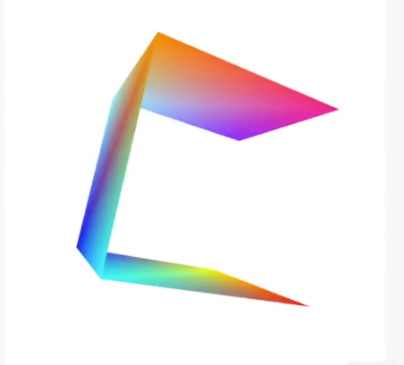
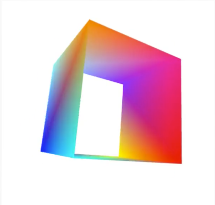
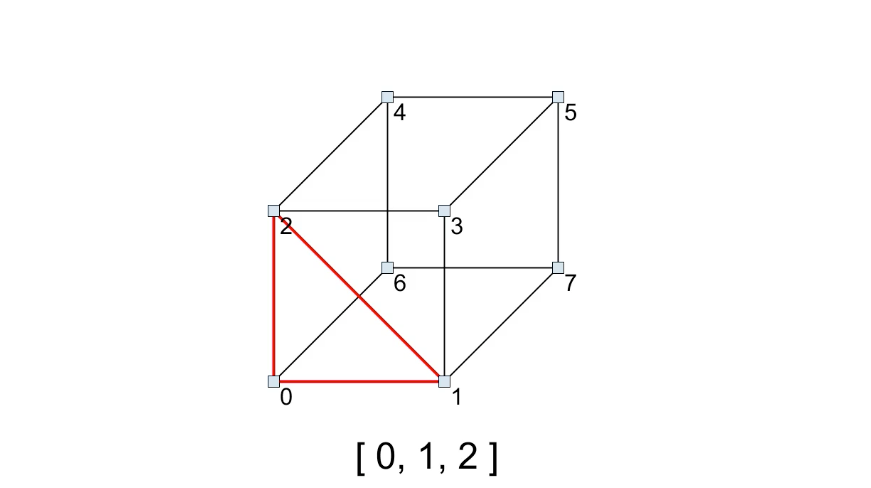
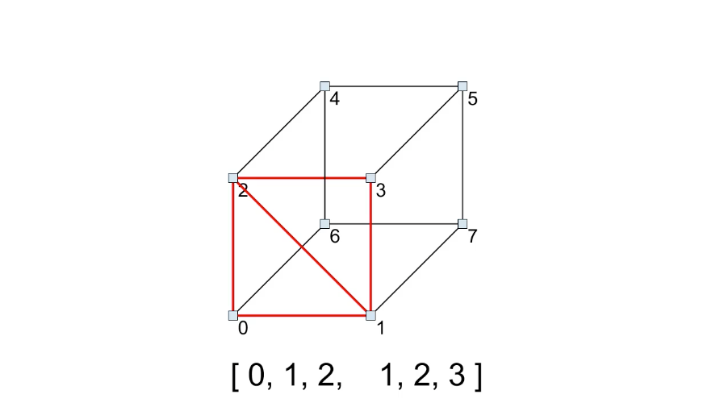
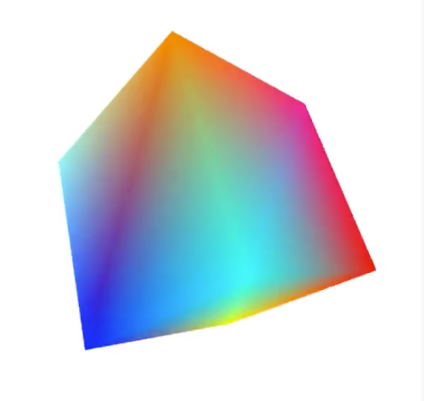

We've covered all the methods of drawing arrays in **WebGL**. You should be able to make some pretty cool stuff at this point. But if you tried making something a bit more complex, you might see that there's something lacking. Even if we tried making something as simple as a cube, we'll run into problems.



A cube has eight corners. I've labeled them here as zero to seven. What we'd like to do is draw two triangles for each of the six faces of the cube. Let's jump over to the code and try it.

I'll get rid of the blue background here and all this sea-shell code. 

```javascript
// vvv REMOVED vvv
vertices.push(0, 0.9, 0.3, 1, 1, 1, 1);
for(var i = 0; i < Math.PI * 2; i+= 0.1) {
    vertices.push(Math.cos(i));
    vertices.push(Math.sin(i));
    vertices.push(Math.sin(i * 10) * 0.1);

    vertices.push(Math.sin(i * 10) * 0.5 + 0.5);
    vertices.push(Math.sin(i * 8) * 0.5 + 0.5);
    vertices.push(Math.sin(i * 12) * 0.5 + 0.5);
    vertices.push(1);
}
    i = Math.PI * 2;
    vertices.push(Math.cos(i));
    vertices.push(Math.sin(i));
    vertices.push(Math.sin(i * 10) * 0.1);

    vertices.push(Math.sin(i * 10) * 0.5 + 0.5);
    vertices.push(Math.sin(i * 8) * 0.5 + 0.5);
    vertices.push(Math.sin(i * 12) * 0.5 + 0.5);
    vertices.push(1);
// ^^^ REMOVED ^^^
```

I'll paste in a vertex array that contains eight points of a cube. Each vertex also contains a separate color. 

```javascript
vertices = [
    -1, -1, -1,     1, 0, 0, 1,     //0
     1, -1, -1,     1, 1, 0, 1,     //1
    -1,  1, -1,     0, 1, 1, 1,     //2
     1,  1, -1,     0, 0, 1, 1,     //3
    -1,  1,  1,     1, 0.5, 0, 1,   //4
     1,  1,  1,     0.5, 1, 1, 1,   //5
    -1, -1,  1,     1, 0, 0.5, 1,   //6
     1, -1,  1,     0.5, 0, 1, 1,   //7
];
```

In the `translate` line, I'm going to push this out a bit away from us so we can see the whole cube. 

```javascript
mat4.translate(matrix, matrix, [0, 0, -4]);
```

Down in the `draw()` function, I'll make sure we're using `gl.TRIANGLE_STRIP` and then run this.



We have a strip of triangles from the first three vertices in the array down to the last three. But this only forms three sides of a cube. There's no way to finish the cube without creating more vertices which exactly duplicate the existing vertices.

For example, I can copy the first two vertices and add them to the end of the array. This will give us our fourth face. 

```javascript
vertices = [
    -1, -1, -1,     1, 0, 0, 1,     //0
     1, -1, -1,     1, 1, 0, 1,     //1
    -1,  1, -1,     0, 1, 1, 1,     //2
     1,  1, -1,     0, 0, 1, 1,     //3
    -1,  1,  1,     1, 0.5, 0, 1,   //4
     1,  1,  1,     0.5, 1, 1, 1,   //5
    -1, -1,  1,     1, 0, 0.5, 1,   //6
     1, -1,  1,     0.5, 0, 1, 1,   //7
    -1, -1, -1,     1, 0, 0, 1,     //0
     1, -1, -1,     1, 1, 0, 1,     //1
];
```



But the last two faces require even more duplicated points. You can get tricky with it, but you'll always need a number of new duplicates. Ideally we'd be able to draw this cube using just the eight existing vertices.

That's where `gl.DrawElements` comes in, `gl.DrawArrays` runs through the vertices that are in the vertex buffer from beginning to end. You can choose how many vertices you want to draw and where to start, but you can't rearrange them or use the same vertex more than one time in a single call.

But `glDrawElements` allows you to pick and choose and assemble a custom list of vertices to draw just by providing a list of indices that point to specific vertices. Sound confusing? Let's go back to the drawing of the cube.


All the eight points shown here, zero to seven, will be in a vertex buffer. If I want to draw a triangle with points zero, one, and two, I can create an indices array with those three values in it, just the numbers zero, one, and two. 



Then I can add the numbers one, two, and three to that indices array to draw the second triangle. There's our first face.



Notice that I reused points one and two. Here are the indices that make up the two triangles for the second face, and the third, fourth, fifth, and sixth. Now we've individually defined every triangle that makes up the entire cube just by specifying which vertices to draw with.

Back in the code, I'll make a new function called, `createIndices()` just after, `createVertices()` and then create that function in the same location. What we need to do is make an element array buffer that will hold our index list.

This is process very similar to how we created the vertex buffer. First I'm going to paste the array of indices that we just came up with.

```javascript
function createIndices() {
    var indices = [
        0, 1, 2,    1, 2, 3,
        2, 3, 4,    3, 4, 5,
        4, 5, 6,    5, 6, 7,
        0, 2, 6,    2, 6, 4,
        1, 3, 7,    3, 7, 5
    ];
}
```

Now I'll need to know how many indices we have. I'll create a variable up at the top here called, `indexCount` Back in the function I'll say, `indexCount = indices.length;`

Now we can create a buffer. I'll say, `var indexBuffer = gl.createBuffer();` Then we need a way to bind the buffer to a target. When binding the vertex buffer, the target was, `gl.ARRAY_BUFFER` But for `indices`, we want to use the target, `gl.ELEMENT_ARRAY_BUFFER`

Now we can put our `indices` data into the buffer with `gl.bufferData` just like we did with vertices. The target again is, `gl.ELEMENT_ARRAY_BUFFER` For vertices, we were passing in floating point values so we wrapped the JavaScript array in a `Float32Array`.

Here we're using integers though, so we'll wrap `indices` in a `Uint8Array`. This is an unsigned 8-bit integer, fine for what we're doing here. If you wind up with a lot more vertices you need to index, you should use a `Uint16Array`, which would allow for larger numbers.

Finally, the mode. Like before, it's `gl.STATIC_DRAW`. I'm not going to unbind this buffer now because it needs to be an element buffer bound when we call to our elements in the draw function.

```javascript
function createIndices() {
    var indices = [
        0, 1, 2,    1, 2, 3,
        2, 3, 4,    3, 4, 5,
        4, 5, 6,    5, 6, 7,
        0, 2, 6,    2, 6, 4,
        1, 3, 7,    3, 7, 5
    ];
    indexCount = indices.length;

    var indexBuffer = gl.createBuffer();
    gl.bindBuffer(gl.ElEMENT_ARRAY_BUFFER, indexBuffer);
    gl.bufferData(gl.ELEMENT_ARRAY_BUFFER, new Uint8Array(indices), gl.STATIC_DRAW);
}
```

In a more complex application, you might have multiple objects composed of multiple element buffers. You could switch out which elements you want to draw by binding the appropriate buffer. Since we just have the one here, I'll leave it permanently bound.

Now down to the `draw()` function. I'll get rid of this first call to `gl.drawArrays` and instead call `gl.drawElements()`. This again takes the drawing mode first. We've set up individual triangles so the mode is `gl.TRIANGLES`.

Next is the number of indices in the element buffer. This is `indexCount`. Then the data type, a Uint8 corresponds to `gl.UNSIGNED_BYTE`. If you happen to use a `Uint16Array`, you should use `gl_UNSIGNED_SHORT` here to correspond to the 16 bit data type.

Final parameter is the offset in case you wanted to start some number of indices into the array. Oddly while the second parameter's a simple integer for the number of indices to draw, the offset parameter requires a number of bytes.

If you wanted to start with an offset of say three, you'd have to multiply `3 * Uint8Array.BYTES_PER_ELEMENT` or `Uint16Array.BYTES_PER_ELEMENT` if that's what you used to get the proper value. We'll just use `0` here though as we'll be drawing everything.

```javascript
function draw() {
    ...

    gl.clear(gl.COLOR_BUFFER_BIT);
    // REMOVED gl.drawArrays(gl.TRIANGLE_STRIP, 0, vertexCount);
    gl.drawElements(gl.TRIANGLES, indexCount, gl.UNSIGNED_BYTE, 0);
    requestAnimationFrame(draw);
}
```

We're ready to roll. Let's see what we have. Excellent, a nice multi-colored cube with only eight vertices used.



You could use different drawing modes here, `gl.POINTS` or any of the line modes or `gl.TRIANGLE_STRIP` or `gl.TRIANGLE_FAN`. You can make multiple calls to `drawElements` with different offsets and counts to draw different portions of the data. As I just said, you could even have multiple element buffers and draw each one separately. You now have all the tools you need to model just about any type of 2-3D object. Have fun with it.