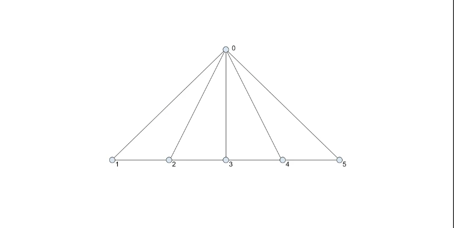
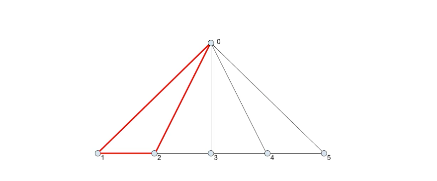
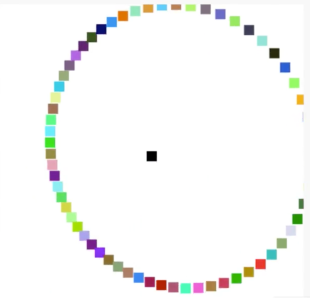
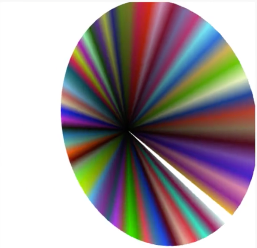
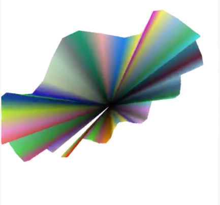
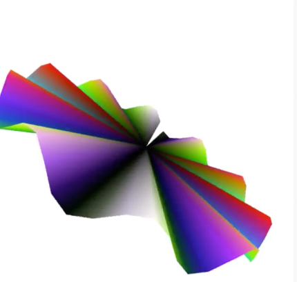
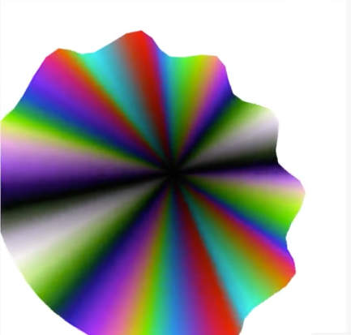
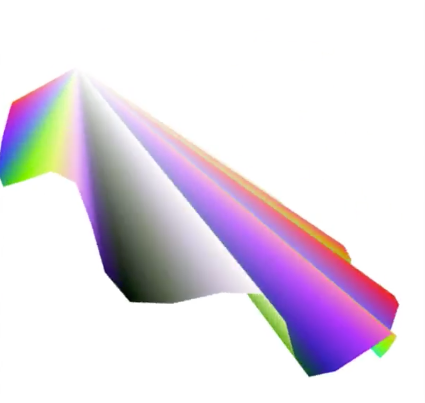
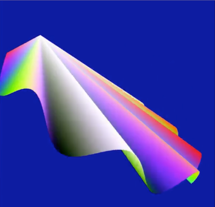

Let's take a look at the last drawing mode available for the draw/erase function, `gl.TRIANGLE_FAN`. The name itself should give you a rough idea of what it does. If you add any paper folded fan, not an electrical rotary fan.



Say we have groups of points like this. The first point, point zero at the top, and the rest spread left to right across the bottom. A triangle fan takes points zero, one, and two, and creates the first triangle, 



just like both of the other triangle drawing methods. Then, it goes to zero, two, three, then zero, three, four, and so on.

The fan always has that initial starting point that connects all the triangles. It uses that initial point, plus each successive pair of points, to create each successive triangle. In a fan, every triangle shares an edge with at least one of the triangle, and all triangles share that initial point.

Let's see it in action. I'll start with the code we had for the `gl.TRIANGLE_STRIP` example. First, I'll create a center point, we can put all seven values into the array with one push.

```javascript
vertices = [];
// vvv REMOVED vvv
for(var i = 0; i < 2; i += 0.1) {
    vertices.push(i - 1);
    vertices.push(-0.3);
    vertices.push(Math.sin(i * 10) * 0.2);
    vertices.push(i / 2);
    vertices.push(1 - i / 2);
    vertices.push(0);
    vertices.push(1);

    vertices.push(i - 1);
    vertices.push(0.3);
    vertices.push(Math.sin(i * 10) * 0.2);
    vertices.push(0);
    vertices.push(1 - i / 2);
    vertices.push(i / 2);
    vertices.push(1);
}
// ^^^ REMOVED ^^^
vertexCount = vertices.length / 7;
```

It will be at `0, 0, 0,` and the color will be `0, 0, 0, ` with `1` for alpha, solid black.

```javascript
vertices = [];
vertices.push(0, 0, 0,  0, 0, 0, 1);
vertexCount = vertices.length / 7;
```

Now, I'll make this `for` loop go from `0` to `Math.PI * 2` radians which is equivalent to 0 to 360 degrees. I'll increment by `0.1`, and I'll arrange the `vertices` around in a circle, using the same easy trig. X will be `Math.cos(i)`, and Y will be `Math.sin(i)`. Z will be `0` for now, and I'll set the colors with random values for red, green, and blue, plus `1` for alpha.

```javascript
vertices = [];
vertices.push(0, 0, 0,  0, 0, 0, 1);
for(var i = 0; i < Math.PI * 2; i+= 0.1) {
    vertices.push(Math.cos(i));
    vertices.push(Math.sin(i));
    vertices.push(0);

    vertices.push(Math.random());
    vertices.push(Math.random());
    vertices.push(Math.random());
    vertices.push(1);
}
vertexCount = vertices.length / 7;
```

Down to the `draw()` function, I'll just change this to `gl.POINTS`, just to see what we have. Yep, we have the center black point, and the rest arranged in a circle around that center point.



Let's change this to `gl.TRIANGLE_FAN` mode. You see we have a solid circle shape, you might notice that it's not quite closed though, we can handle that later. 



We can now do some more modeling with these vertices. Instead of being flat, let's change the Z positions somehow.

Let's have them go up and down in a `sin` wave. I'll say Z to `(Math.sin(i * 10) * 0.1)` OK. That's more interesting. 



Now, the colors, for red, I'll use the same `sin` wave, but I'll multiply it by `0.5`, so, it goes from `-0.5` to `0.5`. Then I'll add `0.5` to that, so, it arranges from 0 to 1, which is a valid range for the color channels here. I'll do the same thing for green and blue, but I'll have them use `i * 8`, and `i * 12` just to get a variation. 

```javascript
vertices = [];
vertices.push(0, 0, 0,  0, 0, 0, 1);
for(var i = 0; i < Math.PI * 2; i+= 0.1) {
    vertices.push(Math.cos(i));
    vertices.push(Math.sin(i));
    vertices.push(Math.sin(i * 10) * 0.1);

    vertices.push(Math.sin(i * 10) * 0.5 + 0.5);
    vertices.push(Math.sin(i * 8) * 0.5 + 0.5);
    vertices.push(Math.sin(i * 12) * 0.5 + 0.5);
    vertices.push(1);
}
vertexCount = vertices.length / 7;
```

Cool, these colors now flow nicely together.



Let's handle that little gap. I'll copy all the points here, and paste them down again, after the for loop. I'll save before that, `i = Math.PI * 2;`, that will pull one final point where it needs to be a closer circle. Looks good.

```javascript
for(var i = 0; i < Math.PI * 2; i+= 0.1) {
    vertices.push(Math.cos(i));
    vertices.push(Math.sin(i));
    vertices.push(Math.sin(i * 10) * 0.1);

    vertices.push(Math.sin(i * 10) * 0.5 + 0.5);
    vertices.push(Math.sin(i * 8) * 0.5 + 0.5);
    vertices.push(Math.sin(i * 12) * 0.5 + 0.5);
    vertices.push(1);
}
    i = Math.PI * 2;
    vertices.push(Math.cos(i));
    vertices.push(Math.sin(i));
    vertices.push(Math.sin(i * 10) * 0.1);

    vertices.push(Math.sin(i * 10) * 0.5 + 0.5);
    vertices.push(Math.sin(i * 8) * 0.5 + 0.5);
    vertices.push(Math.sin(i * 12) * 0.5 + 0.5);
    vertices.push(1);
```



Now, to me this looks like some kind of shell, let's roll with that theme. I am going to try to move the center point up a bit, `0.9` on the Y-axis, and `0.3` on the Z-axis. I'll change the center color to white. 

```javascript
vertices.push(0, 0.9, 0.3,  1, 1, 1, 1)
```

Now, it looks even more like a shell, let's keep going.



I'll up the resolution by changing the increment to the `for` loop, then I'll set the `gl.clearColor` to a dark blue `(0, 0, 0.6, 1)`. Now, we've got something pretty cool going on. 



With `gl.TRIANGLE_STRIP` and `gl.TRIANGLE_FAN` you can start creating some pretty complex models. See what you can do with them.