The next step we take is going to handle several issues, aspect ratio, clipping, and maybe most importantly perspective. First let's take a look at the issues themselves. When we initialize WebGL we're given a viewport. Up until now the viewport has been the size of the **canvas**, which happens to be square, 600x600 in our examples. Remember that the default WebGL coordinate system goes from -1 to +1 on the x and y axes, also forming a square, so that works out.

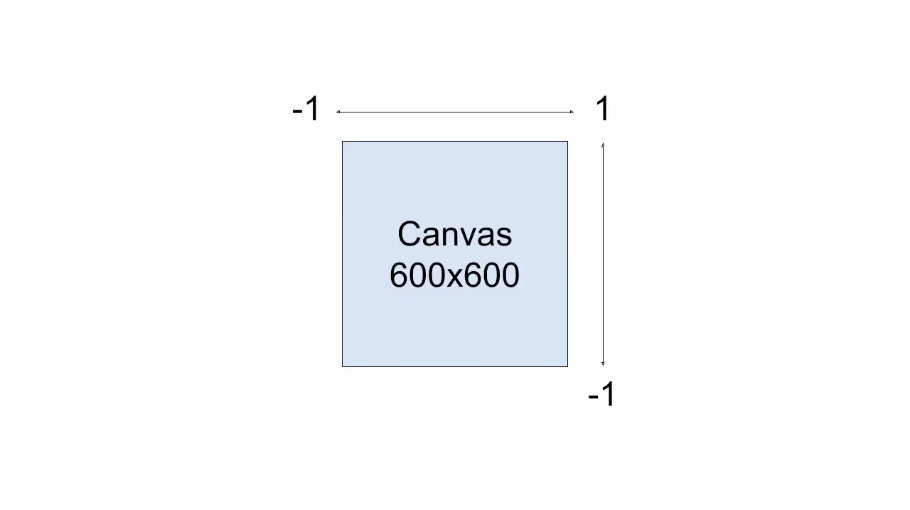

But let's see what happens if we change the size of the canvas. I'll do that here in the JavaScript just before setting up the WebGL context. First I'll change the `height` to `200`, then I'll change the `width` instead. You see what's happening is the coordinate system is still going from -1 to +1 on each axis, but since the canvas is no longer square, things are getting squished. 

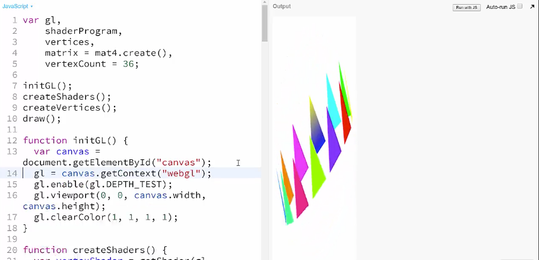

It would be nice to be able to set the canvas to any size and have the coordinate system just adjust. Then there's the problem of clipping.

You might have seen bits of this in the example with the random-colored triangles, but let's make it more obvious here. At the end of `createVertices`, I'm going to `translate` the whole model by calling `mat4.translate()`, passing in the main `matrix` and an array of x,y,z translations. I'll just move it a bit closer to us on the z-axis. 

```javascript
mat4.translate(matrix, matrix, [0, 0, -2]);
```

Now you can see that when the triangles get a bit close to us, the disappear. If we push the model out a bit away from us, you see that they also disappear when they get too far away.

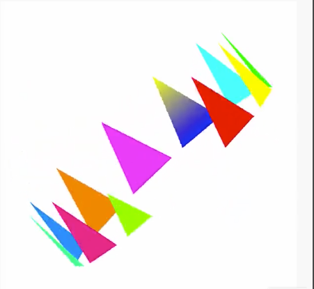

This is called clipping. By default WebGL will only render objects between -1 and +1 on the z-axis. You're probably going to want to have things appear outside of that range sometimes. As a quick note, earlier I said that the z-axis in WebGL extends positively towards us, and negatively into the distance. What we just did seemed to negate that. Don't worry about it for right now, once we apply the fix we're about to do, it will put that right too.

Finally, this is a bit more subtle here, but we really don't have any perspective going on here. The triangles in the back are the same size as the triangles in the front. You have to pay attention to which ones are overlapping with the other ones to make sure you're seeing it right. The act of turning a three-dimensional model into a two-dimensional image is called projection. By default WebGL uses [orthographic projection](https://en.wikipedia.org/wiki/Orthographic_projection), which will not scale things down as they go into the distance, or up as they come closer to the viewer.

What we want is perspective projection, which does do that scaling. All three of these issues are handled by supplying another matrix to the vertex shader. I could go into all the matrix math that makes this possible, but if you're using a WebGL-specific matrix library such as **glMatrix** like we're using here, you will likely have a method that will construct this special matrix for you. glMatrix has a function called `perspective` that does just this.

The strategy is going to be make a new matrix called `perspectiveMatrix`, configure that using glMatrix, and pass it to the vertex shader. Down at the bottom of `createVertices` again, I'll first create an identity matrix using `mat4.create()`. Then I'll call `mat4.perspective()`. First we want to pass in the matrix we just created `perspectiveMatrix`, this will be transformed in place. Then we need a field of view `1`. This is based on an angle of the y-axis. This picture may help, you're the viewer on the left looking at the scene on the right.

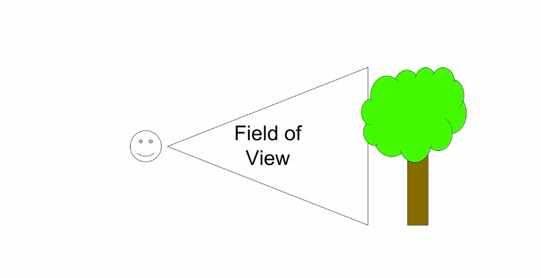

The field of view is represented by that angle. A wider field of view is exactly like a wide-angle lens on a camera. You can see a lot more of the scene, and the perspective scaling effect is a lot stronger. A very wide field of view gives you the kind of distortion you see in a fish-eye lens. A narrower field of view lets you see less, but decreases the perspective effect, this is like a telephoto lens. 

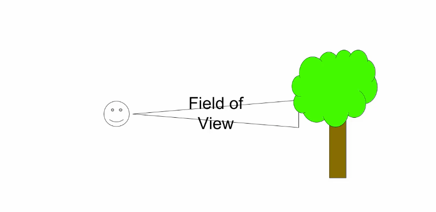

You'll often see this in photos of baseball games where the batter appears the same size as the pitcher, even though the batter is much further away.

Field of view is an angle in radians, we'll just say `1` for now. We've fixed our perspective now. The next parameter is aspect ratio. This is the `width` of the viewport divided by its `height`. Since we're using the full `canvas`, we can pass in `canvas.width / canvas.height`. This will allow us to change the canvas size without distortion. The final two parameters are near and far. Consider that your eyes are at point `0`, you want to be able to see things just in front of you, up to some further distance away from you.

So we'll say `0.1` for near, and `10` for far. This will prevent clipping in our current scene. 

```javascript
var perspectiveMatrix = mat4.create();
mat4.perspective(perspectiveMatrix, 1, canvas.width / canvas.height, 0.1, 10);
```

We have our matrix and we'll pass it to the shader, we'll `gl.getUniformLocation` for a uniform name `"perspectiveMatrix"` which we'll need to create in the shader. We'll pass it to the shader with `gl.uniformMatrix4fv()` like we did with the other matrix, and we're done with the JavaScript code. 

```javascript
var perspectiveLoc = gl.getUniformLocation(shaderProgram, "perspectiveMatrix");
gl.uniformMatrix4fv(perspectiveLoc, false, perpsectiveMatrix);
```

Over to the shader. We'll create the new `uniform mat4 perspectiveMatrix;`. In the main function we'll just add that to the multiplication that we're already doing. Matrix multiplication can seem like magic sometimes. 

```html
<script id="shader-vs" type="x-shader/x-vertex">
attribute vec4 coords;
attribute float pointSize;
uniform mat4 transformMatrix;
uniform mat4 perspectiveMatrix;
attribute vec4 colors;
varying vec4 varyingColors;
void main(void) {
    gl_Position = perspectiveMatrix * transformMatrix * coords;
    gl_PointSize = pointSize;
    varyingColors = colors;
}
</script>
```

We'll test it, all right, that's very different. 

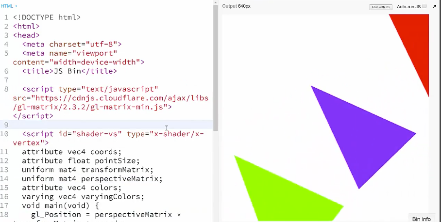

Perspective matrix has put us right in the center of the coordinate system, 0, 0, 0. So the triangles are kind of rotating around us now. But you can see that we definitely have some perspective going on. We already have this `translate` code in here, so let's just push the matrix out two units ahead of us. See now that `-2` does move the model into the distance as I originally said it should.

```javascript
mat4.translate(matrix, matrix, [0, 0, -2]);
```

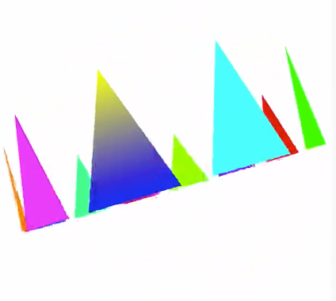

Now look at the size of the triangles, the ones farther away are definitely smaller. So we've handled perspective, how about clipping? I'll move things out to 5, looks OK, 

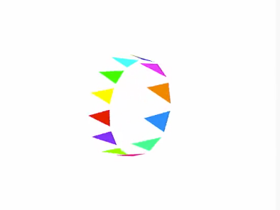

9, all good, 

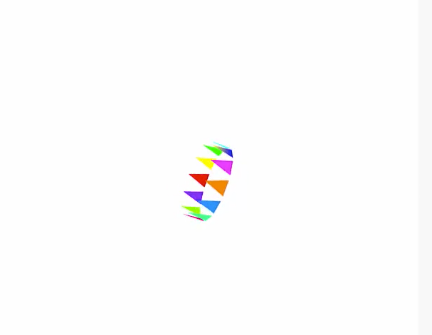

10, we're at the far edge of the clipping range so anything that goes beyond 10 is now being clipped. 


If we go up and change our far value to `11`, we're back in business. Let's take a look at the field of view. I'll bring that down to `0.2`, a very narrow field of view. You can see that this has pulled everything right up close, just like a telephoto lens would.

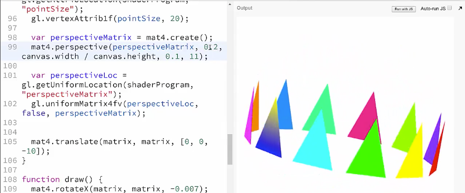

Notice that the far triangles are nearly the same size as the near ones, less perspective. Now let's change field of view to `3`. That's almost 180 degrees, super wide. Notice that the model is so small that it's barely visible. I'll change the translation and bring it up to `-1`, so close that we're actually getting some clipping on the near triangles. 


But look at that exaggerated perspective, just like a fish-eye lens. The last issue we want to verify is the aspect ratio, so I'll set field of view back to `1`, and zTranslation to `-2`, so the ring pretty much fills the canvas.

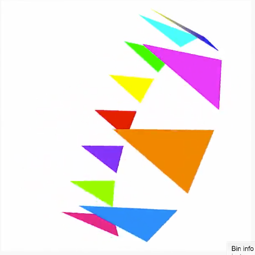

Now if I go up into `initGL`, and change the `height` of the canvas to `200`, you'll see that the ring still fits in the canvas, it's shrunken down, but it's not all distorted, the aspect ratio is correct. 

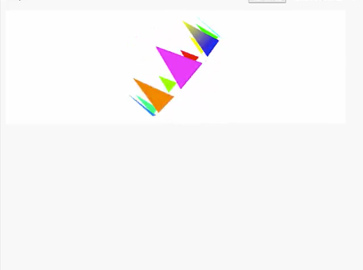

Now if I change the `width` instead to `200`, we get something totally different. Remember that **the field of view is keyed to the y-axis**, so the ring is still filling the canvas from top to bottom, can't see much on either side, but we don't have any distortion.


As you can see, this one perspective method does all kinds of stuff for us, and is probably one of the hardest working single lines of code in the program. Be sure to experiment with this extensively to get a good idea for all of what it does.