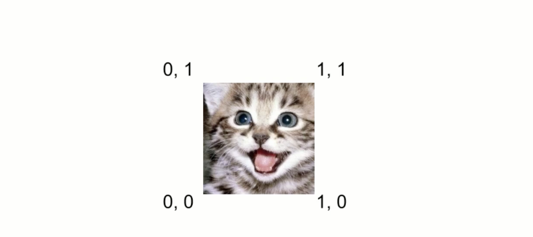
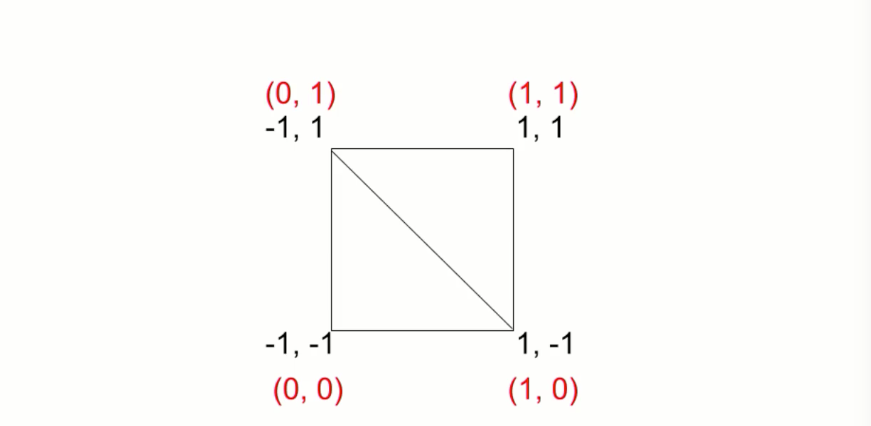
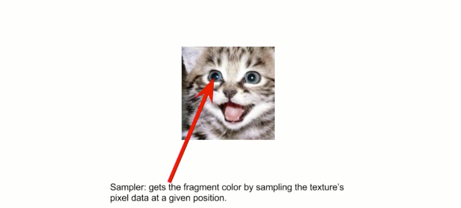
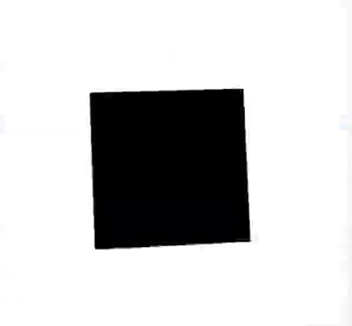
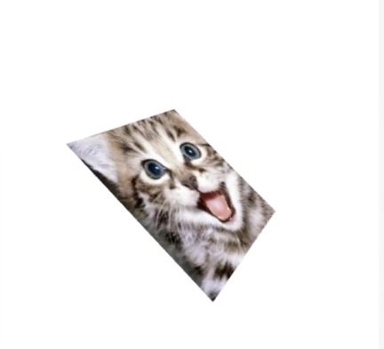

So far, we've covered the tools to model just about any type of 2-3D form, and we've seen how to apply colors to specific vertices, which will result in the colors blending across individual triangles. When we want to make more realistic renderings, we need to know how to put textures onto our forms.

As a warning, there's a lot to do here and a lot to explain, so this video is a bit longer than usual. Even so, there are a few things I'll need to brush over rather quickly. If you need more information, the **Mozilla Developer Network** is an excellent resource for documentation. [Here's the URL to their WebGL docs.](https://developer.mozilla.org/en-US/docs/Web/API/WebGL_API)

A texture is simply a **bitmap image**. It can be a photograph, or an image created with some drawing or painting app, or whatever. In WebGL, we load an image and put that image data into a special texture object. A texture is always rectangular, and no matter its size, its coordinates will be mapped like so.



The bottom left will be `(0, 0)`, bottom right `(1, 0)`, top left `(0, 1`), and top right `(1, 1)`. When we were dealing with per-vertex colors, we assigned a specific color to each vertex and allowed the vertex and fragment shaders to interpolate those colors across the surfaces of the triangles.

What we'll be doing with textures is similar, but we'll assign a different texture coordinate to each vertex, and allow the shaders to interpolate that texture across the triangle surface.

To start, we'll create a rectangle with two triangles. We can assign each vertex a specific texture coordinate. This will map the texture to their rectangle. Vertex zero at position `(-1, -1)`, we get a texture coordinate of `(0, 0)`. Vertex one, we'll get a texture coordinate of `(1, 0)`. Vertex two, we'll get `(0, 1)`, and vertex three is `(1, 1)`.



Just like when we assigned per-vertex colors by passing your `vec4` for R, G, B, and A to each vertex, now I'll need to pass a `vec2` containing these two texture coordinates.

Let's jump over to our shaders. The first part of this should be pretty familiar. I'll create an `attribute` of type `vec2` called `textureCoords`. Just like the color data, we'll need to pass this from the vertex shader over to the fragment shader. We'll create a `varying` `vec2` I'll call `varyingTextureCoords`.

Inside the shader, we'll just assign `textureCoords` to `varyingTextureCoords`.

```html
<script id="shader-vs" type="x-shader/x-vertex">
attribute vec4 coords;
attribute float pointSize;
uniform mat4 transformMatrix; 
attribute vec4 colors;
varying vec4 varyingColors;
uniform mat4 perspectiveMatrix;
attribute vec2 textureCoords;
varying vec2 varyingTextureCoords;
void main(void) {
    gl_Position = perspectiveMatrix * transformMatrix * coords;
    gl_PointSize = pointSize;
    varyingColors = colors;
    varyingTextureCoords = textureCoords;
}
</script>
```

Now, down to the fragment shader. We'll put in the same `varying vec2 varyingTextureCoords;`, but here, things get a bit more complex.

The fragment shader will get coords that are interpolated across the surface of the triangle, just like the color values were interpolated, but from there, it needs to find out what pixel color value that corresponds to on the texture itself. That's called **sampling**.



We sample the texture in a given position, and that will give us the color for each fragment. To do this, we'll need a **sampler object**. The sampler is what does that sampling. The setup for creating that sampler will be done in JavaScript code, and that sampler will be passed into the shader as a **uniform**.

We can create a new `uniform` of type `sampler2D` called `sampler`. Now, with the `sampler` and a texture coordinate, we can calculate a color. We'll say `gl_FragColor = texture2D(sampler, varyingTextureCoords);`.

```html
<script id="shader-fs" type="x-shader/x-fragment">
precision mediump float;
uniform vec4 color;
varying vec4 varyingColors;
varying vec2 varyingTextureCoords;
uniform sampler2D sampler;
void main(void) {
    gl_FragColor = texture2D(sampler, varyingTextureCoords);
}
</script>
```

The `texture2D` method takes the sampler and coordinates, and uses those to sample the currently active texture. We'll create that texture and make it active later.

We're done with the shaders. That wasn't so bad. All the hard work will be done in JavaScript, so let's jump over there.

First, we get rid of the `createIndices` code, since we're not going to be using that here. Then, let's create the vertices along with the texture coordinates. Since we're just going to create a flat square, we'll only need two values for each of the coordinates, x and y. We'll add z of default to zero.

Like we did with the colors, we'll put the texture coordinates right in line with that. The first point, `-1, -1`, gets a texture coordinate of `0, 0`. `1, -1` gets a texture coordinate `1, 0`. `-1, 1` gets `0, 1`. Finally, `1, 1` gets `1, 1`.

```javascript
vertices = [
    -1, -1,     0, 0,
     1, -1,     1, 0,
    -1,  1,     0, 1,
     1,  1,     1, 1
];
```

`vertexCount` becomes `vertices.length / 4;`, because now there are only four elements per vertex. We create the buffer, and that's fine. We get the `coords` location. In the `vertexAttribPointer` call, we need to tell it that we now only need `2` elements per vertex. The stride is `4` times `Float32Array.BYTES_PER_ELEMENT`. Offset remains `0`.

```javascript
var coords = gl.getAttribLocation(shaderProgram, "coords");
gl.vertexAttribPointer(coords, 2, gl.FLOAT, false, Float32Array.BYTES_PER_ELEMENT * 4, 0);
gl.enableVertexAttribArray(coords);
```

Then, we need to do the same for the `textureCoords` attribute. We can just refactor the `"colors"` code to get it to work for the texture instead. Get the location. Call `gl_vertexAttribPointer`. Again, we want `2` elements per coordinate.

Stride is `4` again, but the offset is `2`, because we have to skip the location elements to get to the texture coordinates. We enable the `textureCoords` attribute.

```javascript
var textureCoords = gl.getAttribLocaion(shaderProgram, "textureCoords");
gl.vertexAttribPointer(textureCoords, 2, gl.FLOAT, false, Float32Array.BYTES_PER_ELEMENT * 4, Float32Array.BYTES_PER_ELEMENT * 2);

gl.enableVertexAttribArray(textureCoords);
```

In the `draw()` method, we'll just make sure we're calling `drawArrays` again with `gl.TRIANGLE_STRIP`.

```javascript
gl.drawArrays(gl.TRIANGLE_STRIP, 0, vertexCount);
```

Now, if we run this, we simply have a black square rotating around. We need to load and create the texture. 



I'm going to call a new function, `loadTexture`, right before the call to draw, and I'll create that function in the same position.

```javascript
initGL();
createShaders();
createVertices();
loadText();
draw();

...

function loadTexture() {}

function draw() {
    ...
}
```

Our texture will be an image that we load from the Web. I'll create an `image` element using `document.createElement('img')`. Now, there are a couple of issues we're going to run into here. The first is that we're running our code on one domain and loading the image in from another.

To handle that, I'll say `image.crossOrigin = "";`. Depending where your site is and where you're loading the image from, you may run into other cross-origin issues, but those fall under regular Web development issues, and I'm sure you can figure those out.

Next, we'll `addEventListener` for the `"load"` event. This function will run when the image is fully loaded, and that's where we can set up the texture. Finally, I'll assign the image's `src` property with the URL to the image.

```javascript
function loadTexture() {
    var image = document.createElement("img");
    image.crossOrigin = "";
    image.addEventListener("load", function() {

    });
    image.src="https://pbs.twimg.com/profile_images/664169149002874880/z1fmxo00.jpg"
}
```

Now, the second issue we'll run into here is that this image is loading asynchronously. In our current setup, we'll actually be drawing the vertices before this texture ever loads. Luckily, this doesn't break anything. We'll just get that black square rotating around for the fraction of a second it takes to load the image, so I'm going to leave this as-is.

For a more polished application, you probably want to pre-load your textures first, and only after they were fully loaded, kick off the drawing code.

So, what to do when this texture loads? There's quite a bit to do, so hold on to your hat. First, we make a `texture` with `gl.createTexture`, and we'll get the location of that sampler2D uniform we created in the fragment shader.

```javascript
function loadTexture() {
    var image = document.createElement("img");
    image.crossOrigin = "";
    image.addEventListener("load", function() {
        var texture = gl.createTexture(),
            sampler = gl.getUniformLocation(shaderProgram, "sampler");

    });
    image.src="https://pbs.twimg.com/profile_images/664169149002874880/z1fmxo00.jpg"
}
```

The next step is optional. Remember we saw that WebGL's texture origin points are at the bottom left, **but in bitmaps the origin is top left**. That difference will result in our texture being upside down. We say `gl.pixelStorei(gl.UNPACK_FLIP_Y_WEBGL, 1);`.

```javascript
function loadTexture() {
    var image = document.createElement("img");
    image.crossOrigin = "";
    image.addEventListener("load", function() {
        var texture = gl.createTexture(),
            sampler = gl.getUniformLocation(shaderProgram, "sampler");

        gl.pixelStorei(gl.UNPACK_FLIP_Y_WEBGL, 1);
    });
    image.src="https://pbs.twimg.com/profile_images/664169149002874880/z1fmxo00.jpg"
}
```

`pixelStorei` lets you set a bunch of different options as to how pixels are stored, and the `i` tells us the options will be in the form of an integer. The `gl.UNPACK_FLIP_Y_WEBGL` in the option we're using here should give you an idea of what this does. I won't go into it in further detail than that. You can look up the documentation for it if you want to know more.

Now, WebGL lets you have multiple textures in an app. We'll need to tell it which one is active. Since we only have a single texture here, that'll be `gl.TEXTURE0`. Next, we're going to bind our texture. This is very similar to when we were binding array buffers. We specify a target to bind to and an object to bind.

The target is `gl.TEXTURE_2D`. The object is, of course, the `texture` we just created. Then, we can set various parameters that let WebGL know how to interpret our textures. The one property we'll need to set in this case is `gl.TEXTURE_MIN_FILTER`.

This specifies how the texture will be scaled down as need be, for objects that appear smaller because they're further away. We'll set this to `gl.LINEAR`.

```javascript
function loadTexture() {
    var image = document.createElement("img");
    image.crossOrigin = "";
    image.addEventListener("load", function() {
        var texture = gl.createTexture(),
            sampler = gl.getUniformLocation(shaderProgram, "sampler");

        gl.pixelStorei(gl.UNPACK_FLIP_Y_WEBGL, 1);
        gl.activeTexture(gl.TEXURE0);
        gl.bindTexture(gl.TEXTURE_2D, texture);
        gl.texParameteri(gl.TEXTURE_2D, gl.TEXTURE_MIN_FILTER, gl.LINEAR);
    });
    image.src="https://pbs.twimg.com/profile_images/664169149002874880/z1fmxo00.jpg"
}
```

There's also a `gl.TEXTURE_MAG_FILTER` that tells WebGL how to magnify images when they get closer. We won't run into that in this case. Again, this is something you should definitely do more research on, to see what all the parameters are and what they do.

Now, we can actually take the image we just loaded and put it into our texture with `gl.texImage2D`. This takes the target we bound our texture to, then an integer that affects the level of detail. We can leave this set at `0` for now. Next is the format of the texture image.

We're using a simple `.png`, so the format is `gl.RGB`. Then, there's the image format that WebGL will use to render the texture. For the version of WebGL we're using, this should be the same as the input format, `gl.RGB`.

```javascript
function loadTexture() {
    var image = document.createElement("img");
    image.crossOrigin = "";
    image.addEventListener("load", function() {
        var texture = gl.createTexture(),
            sampler = gl.getUniformLocation(shaderProgram, "sampler");

        gl.pixelStorei(gl.UNPACK_FLIP_Y_WEBGL, 1);
        gl.activeTexture(gl.TEXURE0);
        gl.bindTexture(gl.TEXTURE_2D, texture);
        gl.texParameteri(gl.TEXTURE_2D, gl.TEXTURE_MIN_FILTER, gl.LINEAR);
        gl.texImage2D(gl.TEXTURE_2D, 0, gl.RGB, gl.RGB, gl.UNSIGNED_BYTE, image);

    });
    image.src="https://pbs.twimg.com/profile_images/664169149002874880/z1fmxo00.jpg"
}
```

Then, the numerical type of the pixel data channel. Most RGB images you use will be defined with eight bits per channel, which is a byte, so we say `gl.UNSIGNED_BYTE`. Finally, the `image` that contains the texture data.

Now, there are alternate signatures to this method, and lots of variations in what you can pass for different parameters. We're actually using the simplest version possible, so mark this one down as another one to look into in more detail.

Now, we can pass the `sampler` to our shader. Of course, we didn't explicitly create a `sampler`, but we can access the `sampler` that was created using an integer. This is key to the texture number. We're using texture `0`, so we actually just pass the integer `0` to this uniform. We say `gl.uniform1i`, which sets one integer, passing in the location and the value, `0`.

```javascript
function loadTexture() {
    var image = document.createElement("img");
    image.crossOrigin = "";
    image.addEventListener("load", function() {
        var texture = gl.createTexture(),
            sampler = gl.getUniformLocation(shaderProgram, "sampler");

        gl.pixelStorei(gl.UNPACK_FLIP_Y_WEBGL, 1);
        gl.activeTexture(gl.TEXURE0);
        gl.bindTexture(gl.TEXTURE_2D, texture);
        gl.texParameteri(gl.TEXTURE_2D, gl.TEXTURE_MIN_FILTER, gl.LINEAR);
        gl.texImage2D(gl.TEXTURE_2D, 0, gl.RGB, gl.RGB, gl.UNSIGNED_BYTE, image);
        gl.uniform1i(sampler, 0);
    });
    image.src="https://pbs.twimg.com/profile_images/664169149002874880/z1fmxo00.jpg"
}
```

And we're done! We've got an image as a texture mapped to a rectangle. One thing to note here, is that the image I used was 256 pixels square. Textures should ideally be square with their measurements a power of two. In this case, 2^8 is 256.



While it is possible, in some cases, to use different size textures, it's highly recommended to stick with the powers of two. If the actual image you want to map is not that size, just create the next larger square image and put your image inside of that. Then, set up your texture mapping so it only covers the image you want to use.

Make sure to go to the documentation and read about all the other options for all the methods we called. We really only scratched the surface on textures here.