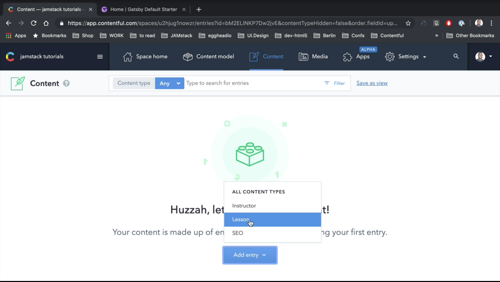

00:00 First, run `npx gatsby new` and give it the name of the website.

```
npx gatsby new jamstacktutorials
```

Now let's `cd` to this directory.

```
cd jamstacktutorials
```

Let's run `npm run develop`.

```
npm run develop
```

If we click on this link, you can see this is the "Hello, World" example provided by Gatsby.


00:31 Now let's add some Contentful dependency to it.

We'll stop our server, and we'll install the `gatsby-source-contentful` plugin.

```
npm i gatsby-source-contentful
```

Now let's open our project in a text editor. We need to go to the `gatsby-config.js` and add our new plugin in there.

01:08 We will need to provide two options -- the `spaceId` and the `accessToken`. To get this, we need to go to Contentful and Settings, API Keys. We will click on the first entry here, copy the `spaceId` and copy the Delivery `accessToken`.

01:45 This is a read-only Delivery `accessToken`. We paste it in here.

```js
      resolve: `gatsby-source-contentful`,
      options: {
        spaceId: `u2hjug1nowzr`,
        accessToken: `sJJaBCxUdA4BFqtfR_f5y4m9lvmyOHa3siR8iEETKEc`,
      }
```

01:55 This is done from the Gatsby side. We need to add some content to the website. To do that, we can go to Content, click on `Add entry`.



02:05 We'll add our first lesson. It will be called `"WTF is JAMstack."` I would paste some text in the body.

02:26 Now let's create an instructor and link it to this lesson. Our instructor name is `Mr Jam`. The website will be `https://learnjamstack.com`.

02:48 For the avatar, we need to create an asset and link it.


Now we can publish the asset and publish our lesson. Also, we can add an image to our lesson. We publish the asset.

03:43 Finally, we can create a new reference for SEO and link it. The title will be the same. We add in some description and some keywords. We publish that, and finally, we publish our entire lesson.

04:13 Let's go back to our command line. Let's run `npm run develop`.

```
npm run develop
```
To test if this works, we can go to the GraphQL server that's provided by Gatsby.

04:28 Then here, we go to docs, query. We look for some Contentful-related nodes. As you can see here, we have all Contentful content types and Contentful lessons.

04:44 Here we can simply query for all lessons. Inside of the node, we can get all the fields that we have, so let's get titles.


As you can see here, this is the title of our lesson.


