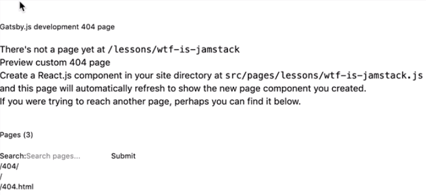

00:00 Here, I have my Gatsby website, and it's listing all the lessons that are coming from Contentful.


If we click in one of the lessons, you can see here, Gatsby is giving us a 404 page. That's because we need to create a page for every lesson to show its details.



00:20 To do that, we need to go to the `gatsby-node.js` and write some code here to create the pages. First, we need to export a `createPages` function. We can then extract the `createPage` from the actions object. To be able to create a page, we need a path to a template, which is basically a React component.

```js
exports.createPages = ({ graphql, actions }) => {
  const { createPage } = actions
  const lessonTemplate = path.resolve(`src/templates/lesson.js`)
```

00:50 We will create the `lesson.js` later.

Let's import path in here. Now, we can use GraphQL to query the Gatsby data for all the Contentful lessons.

```js
const path = require(`path`)

exports.createPages = ({ graphql, actions }) => {
  const { createPage } = actions
  const lessonTemplate = path.resolve(`src/templates/lesson.js`)
  const instructorTemplate = path.resolve(`src/templates/instructor.js`)
  return graphql(`
    {
      allContentfulLesson {
        edges {
          node {
            slug
          }
        }
      }
      allContentfulInstructor {
        edges {
          node {
            slug
          }
        }
      }
    }
```

01:07 The GraphQL function returns a promise that will contain our `result`, and inside of the result, we need to check for `errors`. If so, we `throw result.error`.

```js
`).then(result => {
  if (result.errors) {
    throw result.errors
  }
```

Otherwise, we can create our pages. To do that, we need to loop through all the edges and create a page for every lesson.

01:33 The `createPage` will accept the `path` the `component`, and a `context` for additional data.

```js
result.data.allContentfulLesson.edges.forEach(edge => {
  createPage({
    path: `/lessons/${edge.node.slug}`,
    component: lessonTemplate,
    context: {
      slug: edge.node.slug,
    },
  })
})
```

Let's save this and create our lesson template. Let's go to `src` and create a new folder. Call it `templates`. Inside of `templates`, we need to create a file called `lesson.js`.

01:53 Let's do some imports first. We need `React`, we need `graphql` from `gatsby`, we need the `Layout` component, and the `SEO` component.

```js
import React from "react"
import { graphql } from "gatsby"
import Layout from "../components/layout"
import SEO from "../components/seo"
```

Before we render anything, we need to get some additional data for the lesson detail.

02:09 We need to export a GraphQL query. This will get the lesson query and use the slug that we passed in the component context when you create the page, and get all the data that we need.

```js
export const query = graphql`
  query lessonQuery($slug: String!) {
    contentfulLesson(slug: { eq: $slug }) {
      title
      body {
        json
      }
      seo {
        title
        description
      }
    }
  }
`
```

Once the query is successful, we will get this `data` object that has all the data, so we can fill in our components.

```js
function Lesson({ data }) {
  return (
    <Layout>
      <SEO
        title={data.contentfulLesson.seo.title}
        description={data.contentfulLesson.seo.description}
      />
      <div className="lesson__details">
        <h2 className="text-4xl">{data.contentfulLesson.title}</h2>
        {documentToReactComponents(data.contentfulLesson.body.json, {
          renderNode: {
            [BLOCKS.HEADING_2]: (node, children) => (
              <h2 className="text-4xl">{children}</h2>
            ),
            [BLOCKS.EMBEDDED_ASSET]: (node, children) => (
              
            ),
          },
        })}
      </div>
    </Layout>
  )
}
```

02:41 Finally, let's export the `Lesson` component.

```js
export default Lesson
```

Let's hit save, and we need to restart our server.

```bash
npm run develop
```

Now, if we refresh, go to the one of the lessons, and scroll down, you can see here the title of our lesson. If we check the second one, indeed, we can see its title.


