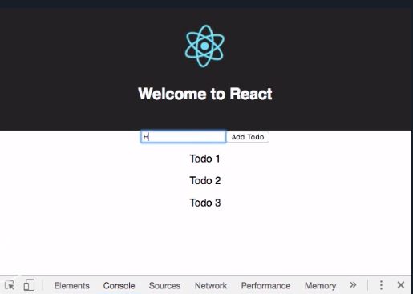
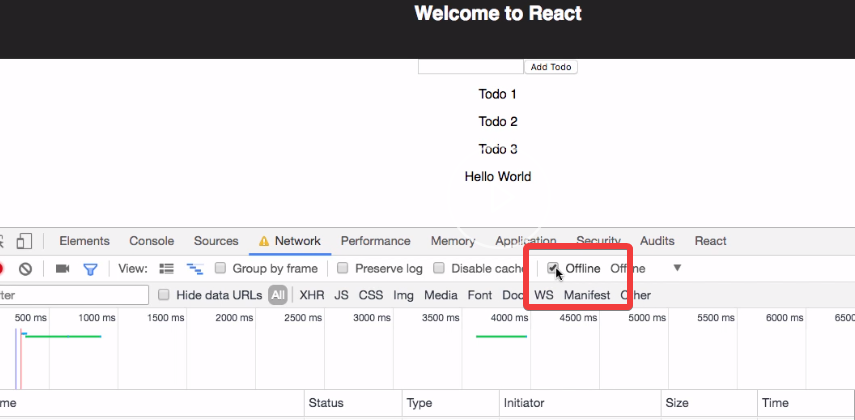
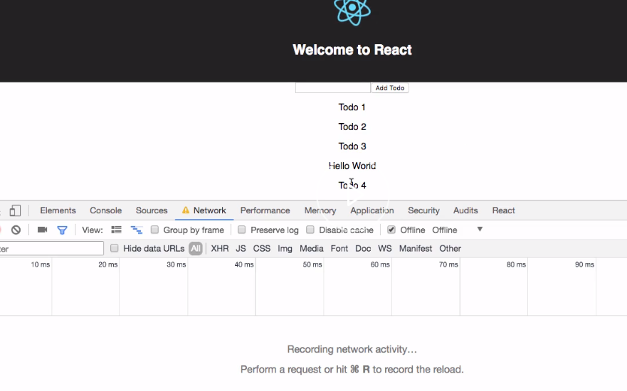
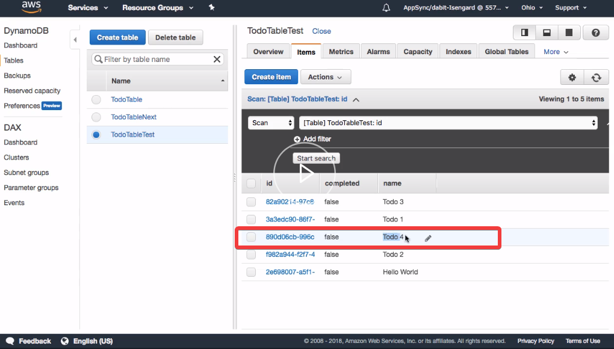

We'd like to add an optimistic response to our application. An optimistic response will allow our UI to update instantly when a new mutation is created, without waiting for the round trip to and from the server.

To get started, we'll go ahead and install a new package, `uuid`. `uuid` will allow us to create randomly generated IDs. 

We'll update our imports. We'll `import` the `compose` high-order component from `react-apollo` as well as `uuid`.

#### App.js
```javascript
import { graphql, compose } from 'react-apollo'
import uuidV4 from 'uuid/V4'
```

`uuid` has multiple algorithms. We'll use `V4` which will just generate a completely random ID. 

We'll rename the name of our mutation to `mutation`, because later on, we're going to be using the `createTodo` reference, and we don't want to have a naming collision.

```javascript
const mutation = gql`
  mutation createTodo($name: String!, $completed: Boolean!) {
    createTodo(input: {
      name: $name
      completed: $completed
    }) {
       id
    }
  }
`
```

We'll be referencing this mutation from our optimistic response, so let's go ahead and return also the `name` and the `completed` values from the mutation. 

```javascript
const mutation = gql`
  mutation createTodo($name: String!, $completed: Boolean!) {
    createTodo(input: {
      name: $name
      completed: $completed
    }) {
      name
      completed
      id
    }
  }
`
```

Let's go ahead and recreate the `listTodos` GraphQL query.

`listTodos` will return an `items` array containing the `id`, the `name` and the `completed` values for every todo in the array.

```javascript
const query = gql`
  query listTodos {
    listTodos {
      items {
        id
        name
        completed
      }
    }
  }
`
```

 We'll update the `addTodo` class method to add an `id` property to the `todo` that's being created using `uuidV4`.

 ```javascript
 addTodo = () => {
    if (this.state.todo === '') return
    const todo = {
      name: this.state.todo,
      completed: false,
      id: uuidV4()
    }
    this.props.addTodo(todo)
    this.setState({ todo: '' })
  }
 ```

We'll update the `export default`. Instead of exporting the `graphql` high-order component, we're going to export the `compose` high-order component, allowing us to `compose` multiple `graphql` operations.

```javascript
export default compose(
  graphql(createTodo, {
    props: props => ({
      addTodo: todo => {
          props.mutate({ variables: todo })
      }  
    })
  })
)(App)
```

Now, we'll add another `graphql` operation to actually hit the `query`. `query` will contain an `options` object with the `fetchPolicy` of `cache-and-network`. 

```javascript
export default compose(
  graphql(query, {
    options: {
      fetchPolicy: 'cache-and-network'
    }
  }),
```

For the `props`, we'll return a todos array.

For the `todos` array, we'll first check to see if `props.data.listTodos` exists. If it does, we'll return `props.data.listTodos.items`. If not, we'll just return an empty array. 

```javascript
export default compose(
  graphql(query, {
    options: {
      fetchPolicy: 'cache-and-network'
    },
    props: props => ({
      todos: props.data.listTodos ? props.data.listTodos.items : []
    })
  }),
```

Next we'll update the second `graphql` operation, replacing `createTodo` with our updated name `mutation`.

```javascript
graphql(mutation, {
    props: props => ({
        addTodo: todo => {
          props.mutate({ variables: todo })
        }
    })
})
```

We'll update the `props.mutate` properties, adding two more properties, `optimisticResponse` as well as an `update` function. 

```javascript
graphql(mutation, {
    props: props => ({
        addTodo: todo => {
          props.mutate({ 
                variables: todo 
                optimisticResponse: {},
                update: ()
            })
        }
    })
})
```

The `optimisticResponse` will contain two properties, `_typename` and `createTodo`. `createTodo` will take in a `todo` that's being passed in from the mutation as well as the _typename of `Todo`.

```javascript
optimisticResponse: {
    __typename: 'Mutation',
    createTodo: { ...todo,  __typename: 'Todo' }
}
```

The `update` function takes two arguments, the `proxy` as well as the mutation. 

Here, we'll go ahead and destructure the `createTodo`. We'll go ahead and create a new variable called `data` and setting it to `proxy.readQuery` and passing in the `query`.

```javascript
update: (proxy, { data: { createTodo } }) => {
    const data = proxy.readQuery({ query: query);
```

Now we can call `data.listTodos.items.push`, passing in the new mutation. 

```javascript
update: (proxy, { data: { createTodo } }) => {
    const data = proxy.readQuery({ query: query);
    data.listTodos.items.push(createTodo);
```

Finally, we'll call `proxy.writeQuery`, passing in the `query` and the `data`. 

```javascript
update: (proxy, { data: { createTodo } }) => {
    const data = proxy.readQuery({ query: query });
    data.listTodos.items.push(createTodo);
    proxy.writeQuery({ query, data });
    }
```

We'll update our UI, mapping over all of the `todos` showing the todo `name`.

```javascript
 {
    this.props.todos.map((todo, index) => (
        <p key={index}>{todo.name}</p>
    ))
}
```

Let's go ahead and run the app by running `npm start`. 

As we add new items, they show up instantly to our UI without any delay. 



Let's take a look at the offline functionality.

To demonstrate this, let's open the network tab, enable offline mode and clear out any existing network activity. 



We'll add a new todo, see the todo show up in our UI, but notice that no network activity has been recorded.



If we go to our database and click refresh, we see that the new todo has indeed not been added to our database. When we go back to the network tab and disable offline mode, we see that the GraphQL operation has been executed.


When we go back to our database and click refresh, we see that the new todo has been added.

