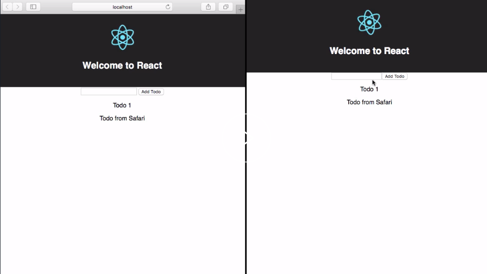

Subscriptions allow us to subscribe to changes within our data. When data changes, the subscription fires and the new data is passed down to our application.

To get started we'll first need to define our subscription. Our `subscription` will be the `onCreateTodo` subscription that was created within our AWS AppSync console.

`onCreateTodo` will return an `id`, `name`, and `completed` property. 

#### App.js

```javascript
const subscription = gql`
  subscription onCreateTodo {
    onCreateTodo {
      id
      name
      completed
    }
  }
`
```

Next we'll go to our `graphql` `query` operation, updating the `props` that are being passed down to the component. 

We'll add a new prop called `subscribeToNewTodos`. `subscribeToNewTodos` will be a function that calls `props.data.subscribeToMore`.

```javascript
 graphql(query, {
    options: {
      fetchPolicy: 'cache-and-network'
    },
    props: props => ({
      todos: props.data.listTodos ? props.data.listTodos.items : [],
      subscribeToNewTodos: params => {    
        props.data.subscribeToMore()
      }
    })
  })
```

`subscribeToMore` takes two properties -- a `document` and an `updateQuery`. The `document` will be the `subscription` that we created and the `updateQuery` will be a function. 

```javascript
props: props => ({
    todos: props.data.listTodos ? props.data.listTodos.items : [],
      subscribeToNewTodos: params => {    
        props.data.subscribeToMore({
           document: subscription,
           updateQuery: ()  => ({

           })
        })
    }
})

```

`updateQuery` takes two arguments -- the previous data as well as the `subscriptionData`. We'll go ahead and de-structure the `onCreateTodo` from the `subscriptionData`.

```javascript
 updateQuery: (prev, { subscriptionData: { data : { onCreateTodo } } }) => ({

 })    
```

From `updateQuery` we'll return the previous data and we'll update the `listTodos` data with a new `items` array. 

```javascript
updateQuery: (prev, { subscriptionData: { data : { onCreateTodo } } }) => ({
    ...prev,
    listTodos: {
        ...prev.listTods,
        items:
    }
 })  
```

In the `items` array, we'll include all of the previous `listTodo` items filtered by `id` to make sure there's no duplicates. We'll also pass in the new `onCreateTodo`.

```javascript
updateQuery: (prev, { subscriptionData: { data : { onCreateTodo } } }) => ({
    ...prev,
    listTodos: {
        ...prev.listTods,
        items:[
            ...prev.listTodos.items.filter(todo => todo.id !== onCreateTodo.id),
            onCreateTodo
        ]
    }
 })  
```

Finally, we'll go back into our definition and create a `componentDidMount` life-cycle method that will call `this.props.subscribeToNewTodos`. 

```javascript
class App extends Component {
  state = {
    todo: ''
  }
  componentDidMount() {
    this.props.subscribeToNewTodos()
  }
```

Next we'll go ahead and run the app, running `npm start` to see how all of this is working.

To check that the subscriptions are working we'll go ahead and open up two separate browsers. When we create a new todo in one browser, the subscription is triggered and the new todo shows up in the other browser.

