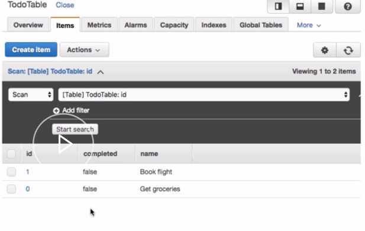
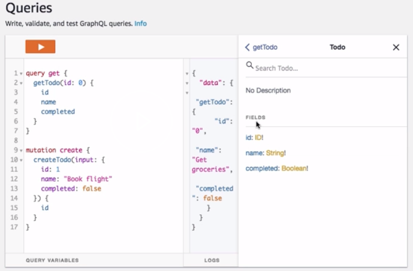
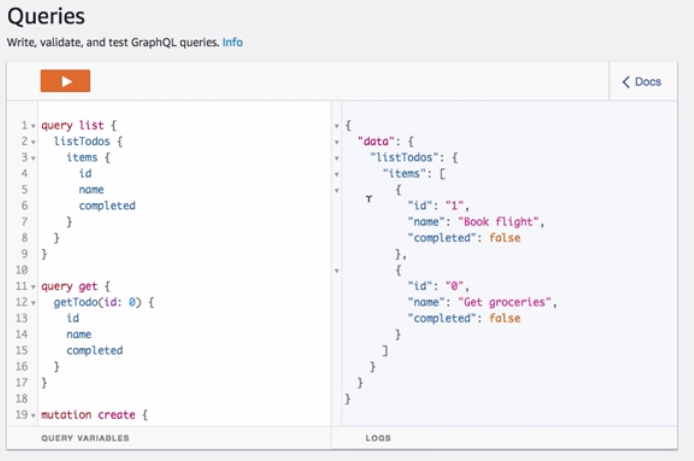

To create a query, we first need to make sure that there's something in our database to query against, therefore we'll create a mutation first. We'll create a `mutation` of `createTodo`, passing in an `id`, a `name`, and a `completed` value. 

```javascript
mutation create {
    createTodo(input: {
        id: 0
        name: "Get groceries"
        completed: false
    }) {
        id
    }
}
```

We'll go ahead and create a second todo so we'll have multiple items to query against.

```javascript
mutation create {
    createTodo(input: {
        id: 1
        name: "Book flight"
        completed: false
    }) {
        id
    }
}
```

Now that our mutations have been created, let's go ahead and take a look at our table to view the two items that are available. 



Here we see the todos with the `id`, `completed`, and `name` properties. 

Next let's go back to our AppSync console, look at the schema, and see the queries that are available to us. Here we see that we can call `fetchTodo`, `getTodo`, and `listTodos`.

```javascript
type Query {
    fetchTodo(id: ID): Todo
    getTodo(id: ID): Todo
    listTodos(first: Int, after: String): TodoConnection
}
```

Now we'll go back to our graphical editor and perform a `getTodo` query. 

`getTodo` takes an `id` and from `getTodo` we'll return the `id`, the `name`, and the `completed` values. 

```javascript
query get {
    getTodo(id: 0){
        id
        name
        completed
    }
}
```

We can also do introspection into the schema and see the exact type that `getTodo` returns.



Next let's query for a list. To do so we'll create a `list` query, calling the `listTodos` query. 

`listTodos` will return an `items` array, and within the `items` array we'll return an `id`, a `name`, and a `completed` Boolean for every `item` in the todo `list`. 

```javascript
query list {
    listTodos {
        items {
            id
            name
            completed
        }
    }
}
```

Here we see that we have an `items` array with two items returned from our database.

