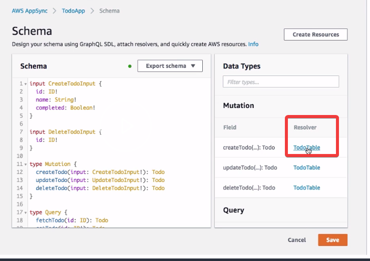
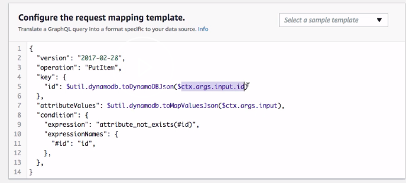
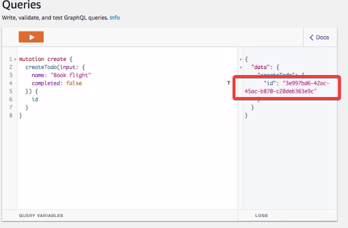
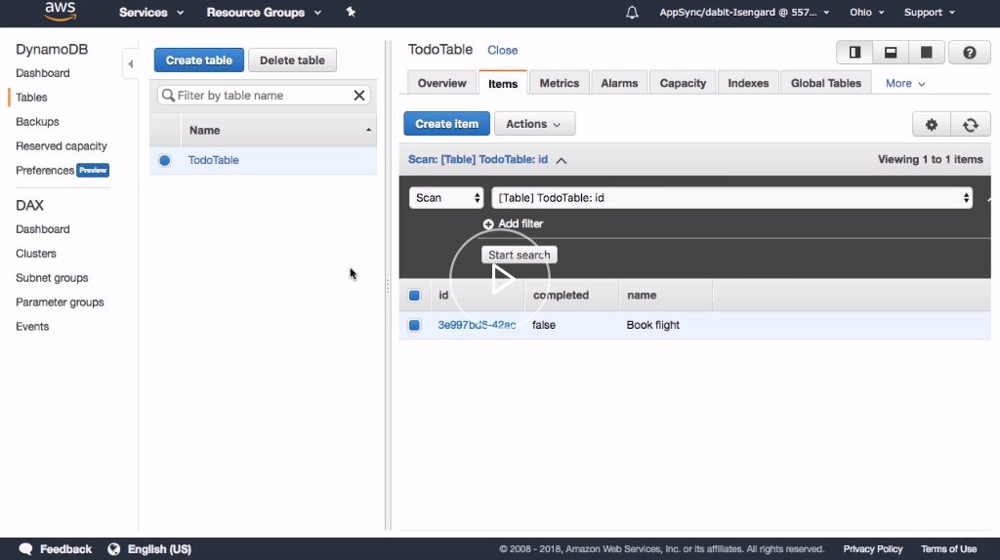

In our `TodoApp`, we currently have to hard-code and pass in an `id` for our mutation to successfully execute. 

If we take a look at our schema and we look at the `createTodo` mutation, we'll see that the createTodo input has an `id` that is required.

```javascript
input: CreateTodoInput {
    id: ID!
    name: String!
    completed: Boolean!
}
```

This means that from our client, if we would like to execute this `createTodo` mutation, we'll have to pass in the `id` ourselves. While this is OK in some cases, we'd like to have the option of auto-generating this `id` on the server.

We can do this by updating the `createTodo` resolver. 

Most GraphQL types are backed by a function called a resolver, which declare the relationship between the GraphQL schema type and the data source. AppSync is no different. We have the availability to update and have full control over our resolvers.

On the right-hand side of our dashboard, under `Data Types`, we can scroll down and see where resolvers were already created for us. Let's scroll down, find the `createTodo` resolver, and open it in our dashboard.



We have three different areas within our resolver. One defines the data source. One defines the request mapping template. One defines the response mapping template. 

In our case, we'd like to update our request mapping template in order to auto-generate an id and send it to our database.

The field that we'd like to update is the id field. 



Right now, we're passing in the `$ctx.args.input.id` . Instead of passing in `$ctx.args.input.id`, we'll replace this with `util.autoId()`. This will automatically generate a unique ID on our server.

```javascript
"key": {
    "id": $util.dynamodb.toDynamoDBJson($util.autoId())
}
```

After that's been updated, we can go ahead and click "Save." Next, we'll go to our schema and remove the `id` property of our `CreateTodo` input.

```javascript
input: CreateTodoInput {
    name: String!
    completed: Boolean!
}
```

Now that our schema's been updated and saved, let's go to queries and create a new `CreateTodo` mutation. Here, we'll call `createTodo` with an `input`. We'll only have to pass in now the `name` and the `completed` values.

If the mutation's successful, we'll still return the `id`. 

```javascript
mutation create {
    createTodo(input: {
        name: "Book Flight"
        completed: false
    }) {
        id
    }
}
```

We execute the mutation. You see that an `id` was auto-generated for us, without us having to pass it in manually.



Next, let's go to Data Sources and view the `TodoTable`. Here, we can see our created `Todo`. We have our `id` that's been automatically generated for us.



AppSync resolvers are written in something called VTL, or Velocity Templating Language. To learn more about VTL and mapping templates in general, you can go to the AWS AppSync documentation and click on `Resources`

Then click on `AWS AppSync Developer Guide` In the left-hand menu, click on `Resolver Mapping Template Reference`

