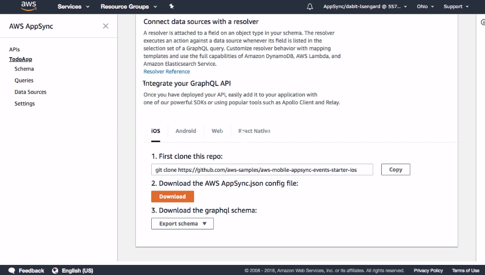
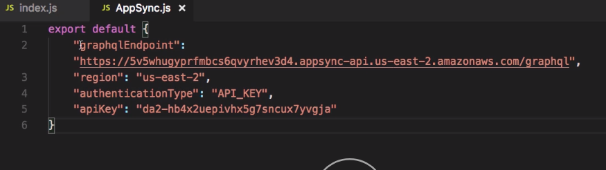

To get started, we'll first create a new React app using `create-react-app`. 

Terminal
```bash
create-react-app react-appsync-app
```

Once the app's been created, we'll go ahead and change into the new directory.

From within the new directory, we'll go ahead and install our dependencies. We're going to need to install `aws-appsync`, `aws-appsync-react`, and `react-apollo`.

```bash
yarn add aws-appsync aws-appsync-react react-appollo
```

Now that our dependencies are created let's go ahead and open up `index.js`. 

In `index.js`, we'll go ahead and import `Client` from  `aws-appsync`, `ApolloProvider` from `react-apollo`, and `Rehydrated` from `aws-appsync-react`.

#### index.js
```javascript
import Client from 'aws-appsync'
import { ApolloProvider } from 'react-apollo'
import { Rehydrated } from 'aws-appsync-react'
```

Next, we're going to need to have the configuration for our AWS AppSync API. 

To get that, we can go to the AWS AppSync Console and download it. In the main dashboard of your AppSync API, scroll down to the bottom of the view.



Here you'll see the Integrate Your GraphQL API section. We can click on Web and download the `AWS AppSync.js` configuration file. Next, we'll move the configuration file into our `src` directory.

Now in `index.js`, we'll go ahead and import the `AppSync` configuration file. 

```javascript
import AppSync from './AppSync'
```

Next, let's go ahead and open `AppSync.js` and take a look at the configuration.



Here you see we have a few different property definitions. We have our `graphqlEndpoint`, our `region`, our `authenticationType`, and our `apiKey` defined.

Next, we'll go ahead and create our AppSync Client. We'll store this in a variable called `client`, and we'll call it `new Client`. 

```javascript
const client = new Client({

})
```

Here we'll specify our API `url` and our API `region`.

```javascript
const client = new Client({
  url: AppSync.graphqlEndpoint,
  region: AppSync.region,
 })
```

Next, we'll set an `auth` property. The `auth` property will give the `auth` a `type`. It will specify our `apiKey`.

```javascript
const client = new Client({
  url: AppSync.graphqlEndpoint,
  region: AppSync.region,
  auth: {
    type: AppSync.authenticationType,
    apiKey: AppSync.apiKey
  }
})
```

Finally, we'll create a new React component called `WithProvider`. Here we'll create a new `ApolloProvider` passing in our newly-created `client`.

```javascript
const WithProvider = () => (
  <ApolloProvider client={client}>
  </ApolloProvider>
)
```

Next, we'll use the `Rehydrated` component. The `Rehydrated` component comes from 'aws-appsync-react'. Because AWS AppSync works offline, we need to check the AsyncStorage, or the local storage if we're on the Web to make sure we pull down the most current cache. 

```javascript
const WithProvider = () => (
  <ApolloProvider client={client}>
    <Rehydrated>
    </Rehydrated>
  </ApolloProvider>
)
```
`Rehydrated` will prevent the application from being loaded until the cache has been read.

Finally, we'll pass in our `App` component. 

```javascript
const WithProvider = () => (
  <ApolloProvider client={client}>
    <Rehydrated>
      <App />
    </Rehydrated>
  </ApolloProvider>
)
```

Now instead of rendering our `App`, we'll just render the `WithProvider` component. 

```javascript
ReactDOM.render(<WithProvider />, document.getElementById('root'));
```
Now we'll run `npm start` to run our React app to make sure everything is still working correctly.