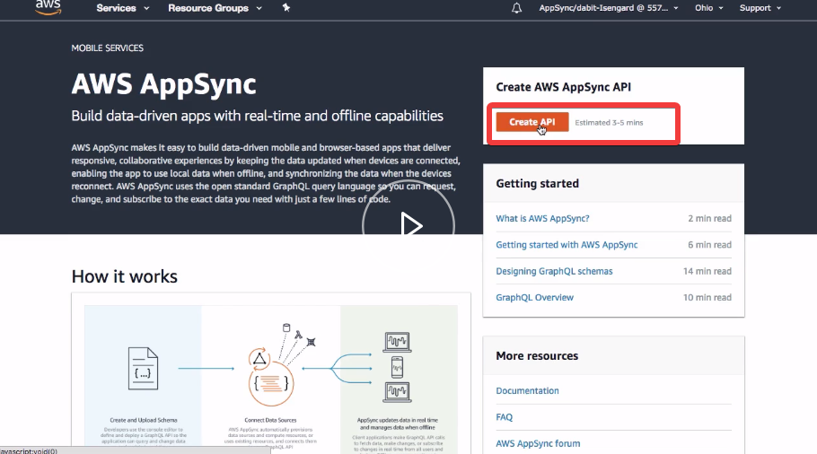
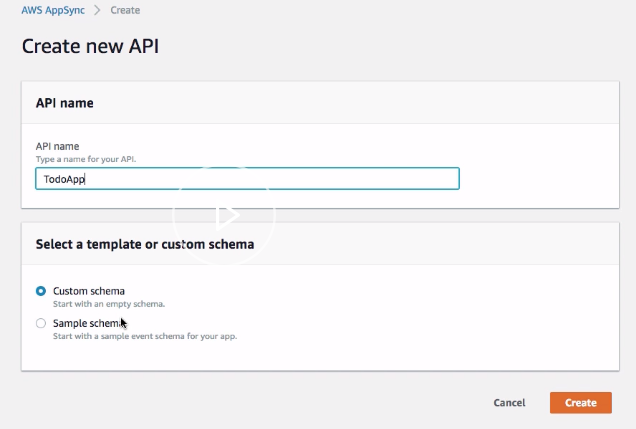
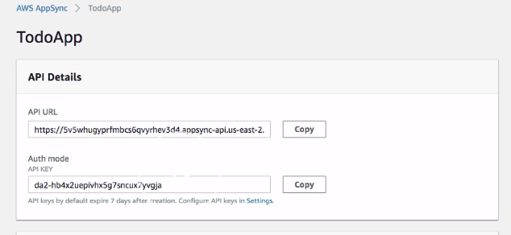
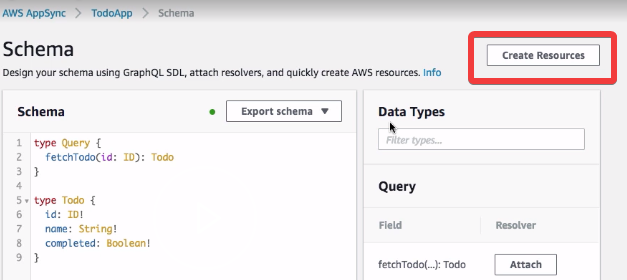
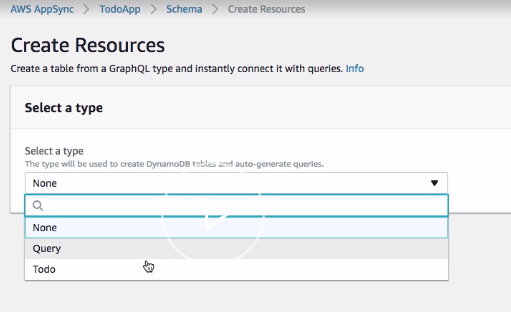
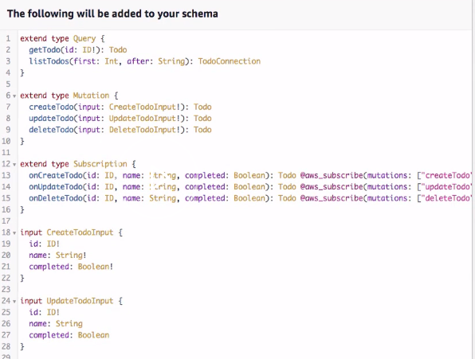
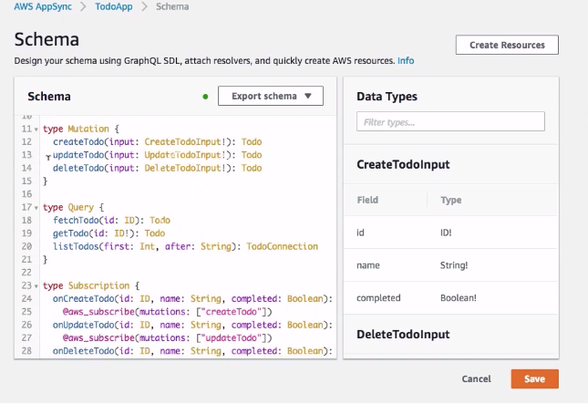
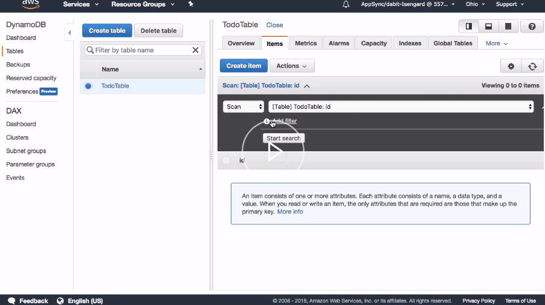

To get started, click on the orange create API button from the AWS appsync dashboard. 



Here, we can now give our API a name. I'm going to give ours a name of `TodoApp`.

We can also choose either a custom or a sample schema. The sample schema will be an autogenerated schema, and the custom schema will be a blank schema.

We'll choose custom schema because we'd like to start from scratch. Next, we will then click create. 



Now that our API has been created we're given a few details about the API.

We're given the API URL which we can use to access the API from a client-side application. We're given the default mode which is set to API key.



To give our API functionality we need to go ahead and create a schema. In our schema we'll create a `type` of `Todo`. `Todo` will have an `id` that has an `ID!` type, a `name` that has a `String!` type and a `completed` that has `Boolean!` type.

```javascript
type Todo{
    id: ID!
    name: String!
    completed: Boolean!
}
```

We'll also create a type of `Query` that has a single query called `fetchTodo`. `fetchTodo` will take an `id` and will return a `Todo`.

```javascript
type Query {
    fetchTodo(id: ID): Todo
}
```

Next, we can go ahead and click save to create our first schema. Once the schema's been created we can go ahead and click on create resources to create resources around our schema.



Here, we'll go ahead and choose the type of `Todo`. 



This will autogenerate a table name that we have as `TodoTable`, along with some additional schema that will be added to our existing schema.



We'll go ahead and scroll down and click create. Now that our resources are created, we can go ahead and scroll through our schema and take a look at the additional schema that's been added. We have queries, mutations and subscriptions that have all been added for us.



Now let's click on `Data Sources` to see the data source that was created around our schema. 


Here we see a resource called `TodoTable`. This `TodoTable` is a dynamo DB table. If we click on it we can actually go into the table view and see the table itself.

