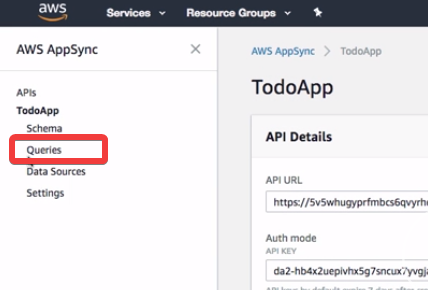
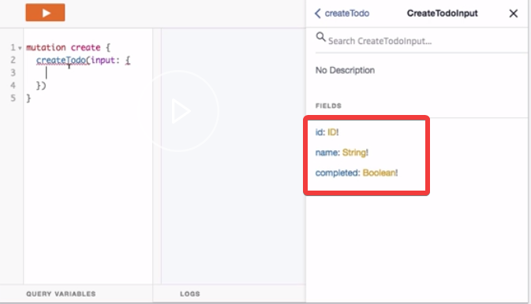
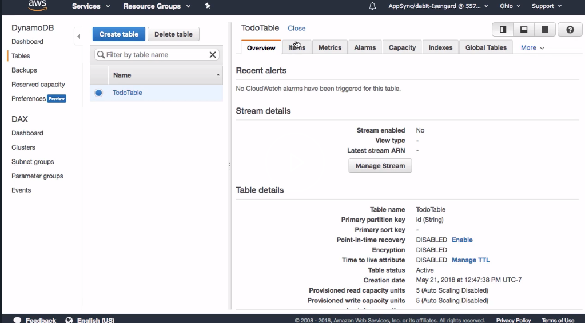
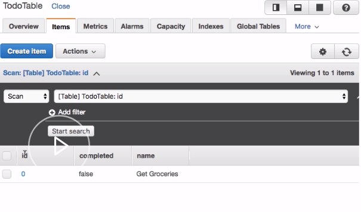
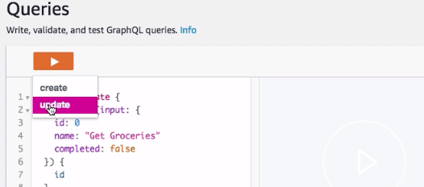
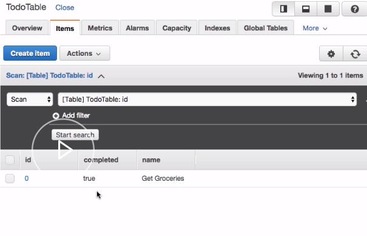
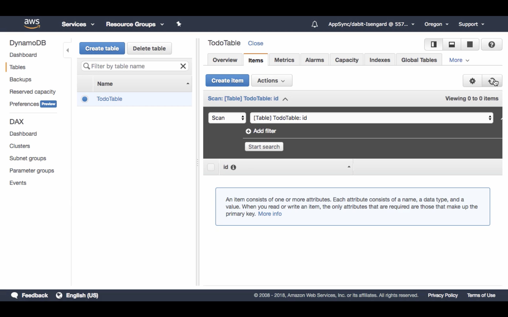

To create a mutation we'll go ahead and click on the queries link in our left-hand menu to take us to the graphical editor. Here we can execute queries and mutations.



We'll go ahead and create our first `mutation` of `createTodo`. `createTodo` will take an `input` type. 

```javascript
mutation_create {
    createTodo(input: {

    })
}
```

We can actually do introspection by clicking on docs and seeing the values that input takes.



Here we see that todo takes an `id`, a `name`, and a `completed` value. We'll set the `id` to `0`. We'll set the `name` to a string. We'll set the `completed` value to `false`.

```javascript
mutation_create {
    createTodo(input: {
        id: 0
        name: 'Get Groceries'
        completed: false
    })
}
```

If this is successful, we'll just return an `id`. 

```javascript
mutation_create {
    createTodo(input: {
        id: 0
        name: 'Get Groceries'
        completed: false
    }) {
        id
    }
}
```

Next we'll click the orange play button to create the mutation.


Now let's take a look at our `Schema` to see what mutations are available to us. Here you see that we have `createTodo`, `updateTodo`, and `deleteTodo`.

```javascript
type Mutation{
    createTodo(input: CreateTodoInput!): Todo
    updateTodo(input: UpdateTodoInput!): Todo
    deleteTodo(input: DeleteTodoInput!): Todo
}
```

 Let's go ahead and click on our `Data Sources` and view the `Todo` that we just created in our dynamo DB table.



Here we can click on `Items` and see that the `id`, the `completed` value, and the `name` are all stored in our dynamo DB table. 



Let's go back to our AWS AppSync console and perform another mutation.

Let's now update the `completed` value of the todo that we just created. To do so, we'll go ahead and create another mutation called `update`. Here we'll perform `updateTodo`.

Update will only take an `id` in a `completed` value and will return an `id` if it's successful. 

```javascript
mutation_update {
    updateTodo(input: {
        id: 0
        completed: true
    }) {
        id
    }
}
```

Now we'll go ahead and click update. 



We'll go back to our DynamoDB console and we'll refresh to see if the `completed` value has changed to `true`.



Next, let's perform a delete `todo` mutation. To do so, we'll create a new mutation called `delete`. `delete` will only take an `id` and will return an `id` if the mutation is successful.

```javascript
mutation delete{
    deleteTodo(input: {
        id: 0
    }) {
        id
    }
}
```

Now we can go back to DynamoDB, refresh the table, and see that the `todo` has been deleted.

