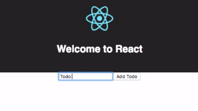
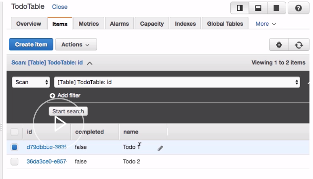

To execute mutations from our React application, we need to go ahead and import `gql` from `graphql-tag` and `graphql` higher-order component from `react-apollo`. 

#### App.js
```javascript
import gql from 'graphql-tag'
import { graphql } from 'react-apollo'
```

Next we'll go ahead and define our mutation, storing it in a variable called `createTodo`.

`createTodo` will take two arguments -- `name` and `completed` -- and return an `id`.

```javascript
const createTodo = gql`
  mutation createTodo($name: String!, $completed: Boolean!) {
    createTodo(input: {
      name: $name
      completed: $completed
    }) {
      id
    }
  }
`
```

After we define the mutation we'll scroll down to our default export. Instead of exporting the `App` component, we'll export the `graphql` higher-order component. 

We'll pass in the `App` component as the second function argument and the `createTodo` mutation as the first function argument. We'll also define the `props` configuration of the `graphql` higher-order component.

```javascript
export default graphql(createTodo, {
  props: props => ({
   
  })
})(App)
```

Here we'll pass down an `addTodo` function that takes a `todo` as an argument. `addTodo` will call `props.mutate`, passing on the `todo` as the variable.

```javascript
export default graphql(createTodo, {
  props: props => ({
    addTodo: todo => {
      props.mutate({ variables: todo })
    }
  })
})(App)
```

Now that we've defined the `addTodo` mutation, we'll go back into our component and use it. 

First we'll create some `state`, creating a `todo` property, setting it to an empty string. 

```javascript
class App extends Component {
  state = { todo: '' }
```

Next we'll define an `addTodo` class method.

In this method we'll first check to see if `this.state.todo` is equal to an empty string, and if it is, we'll `return` from the method. 

```javascript
class App extends Component {
  state = { todo: '' }
  addTodo = () => {
    if (this.state.todo === '') return
```
`addTodo` will call `this.props.addTodo`, passing in a `todo` variable we'll create in just a second.

The `todo` variable will have two properties -- `name` and `completed`. `name` will be set to `this.state.todo` and `completed` will be set to `false`. 

Next after `this.props.addTodo` has been executed, we'll call `this.setState`, resetting the value of `todo`.

```javascript
class App extends Component {
  state = { todo: '' }
  addTodo = () => {
    if (this.state.todo === '') return
    const todo = {
      name: this.state.todo,
      completed: false
    }
    this.props.addTodo(todo)
    this.setState({ todo: '' })
  }
```

Now in our UI we'll create an `input` field. The input's `onChange` function will call `this.setState`, setting the `todo` as the `e.target.value`. We'll also set the `value` of the `input` to `this.state.todo`.

```html
<input
    onChange={e => this.setState({ todo: e.target.value })}
    value={this.state.todo}
/>
```

Next we'll create a `button` and set the `onClick` handler to `this.addTodo`. 

```html
<button onClick={this.addTodo}>
    Add Todo
</button>
```

Now we're ready to test it all out. We'll go to our terminal and run `npm start`. 

To test it out, we'll create a couple of todos.



Now we'll jump back into our AppSync API dashboard, click on `Data Sources`, and open the `todoTable`. In the `todoTable` we should now see the two items that we just created.

