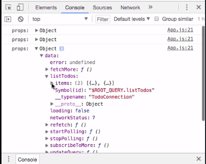
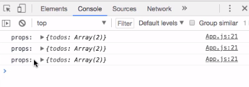
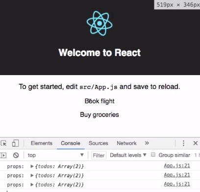

To get started executing queries from our React application we first need to make sure we have some data available within our API. To do so we'll go back into our AWS AppSync console, open our queries editor, and create a couple of mutations.

```javascript
mutation create {
    createTodo(input: {
        name: "Buy groceries"
        completed: false
    }){
        id
    }
}
mutation create {
    createTodo(input: {
        name: "Book flight"
        completed: false
    }){
        id
    }
}

```

Now we can jump back into our code. We'll go into the `src` directory and we'll open `App.js`. 

To execute a query we're going to need to install the `graphql-tag` package. 

#### Terminal
```bash
yarn add graphql-tag
```

After `graphql-tag` has been installed we'll jump into `App.js` and begin writing some code.

First we'll import `gql` from `graphql-tag`. We'll also import the `graphql` higher-order component from `react-apollo`.

#### App.js
```javascript
import gql from 'graphql-tag'
import { graphql } from 'react-apollo'
```

The query that we're going to be executing is list todos. We'll create a variable called `query` to store our query. We define the list of these queries returning the `listTodos` `items`.

```javascript
const query = gql`
  query listTodos {
    listTodos {
      items {
        id
        name
        completed
      }
    }
  }
`
```

Next we'll scroll down to our `export default`. Instead of exporting the `App` component, we'd like to export the `graphql` higher order component, passing in the `query` as the first function argument and `App` as the second function argument.

```javascript
export default graphql(query)(App)
```

`graphql` takes a second argument, allowing us to more precisely define how our query is executed. Here we'll create an `options` object and we'll set a `fetchPolicy` of `cache-and-network`. This means that when the application loads, it will first pull the data from our cache and then retrieve the data from the network.

```javascript
export default graphql(query, {
  options: {
    fetchPolicy: 'cache-and-network'
  }
})(App)
```

Now our data should be available within our component as props. To double-check that this is working, let's go ahead and `console.log` the `this.props` for this component.

```javascript
class App extends Component {
  render() {
    console.log('props: ', this.props)
    ....
```

We'll go ahead and start the app and open the console. Here you see we have a `props` object with a `data` object holding a `listTodos` object. `listTodos` has an `items` array with two items.



We can more precisely define how our props are passed down. To do so we'll add a second property to our `graphql` configuration called `props`. `props` gives us all of the `props` and returns an object. Within the object we can define keys that will be passed down as props. In our app it may make sense just to return an array of `todos`, so we'll set a prop called `todos`.

Now we can reference the object, passing on the `props.data.listTodos.items`. 

```javascript
export default graphql(query, {
  options: {
    fetchPolicy: 'cache-and-network'
  },
  props: props => ({
      todos: props.data.listTodos.items
  })
})(App)
```

When our app refreshes, we see that we have a `todos` prop with two `todos` in an array.



Let's render these `todos` within our UI. To do so, we'll call `this.props.todos.map`, returning the `todo.name`. 

```javascript
{
    this.props.todos.map((todo, index) => (
        <p key={index}>{todo.name}</p>
    ))
}
```

Now when we save, we see that the todos are rendered to our UI.

