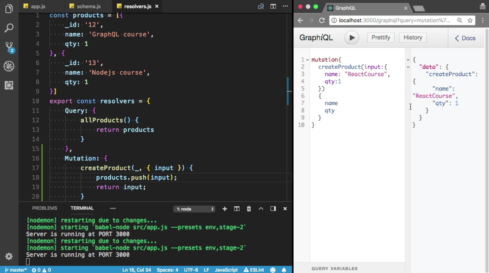
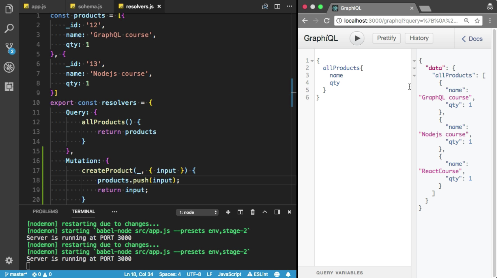
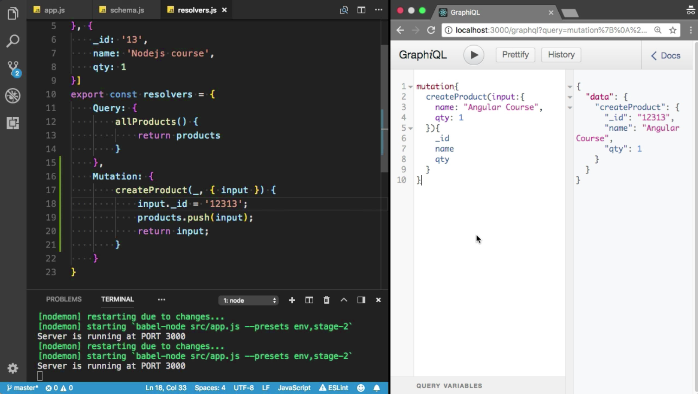
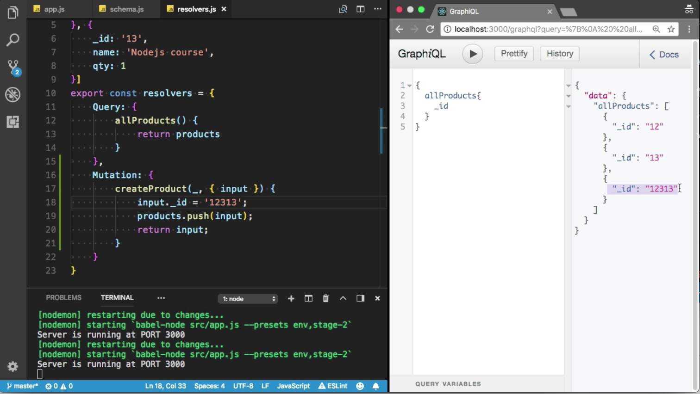

Instructor: 00:00 You can define mutation to add or update the data in GraphQL. `type` `Mutation`. I am going to create a new `type`, which is `Mutation`. The first `Mutation` is `createProduct`. It will accept the `input`. This time, the `return` `type` is `ProductInput`.

00:20 It is going to `return` the `Product`. The `return` `type` is `Product`. We did not define the `ProductInput`. Let's create the `ProductInput`. Make sure you use the `input` keyword this time.

00:34 I want to get the `name`. The `type` of the `name` is `String!`. I also want to get the `qty`, and the `type` of the `qty` is `Int`. 

#### shcema.js
```javascript
const typeDefs = `
type Product {
    _id : ID
    name: String!
    qty: Int
}
 type Query {
     allProducts: [Product]
 }
 input ProductInput{
    name: String!
    qty: Int
 }
 type Mutation {
     createProduct(input: ProductInput) : Product
 }
`
```

Let's try to create the Mutation here. `Mutation`, and `createProduct`.

00:52 The second argument is `args`. I am going to de-structure into the `input` because we will send the `input` from the GraphQL. I am going to add new product inside the products id.

01:10 I am going to call `products.push`. Here, I need to provide the `input`. I am going to `return` the same `input` here in the response. 

#### resolver.js
```javascript
export const resolvers = {
    Query: {
        allProducts() {
            return products
        }
    },
    Mutation: {
        createProduct(_, { input }) {
            products.push(input);
            return input;
        }
    }
}
```

Let's try to test it. Let me check the docs. Did you see the mutation?

01:27 Here, we have `createProduct` `mutation`. It will `accept` the `Productinput`. I need to provide these two values, `name` and `qty`. Let's perform the mutation. I am going to create the new `mutation`. The name of the `mutation` is `createProduct`. It will accept the `input`. We must need to provide the name here.

01:46 Let's say, this time, the `ReactCourse`, and we must need to provide `qty`. I also want to see the `_id`. We did not define the ID here. I also want to see the `name` and `qty` in the `response`. Cool.



02:05 Now, let's try to fetch all the products. I want to see the name and qty. Incredible. We have three products. Did you see that? Here, we have `ReactCourse`. 



I did not add the _id. If you want to add the _id, you can also add random _id.

02:26 I am going to add, here, let's say, invalid, `12313` random `_id`. I am going to use this `_id` for only testing purpose. 

```javascript
export const resolvers = {
    Query: {
        allProducts() {
            return products
        }
    },
    Mutation: {
        createProduct(_, { input }) {
            input._id = '12313';
            products.push(input);
            return input;
        }
    }
}
```
Let's create the `mutation`, `createProduct`. The name is `Angular Course`. I am going to define the `qty`. I also want to see the `_id` in the response, `name` and `qty`.



02:52 Let's try to do that. Now, I am going to fetch all the products. I also want to see the _id. Boom. Here, we have a new product, which is 12313.

