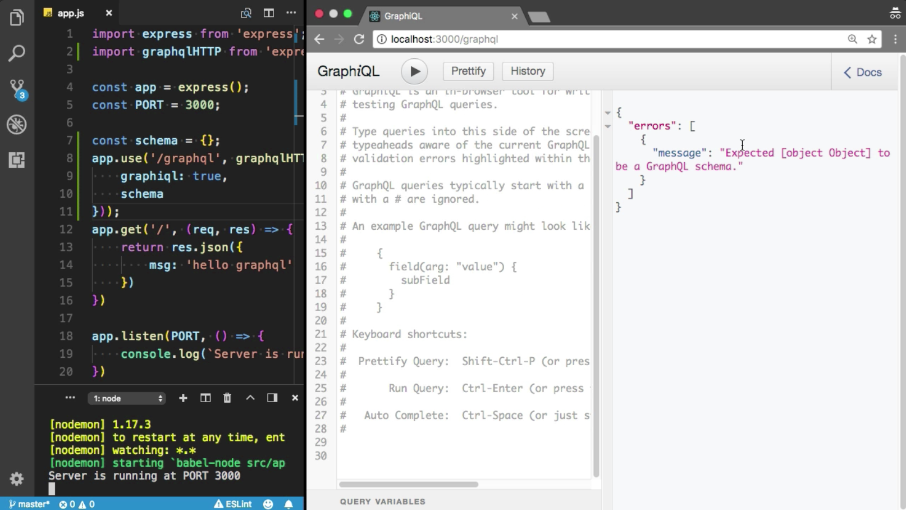

Instructor: 00:00 We need to create GraphQL HTTP server with Express.js. We need to install another package, `express-graphql`, and `graphql-tools`. 

```bash
$ npm i -s express-graphql graphql-tools
```

Now, we need to `import` the `express-graphql`. I am going to name it `graphqlHTTP from 'express-graphql'`.

#### app.js
```javascript
import express from 'express';
import graphqlHTTP from 'express-graphql';
```

00:19 Now, we need to create GraphQL endpoint. I am going to use `app.use`. The endpoint should be `graphql`. Here, we need to provide some options. `graphql` should be `true`.

00:33 I also need to provide the `schema`. We don't have schema yet. 

```javascript
const schema = {};
app.use('/graphql', graphqlHTTP({
    graphiql: true,
    schema
}));
```

Let's try to enter the schema object. I am going to start the application. Oops, I've got the error. "Cannot find module GraphQL." We did not install GraphQL.

```bash
$ nmp i -s graphql
```

00:55 Do it again, npm start. 

```bash 
$ npm start 
```

Cool. Server is running. Now, I am going to the 'localhost:3000/graphql'. Cool. I've got the GraphiQL. This is a GraphiQL. Facebook has created this tool to test the GraphQL endpoints, queries, and mutations.

01:16 Welcome to the GraphicQL...errors, expected object to be GraphQL schema, because we did not provide the valid schema object.


