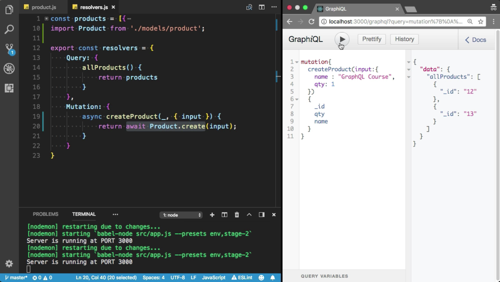
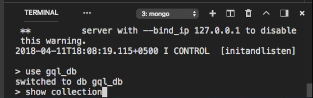
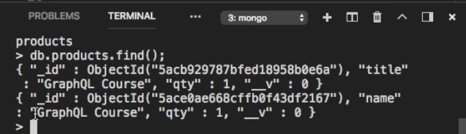

Instructor: 00:00 First of all, we need to import the product model from the models directly. 

#### resolver.js
```javascript
import Product from './models/product';
```

Now, I can use this product model inside the create product mutation. Get it off this stuff.

00:11 I am going to use `async/await`, this resolver can also return a promise. Now, you can use `await` expression inside the `createProduct` method. It will return a promise. I am going to use `create` method from the `Product` model to create new `Product`. I need to provide the `input` here, which is our `input` `object`.

00:33 When promise will be resolved, it will return a new Product. 

```javascript
export const resolvers = {
    Query: {
        allProducts() {
            return products
        }
    },
    Mutation: {
        async createProduct(_, { input }) {
            return await Product.create(input);
        }
    }
}
```

Let's try to test it. I am going to refresh that. Here, we have mutation. We have create product mutation. Let me execute the create product mutation. It will accept the input.

00:50 I am going to provide the name, GraphQL course. You also need to provide the qty. I am going to choose one. I want to see ID and qty. I also want to see the name in the response.



01:07 Cool. We have successfully created the product in the MongoDB. 


Let me check that. I am going to run the `mongo` command. 

```bash
$ mongo
```

Now, I can execute the query. The name of the database is `gql_db`. I am going to run the show collection.



01:27 Cool. We have products. Now, I need to find all the products. Here, we have our new GraphQL course product.

