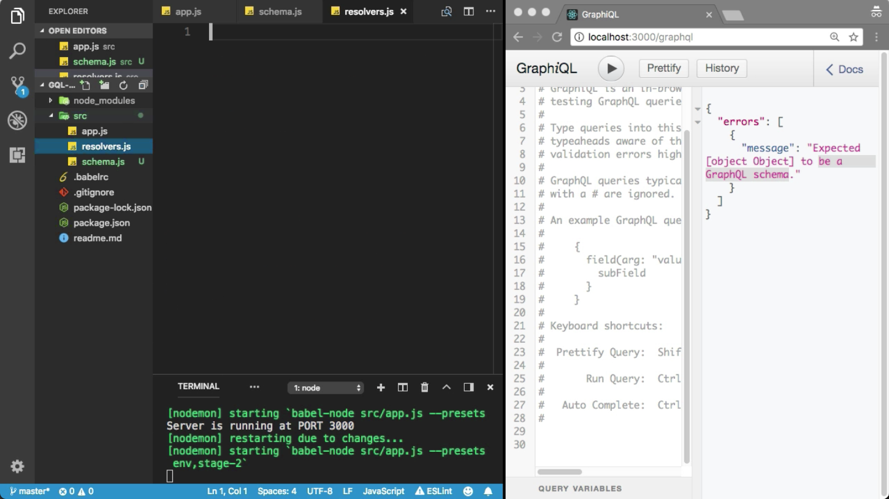
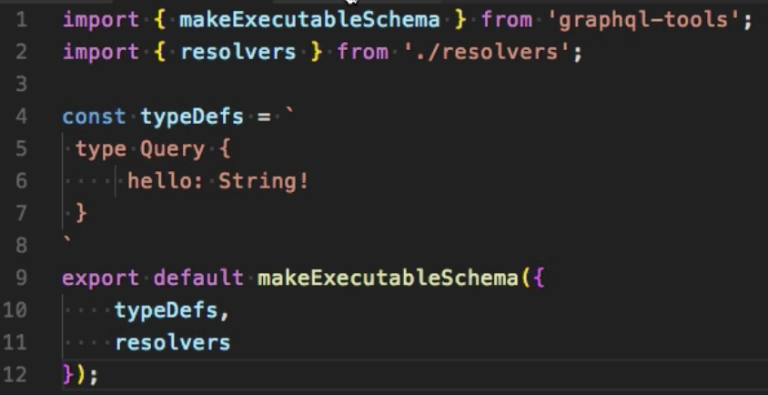
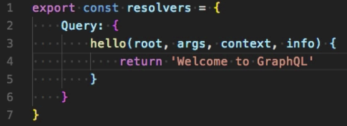
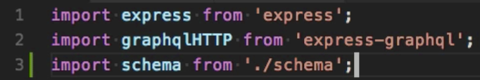
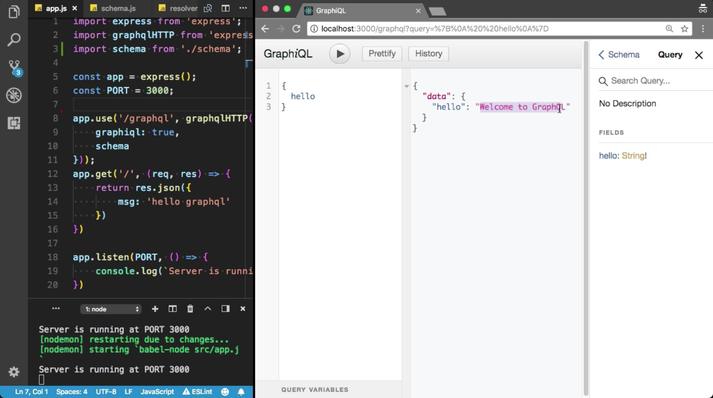

Instructor: 00:00 The schema is not a valid object, I got this error. We need to create the schema. Go to the source directly, and create the `schema.js` file. I also need the resolvers, I am going to create another file, `resolvers.js`.

00:16 First, we need to import some of the packages from the `graphql-tools`. We need to `makeExecutableSchema`. I am going to use this method to create the `GraphQL schema`. I also need `resolvers from resolvers`, we do not create the resolver object yet.

00:38 Let me define the `typeDefs`, `const`. I am going to use `backtick` here. Let's define our first `Query` `type`, which is our root `Query` `type`. I am going to define `hello`, the type of the `hello` field is `String!`.

#### schema.js

00:57 I am going to `export` the `schema` object. We need to use the `makeExecutableSchema`. It will take `typeDefs`, and `resolvers`. We did not define any resolver. 

Let me create the `resolvers` object. This `resolver` object will have `Query` `type`. The `type` is `Query`.

01:17 We have only single field. I already defined the `hello` field here. 

Each resolver object will take four arguments -- `root`, `args`, `context`, and `info`. Here, I am going to `return` this simple string, `'Welcome to GraphQL'`. Because the return type is string, 

#### resolvers.js

I am going to refresh the browser.

01:40 I've got the same error, because we did not update the schema here in the `app.js` file. Import the schema from Schema.js. Get it off the schema. Cool. I am going to refresh that.

#### app.js

01:56 Cool. Everything looks good, so far. We did not have any error. Let me show you the documentation. That is a very fantastic feature in GraphQL. GraphQL automatically generates the documentation for you. Here is our root query type, and inside the root query type, we have Hello field.

02:15 How can we query that? I am going to query for the Hello field. Hey, GraphQL, Please, give me the "Hello World. Welcome to GraphQL." Here is the result. I've got the result from the GraphQL server.

