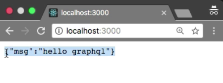

Instructor: 00:00 I'm going to use Express in node.js. First, we need to install Express package. 

```bash
$ npm i -s express
```

Express package has installed successfully. Let me `import` the `express` package. I'm going to create a new `application` from the `express` class, now you can define here `app.listen`.

00:16 Basically, we need to specify the `PORT`. I'm going to choose `3000`. You can also create a `PORT` variable. Let me create the `PORT` variable `3000`. Now I can use this variable. I'm going to use adder function. If everything looks good so far, then we need to run this `server`. `Server is running at port 3000`.

00:39 Let me run the application by using NPM start. Incredible. Application is running at port 3000. Let me go to the local host column 3000. Oops, we don't have any route. Let me create a new `route`, `app.get`. I'm going define a `root route`. It will take `request` and `response`.

01:00 I'm going to send a simple `message`, `res.json`, "`Hello, GraphQL`." Let me test it, boom. Here we have message, "Hello, GraphQL."

```javascript
import express from 'express';

const app = express();
const PORT = 3000;

app.get('/', (req, res) => {
    return res.json({
        msg: 'hello graphql'
    })
})

app.listen(PORT, () => {
    console.log(`Server is running at PORT ${PORT}`);
})
```

