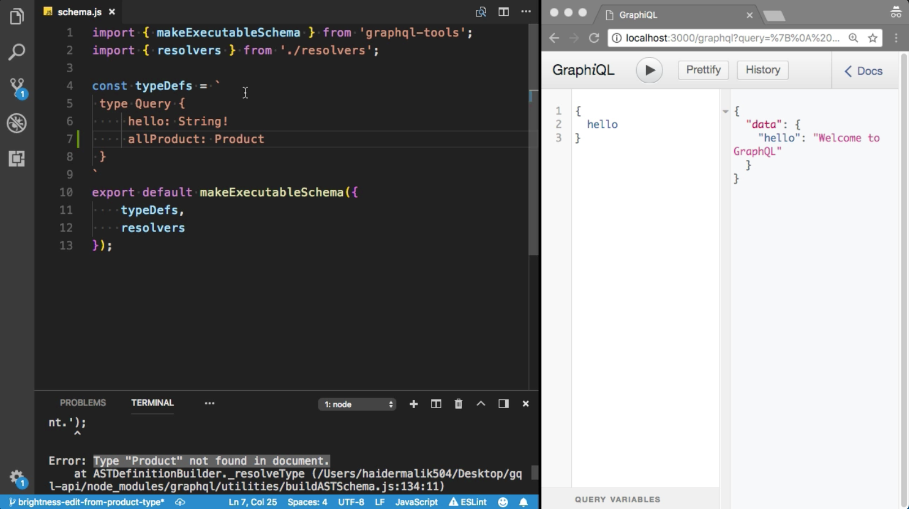
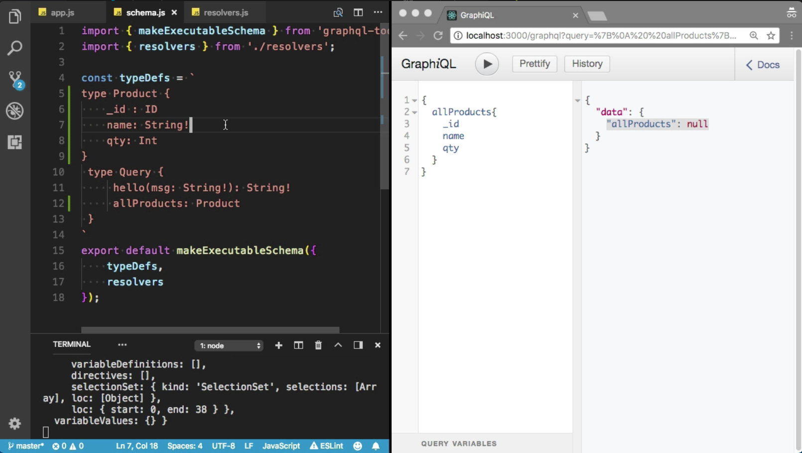
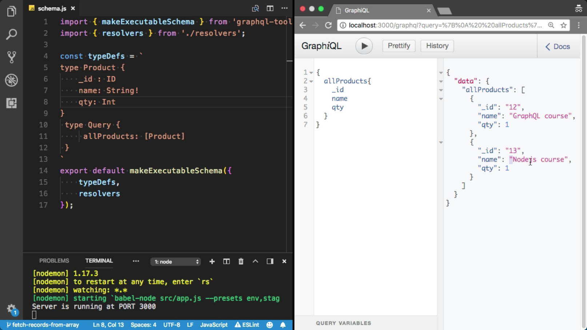

Instructor: 00:00 I am going to create a new `field`, `allProduct`. This time, `return` type is `Product`. We did not define the `Product` type yet. Let's try to test it first. Oops, I've got the `error`. Now, you can see the `error`. Let me show you, `Error: Type "Product" not found in document.` We must need to define the `Product` type.

#### schema.js


00:22 I am going to create a new `type product`. We will have three fields. `_id`, and the `type` of the `_id` field is `ID`, another field, which is `name`. The `type` of the `name` is `String!`, and `name` is required property. I also have `qty`. The type of `qty` is `Integer`. "Type Integer not found in the document."

00:49 Because GraphQL does not provide the Integer type, we need to replace `Integer` to `Int`. GraphQL provides `Int` type. 

```javascript
const typeDefs = `
type Product {
    _id : ID
    name: String!
    qty: Int
}
 type Query {
     allProducts: [Product]
 }
`
```
Everything looks good so far. Let's try to test it here. Boom, here we have allProduct.

01:05 Let's say allProducts. I am going to refresh that. Let me check the query. Here we have allProducts. Let's try to `query` for the `allProducts`. It will return the product. I am going to `query` for `allProducts`. I want to see `_id` in the response, `name`, and `qty`.



01:24 Now I've got them all, because we did not define the resolver to get all the products. Let's define the resolvers. Get it off, this `hello`. I don't need to use this `hello`. I am going to remove the `hello` part from the `schema`. Make sure you use the same `name`, `allProducts`. I don't have root value, so I am going to use underscore. I don't have any args. I don't need any property here.

01:55 I am going to `return` the `products` array. Let's create the `array` first. We have two `products`. Let me return the `products`. This resolver method can also return a promise. I'll talk more about promise in later videos.

#### resolver.js
```javascript
const products = [{
    _id: '12',
    name: 'GraphQL course',
    qty: 1
}, {
    _id: '13',
    name: 'Nodejs course',
    qty: 1
}]
export const resolvers = {
    Query: {
        allProducts() {
            return products
        }
    }
}
```

02:16 Now, let's try to fetch all the products. "Cannot return product.name." I want to return the error type. I am going to convert into the array because I want to return the multiple products. Cool. I've got all the products. Here, we have GraphQL course and Node.js course.

