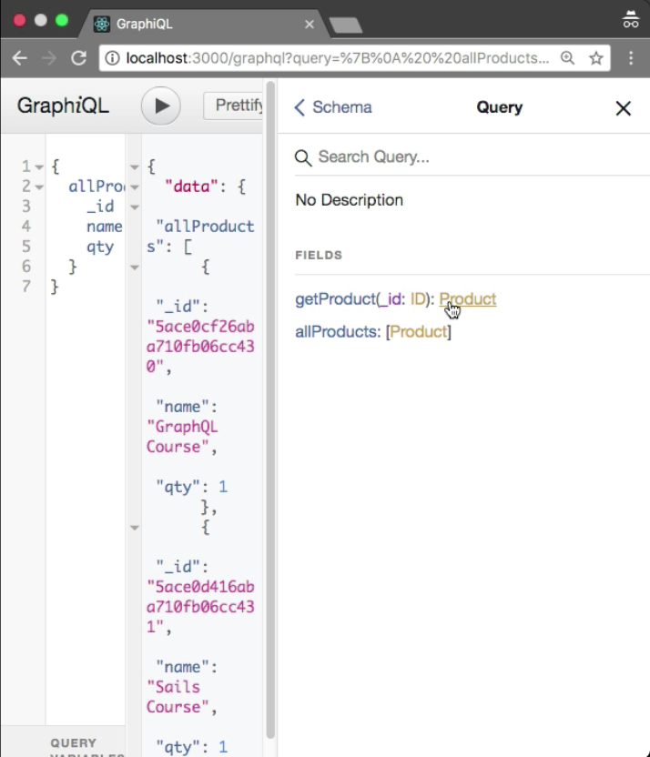
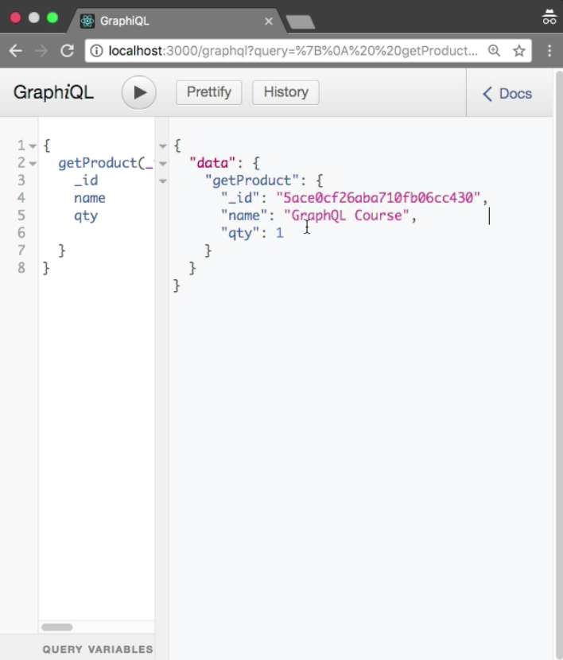

Instructor: 00:00 We did not define any field to fetch the single product. I'm going to define a new field, `getProduct`. It will take the argument `_id`, and the return type is `ID`. It will return the single `Product`.

#### schema.js
```javascript
const typeDefs = `
type Product {
    _id : ID
    name: String!
    qty: Int
}
 type Query {
     getProduct(_id: ID) : Product
     allProducts: [Product]
 }
 input ProductInput{
    name: String!
    qty: Int
 }
 type Mutation {
     createProduct(input: ProductInput) : Product
 }
`
```

00:14 Now we need resolver, because we don't have resolver to fetch the single Product. The name is `getProduct`. The first argument is `root`. I am not going to use root object here. I am going destructure the `_id`. Now I'm going to apply `await` expression. We can use `findOne` method, `product.findByID`.

00:36 Let's say I'm going to use `findById`. Here, we need to provide the simple `_id`. 

#### resolver.js
```javascript
export const resolvers = {
    Query: {
        async allProducts() {
            return await Product.find()
        },
        async getProduct(_, { _id }) {
            return await Product.findById(_id);
        }
    },
```
Let me refresh that. Let me check the docs. Cool. Here we have `getProduct`. It will accept the `_id` argument and it will return the `Product`.



00:50 I am going to copy the `_id` of my `Product`. Let me write the `query` to `getProduct`. We must need to provide the `_id`. I am going to paste `_id` here. It will return the `_id`. I want to see the `_id` in the response. I also want to see the `name` and `qty`. Let me execute the query. Cool. Here we have single `Product`. I found the `Product` by `_id`.

