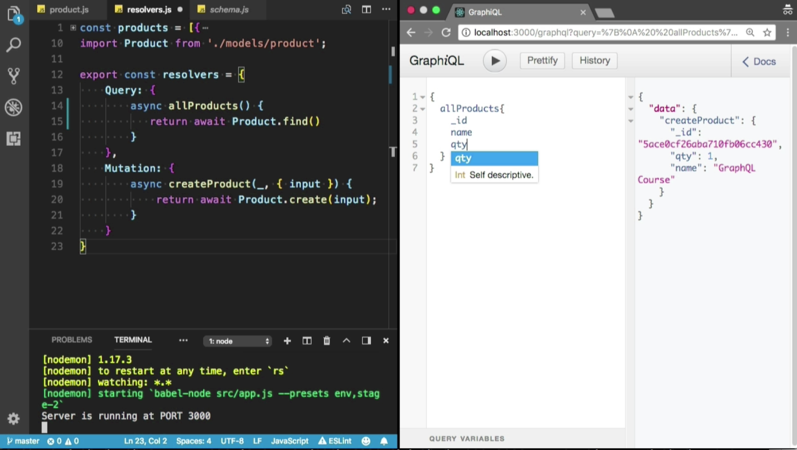

Instructor: 00:00 I am going to convert this all product method to `async/await`, because I want to use `Product.find`. It will return a promise. I am going to apply `await` expression. When promise field will be resolved, it will return all the products from the database. I am going to refresh that.

#### resolver.js
```javascript
export const resolvers = {
    Query: {
        async allProducts() {
            return await Product.find()
        }
    },
```

00:20 Let's create the mutation first. Cool, we have successfully created the mutation. Now, I would like to find all the products. I want to see the `_id`, `name`, and `qty` in the response. Incredible, we have all the products. We have two products in the database, Node.js course and GraphQL course.

