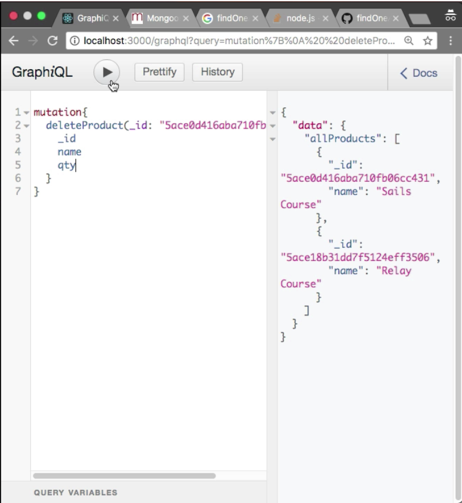
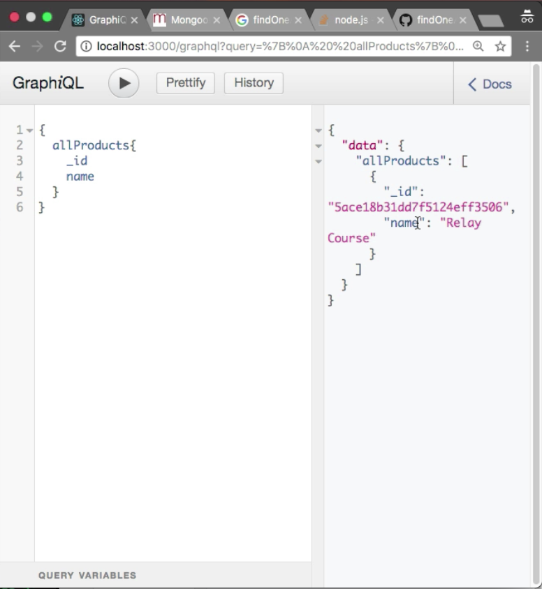

Instructor: 00:00 To delete product, we must have `deleteProduct` mutation. I am going to create a new mutation, `deleteProduct`. It will accept the `_id`. I want to return the deleted product in the response. The return type of the `deleteProduct` mutation is `Product`.

#### schema.js
```javascript
const typeDefs = `
type Product {
    _id : ID
    name: String!
    qty: Int
}
 type Query {
     getProduct(_id: ID) : Product
     allProducts: [Product]
 }
 input ProductInput{
    name: String!
    qty: Int
 }
 type Mutation {
     createProduct(input: ProductInput) : Product
     updateProduct(_id: ID!, input: ProductInput) : Product
     deleteProduct(_id: ID!) : Product
 }
`
```

00:14 Let's create the `resolvers`. I am going to create a new resolver, which is `deleteProduct`. It will accept `_id` as the argument. I am going to destructure the `_id`. There's a method here, `findByID`. Let me add comma here, `findByIDAndRemove`. We need to provide the `_id` here. That's it.

#### resolver.js
```javascript
export const resolvers = {
    Query: {
        async allProducts() {
            return await Product.find()
        },
        async getProduct(_, { _id }) {
            return await Product.findById(_id);
        }
    },
    Mutation: {
        async createProduct(_, { input }) {
            return await Product.create(input);
        },
        async updateProduct(_, { _id, input }) {
            return await Product.findOneAndUpdate({ _id }, input, { new: true })
        },
        async deleteProduct(_, { _id }) {
            return await Product.findByIdAndRemove(_id);
        }
    }
}
```

00:37 I've got the error, "Delete product defined in resolver but not in the schema." Oops, here we have E. We need to define E here. Let's try to test it. Let me check the docs. We have delete product mutation! I would like to delete the product. Let me copy the `_id`.

00:54 I would like to delete the `Sails Course`. `deleteProduct`. We need to provide the `_id` here. I want to see the `_id` `name` and `qty` in the response. Incredible. A product is deleted successfully. Here, we have Sails Course. Let's try to find all the products. I want to see `_id` and `name`. Boom, there is no sails.js course here.



