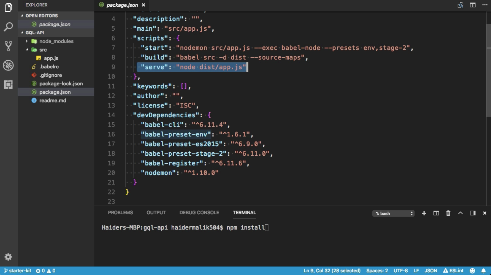
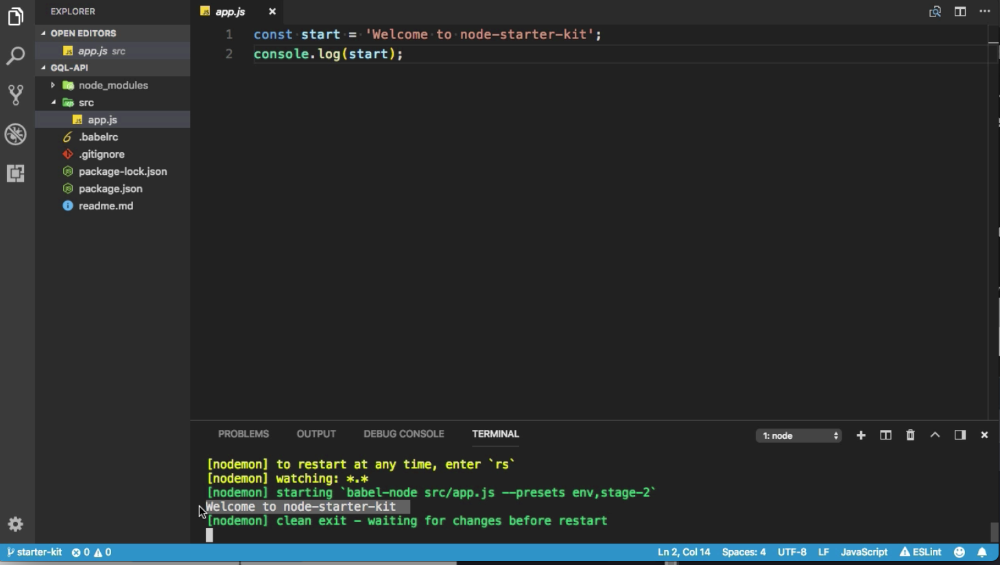

Instructor: 00:00 I have already created the starter kit project for you. You need to check out the starter kit branch and run npm install. 

```bash 
$ npm install
```

It will install all the dependencies. I have already installed all the dependencies. Let me show you the package.json file.

00:14 I am going to use `Babel` to `transpile` our `ES6` code to `ES5`. We have the `script`. If you want to start the application, you need to execute the script, npm start. If you want to use application in production level, you need to use the `build` script first, then you need to `serve` the application.



00:32 Let me open the app.js file. We have simple `constant` here. Here, I am going to log the simple message. Let me run the application by using npm start. 

```bash
$ npm start
```

Incredible. Here, we have `Welcome to node-starter-kit` project.

