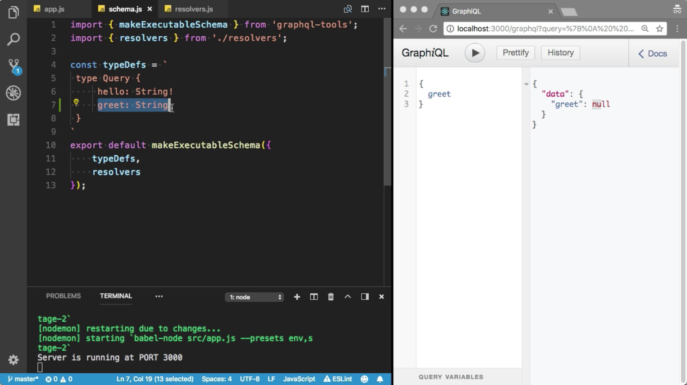
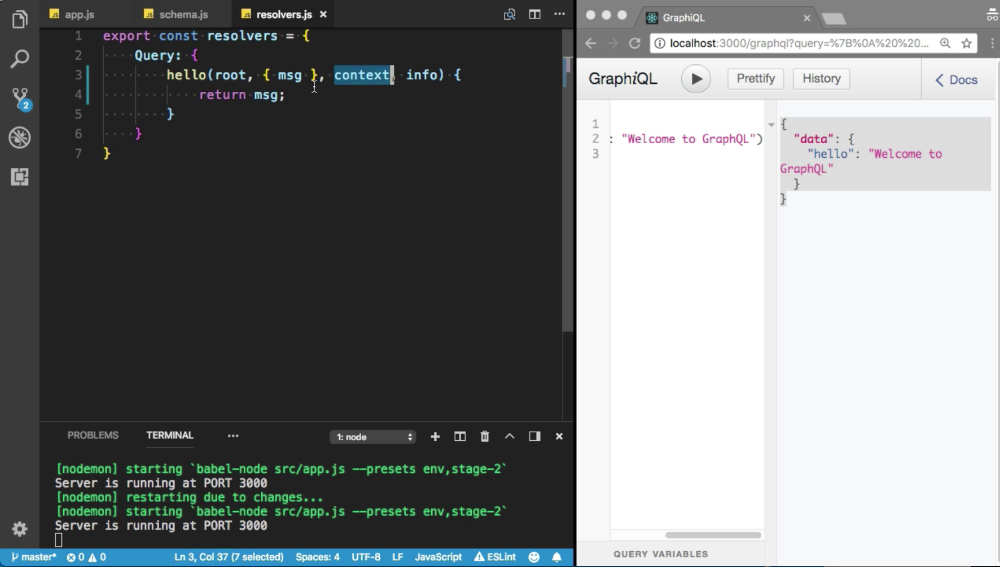
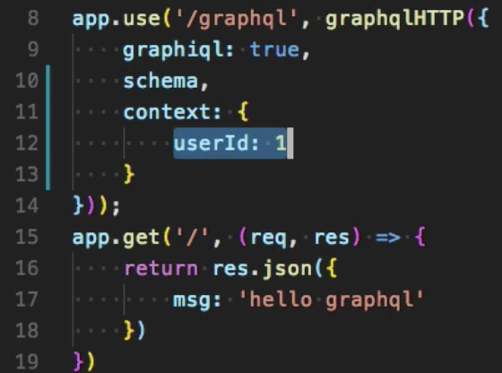
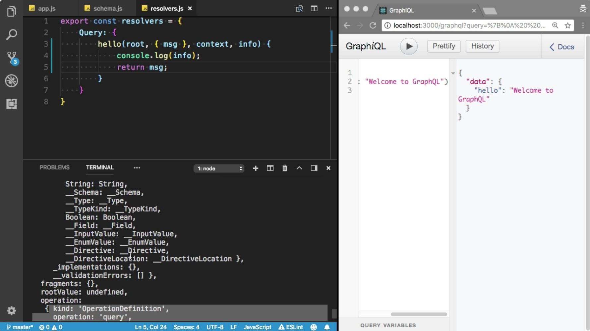

Instructor: 00:00 Each query field must have a resolver method. Let's see, if you define another field. I am going to define another `greet` field, and the return type of the `greet` field is string.

00:13 Let me try to test it. I am going to refresh the browser. Let me check the docs, if we have `greet` field. Let's try to `query` the `greet` field. Oops, I got the error. Let's try to do that. I am going to remove the non-nullable to nullable field. I am going to refresh that. Boom, it has returned the `null` field, because I did not define the resolver method for `greet` field.

#### schema.js

00:38 You must need to define the `resolver` for `greet`. Let's talk about the resolver arguments. This `root` value, basically, it has returned the result from the parent value. I'll talk more about the root in the later videos.

00:52 Let's talk about the `args`. You can provide the `arguments` here. Let's say this `Hello` field will accept the `message`, maybe. You can say that `message`, and `return` type of this message argument is `String!`. You must need to provide the message variable.

01:08 I am going to return the message variable. You can access all the arguments from the `args` property. Let me use the `destruction` here, the first `argument` is `message`. I am going to `return` the `message`.

01:20 Let's try to test it. I am going to refresh the browser. Let me show you the docs. Here, we have `hello`. You must need to provide the `string` argument, which is `message`. Let me provide the `message` here. `hello(msg:. Welcome to GraphQL)`. Cool, now I've got the message.

#### resolver.js

01:32 The `context` is used to share the same object with each resolver method. You can provide some authentication information. Let me show you the demo first. Here, I am going to provide the `context`. Let's say the current logged in `user`, the `Id` of the current `logged` in `user` is `1`.

#### app.js

01:58 Now, you can access the object here. Here, let me `log` the `context` `object`. I am going to execute the request. Cool. Did you see that? Here we have the user. The info basically use to get the information about the GraphQL person. Let me log the information. I am going to execute the query. Incredible. I've got the log information from the information.

02:23 Here, we have query, string, schema, GraphQL schema. It is going to give us the advanced information, what kind of operation you have performed, all this stuff.

