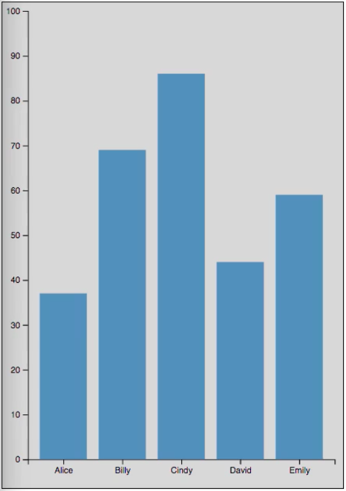
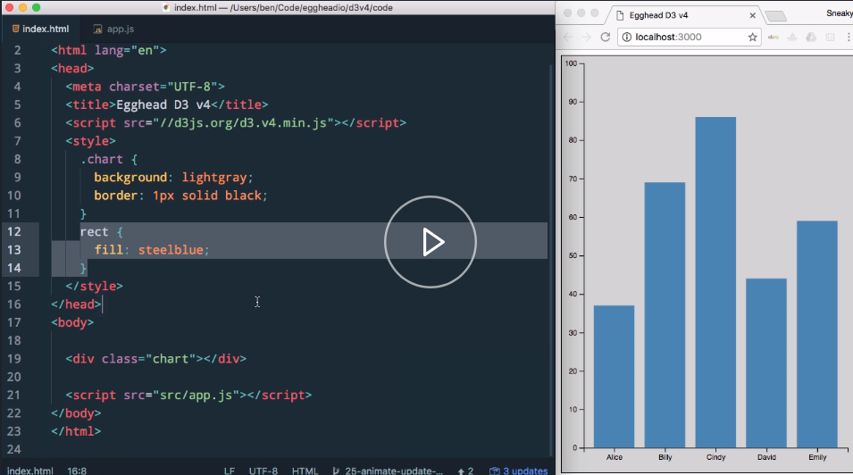
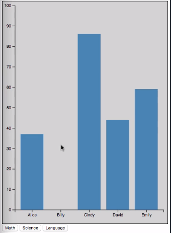

In this example, we have a basic column chart where we're plotting the test scores of five different people. We just have a simple HTML page here. We've got our chart div that things get drawn into. We're specifying the fill style of our rectangles here.



If we go take a look at our code, we can see that our `data` is just an array of objects that each have a `name` property and a `score` property. We're then using the D3 `margin` convention and specifying the margin's `width` and `height`. 

#### app.js
```javascript
var data = [
  {name: 'Alice', score: 37},  
  {name: 'Billy', score: 69},  
  {name: 'Cindy', score: 86},  
  {name: 'David', score: 44},  
  {name: 'Emily', score: 59}  
 ];

var margin = { top: 10, right: 10, bottom: 30, left: 30 };
var width = 400 - margin.left - margin.right;
var height = 535 - margin.top - margin.bottom;
```

Then from that, creating our `svg` tag and the container graphics element. We're calling `responsivefy` so that everything stays responsive when our window resizes. 

```javascript
var svg = d3.select('.chart')
  .append('svg')
    .attr('width', width + margin.left + margin.right)
    .attr('height', height + margin.top + margin.bottom)
    .call(responsivefy)
  .append('g')
    .attr('transform', `translate(${margin.left}, ${margin.top})`);
```

Then we go on to creating our scales. Our `xScale` is a band scale.

Since we're creating a column chart here, that's what we want to use. Our `domain` for our `xScale` is just the list of `name` properties from our data. We're just pulling those names out, and using that to create our `xScale` so that we have everybody's names below their column.

We've got a little bit of `padding` so that we've got some space between our columns there. Then we attach that bottom axis to our chart. 

```javascript
var xScale = d3.scaleBand()
  .domain(data.map(d => d.name))
  .range([0, width])
  .padding(0.2);
svg
  .append('g')
    .attr('transform', `translate(0, ${height})`)
  .call(d3.axisBottom(xScale));
```

Our `yScale` is just hard-coded to run from 0 to 100 for its `domain`. Since they're test scores, we're just going to say it's 0 to 100. We don't need to examine the data at all.

```javascript
var yScale = d3.scaleLinear()
  .domain([0, 100])
  .range([height, 0]);
svg
  .append('g')
  .call(d3.axisLeft(yScale));
```  

Finally, we go ahead and create the rectangles by doing `selectAll('rect')`, doing our `data` join, where we pass in the array of `data` objects. Then once we get to our `enter` selection, we append a rectangle. We set the x and y based on our `xScale` and `yScale`s.

For our `width`, we're able to use the `bandwidth` method that is unique to band scales. That takes care of sizing our columns horizontally. Then for our `height`, we're again just using the `score` passed to our `yScale`, and subtracting that amount from our `height`.

```javascript
svg.selectAll('rect')
  .data(data)
  .enter()
  .append('rect')
  .attr('x', d => xScale(d.name))
  .attr('y', d => yScale(d.score))
  .attr('width', d => xScale.bandwidth())
  .attr('height', d => height - yScale(d.score));
  
```

This is a nice functional chart, but it only renders once. Nothing changes over time. What we're going to do is look at the general update pattern, and how we can accommodate data that does change over time.

The first thing we're going to do is we're going to come over here to our HTML and add back some buttons that I created that each one of them just has an onclick handler that is going to call a method named `render`, and pass in a `subject` name.

#### index.html
```html
<button onclick="render('math')">Math</button>
<button onclick="render('science')">Science</button>
<button onclick="render('language')">Language</button>
```

I'm going to save that. We need to make a little bit of room for that in our chart. We're going to shrink this a little bit. Everything's laid out there. 



Now I'm going to paste in some data that is same basic structure, but instead of just a `score` property, we actually have math, science, and language properties.

```javascript
var data = [
  {name: 'Alice', math: 37,   science: 62,   language: 54},
  {name: 'Billy', math: null, science: 34,   language: 85},
  {name: 'Cindy', math: 86,   science: 48,   language: null},
  {name: 'David', math: 44,   science: null, language: 65},
  {name: 'Emily', math: 59,   science: 73,   language: 29}
]
```

You'll also notice that some of the people have a `null` value for some of the subjects. If a person has a `null` value, they won't be shown on the chart. All of this stuff with our margins, and our axis, and our scales, all of that can stay the same.

What we're really concerned with updating is this block of code here. This is what we're actually going to turn into our `render` function. We're going to say `render`. It's going to take a `subject`, and then we'll paste our code in here.

```javascript
function render (subject){
  svg.selectAll('rect')
  .data(data)
  .enter()
  .append('rect')
  .attr('x', d => xScale(d.name))
  .attr('y', d => yScale(d.score))
  .attr('width', d => xScale.bandwidth())
  .attr('height', d => height - yScale(d.score));
}
```

If I give this `subject` parameter a default value of `math`, and then I'm going to go update these. Instead of reading a `score` property, we're going to use that `subject` parameter and read that property name off of the `data` object.

```javascript
function render (subject = 'math'){
  svg.selectAll('rect')
  .data(data)
  .enter()
  .append('rect')
  .attr('x', d => xScale(d.name))
  .attr('y', d => yScale(d[subject]))
  .attr('width', d => xScale.bandwidth())
  .attr('height', d => height - yScale(d.score));
}
```

Do the same thing down here, change that to `subject`. 

```javascript
function render (subject = 'math'){
  svg.selectAll('rect')
  .data(data)
  .enter()
  .append('rect')
  .attr('x', d => xScale(d.name))
  .attr('y', d => yScale(d[subject]))
  .attr('width', d => xScale.bandwidth())
  .attr('height', d => height - yScale(d[subject]));
}
```

Then we'll go ahead and add a default call to `render()`, which will use that default value of `math`. Now if we save this, we get the same data, except `Billy` is no longer there, because in our new data, `Billy` has a `null` value for `math`.



The first thing we actually want to do is handle those `null` values. It automatically handled that for us here because that value is missing. What we actually want to do is, when we call this method with a `subject`, we want to filter that array so that we only get back items that have a value for that `subject`.

For this, we're just going to use a simple array `filter` method, and say `data.filter`. Then when we get each item, we'll check for the presence of that `subject`. This is essentially saying if the `math` property, in the default case, has a truthy value, then it will be included. If not, it will not be included.

```javascript
.data(data.filter(d => d[subject]));
```

In order to handle things separately, we need to break out our different selections. If you'll remember, our default value that gets returned from a `data` join is the `update` selection. Essentially, these two lines here, it selects all of the rectangles that may be there, joins the data, and that gives us our `update` selection.

```javascript
var update = svg.selectAll('rect')
  .data(data.filter(d => d[subject]));
```

We get our `enter` selection from our `update` selection. `update.enter` is where we're going to append the rectangles. Before we get to that `enter` selection, let's deal with the `exit` selection. Remember, the `exit` selection is where you have a DOM element whose corresponding data item is not in the data.

If we were to say `update.exit().remove()`, that is going to remove any of the rectangles who don't have a corresponding data object in whatever data has been joined to the `update` selection. That will get rid of elements that we no longer need.

Any elements that we don't have anything for, so we're starting off here. `Billy` has a `null` value for `math`, and so he doesn't have an element. When we switch to `science`, where we does have a value, we're going to need to create a rectangle for him.

We can actually go ahead and cut this off here. We'll assign this to a variable named `enter`. Our `enter` variable is our `enter` selection. We're going to `append` a rectangle for everything in that. 

```javascript
var enter = update
  .enter()
  .append('rect')
```

Then all of this code that actually sizes and positions everything, we want that to apply to our `update` and our `enter` selections.

To do that we're going to say `update.merge(enter)`, and then pass in our `enter` selection. This is creating a selection that is both our `update` and our `enter` selection merged together. If we save this, we get math re-rendered here.

```javascript
update.merge(enter)
  .attr('x', d => xScale(d.name))
  .attr('y', d => yScale(d[subject]))
  .attr('width', d => xScale.bandwidth())
  .attr('height', d => height - yScale(d[subject]));
```

If we click `science`, we see `Billy` does appear, and `David` gets removed. That is because `David` does not have a value for science. If we look at `language`, we see that `Cindy` is the one that doesn't have a value.

If we click language, Cindy disappears, and David comes back. Now we have a chart that will actually update based on whichever subject we tell it to render. This is nice, and it's entirely functional, but it would be even better if we could convey what was going on a little bit through animations.

That's what we're going to do now. If we come down to our `render` function, the first thing I'm going to do is I'm going to create a `transition` that we can use throughout here. We're going to say `d3.transition().duration(1000)`, and I'm going to give it a one second duration.

```javascript
function render (subject = 'math') {
  var t = d3.transition().duration(1000);
```

Sometimes it's helpful to use a little bit slower of a duration when you're just working through things, so you can tell what's going on. The first thing that we want to do when the `subject` changes is we want to animate the items that are being removed out of the chart.

We've got our `exit` selection here, but instead of removing things immediately like that, we're actually going to say `transition`, and pass in the `t` instance there. We've got the `duration` already defined for us. We're going to set the `y` attribute of those rectangles to be the `height` of our chart.

```javascript
update.exit()
  .transition(t)
  .attr('y', height)
  .remove();
```

We're going to set the `height` attribute of those rectangles to be zero. 

```javascript
update.exit()
  .transition(t)
  .attr('y', height)
  .attr('height', 0)
  .remove();
```
They're going to simultaneously move down and shrink so that we get those nice slide out animations. When that slide out animation is done, then the element will finally be removed.

After the elements that are being removed have been transitioned out, then we want to `update` any of the items that are remaining on the chart. To do that, we'll just work with our `update` selection. We're going to say `update`, and again, `.transition`, and pass in our `transition` instance.

```javascript
 update
  .transition(t)
```

We're going to add a `delay` this time of one second, because we want this to happen after our `exit` transition. Actually, we'll just copy this code from down here, since this is what we want to happen. We're going to specify that the `y` gets updated and the `height` gets updated.

```javascript
 update
  .transition(t)
  .delay(1000)
  .attr('y', d => yScale(d[subject]))
  .attr('height', d => height - yScale(d[subject]));
```

There we've got that defined. Lastly, we just need to deal with our `enter` selection. We're going to slide everything out. We're then going to update things that are still there. Then we're going to slide in any new items.

To do that, we're going to go ahead, and we don't actually need this `enter` variable anymore. We don't even need this selection merging anymore. We're going to say take the `enter` selection, append the rectangle, but when it's initially appended, we actually want to use these same properties that we're using that we're transitioning out of.

We want things to start there for our new items. We'll paste that down here. 

```javascript
update
  .enter()
  .append('rect')
  .attr('y', height)
  .attr('height', 0)
  .attr('x', d => xScale(d.name))
  .attr('y', d => yScale(d[subject]))
  .attr('width', d => xScale.bandwidth())
  .attr('height', d => height - yScale(d[subject]));
```

The new rectangles are going to start at the bottom with no height. We can get rid of this line here, and this line here. Our `x` and our `width` can be set to their final values initially. There's no problem with that.

```javascript
update
  .enter()
  .append('rect')
  .attr('y', height)
  .attr('height', 0)
  .attr('x', d => xScale(d.name))
  .attr('width', d => xScale.bandwidth())
```

Then we can actually go ahead and do our `transition` again here. This time, we're going to set our `delay` to be two seconds, because remember, we've got one second for our exit transition, one for our update. That's two full seconds that we need before we transition things in.

```javascript
update
  .enter()
  .append('rect')
  .attr('y', height)
  .attr('height', 0)
  .attr('x', d => xScale(d.name))
  .attr('width', d => xScale.bandwidth())
  .transition(t)
  .delay(2000)
  .attr('y', d => yScale(d[subject]))
  .attr('height', d => height - yScale(d[subject]));
```

Now we can copy these lines down here, because that's where we want things to end up for this as well. Now if save this, things update, and then they slide in. If we click on science, it's not actually working. Why is that?

Aha, in order for all of this to work, each of these elements has to be associated with the same `data` object, regardless of what `subject` is being rendered. To do that, we need to use a key function when we call the `data` function here.

What we need to do is define this method. It's again just going to be a little arrow function that gets each item passed in. We're just going to return the `name`. 

```javascript
var update = svg.selectAll('rect')
  .data(data.filter(d => d[subject]), d => d.name);
```
Essentially, what this is saying is when you do this `data` join, we want you to look at this `name` property to uniquely identify each one of these objects.

If we look at our `data`, the `name` property is unique, and we're just changing which `subject` we're looking at. We need that key function so that it knows which rectangles go with which `data` objects. If we save this, we've got to refresh. We've got a little bit of a delay there.

If we switch to `science`, `David` slides out, everybody updates, and `Billy` slides in. Go to `language`, `Cindy` slides out, update, `David` slides in. This is great. This is working perfectly. If we refresh, we see a little bit of a problem, though, because we've got that delay at the beginning.

That's because we're delaying our enter animation by two seconds, and that doesn't make sense to do on the first render. What we can actually do is make this conditional. We can say `update.exit().size()`. If it's true, we'll use a delay of two seconds, if not, it's zero.

```javascript
 .delay(update.exit().size() ? 2000 : 0)
```

This is essentially saying if you have any items to remove from the chart, go ahead and implement that two second delay. If you don't, don't delay things at all. This isn't production quality code, because you may have an empty `exit` selection, but already have some items on there in your `update` selection.

For our purposes, this gets the point across. Now if we save this, it is immediately going to slide those in initially, then we can switch subjects, and we see a column slide out. Everything else updates, and then the new column slides in.