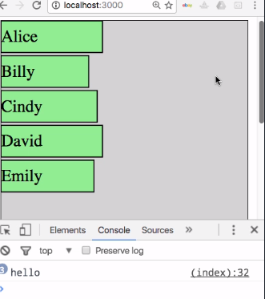
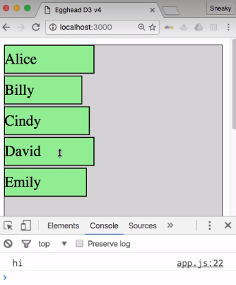
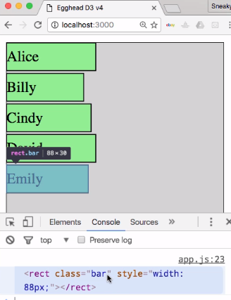
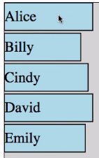
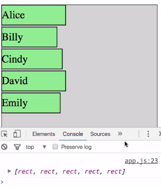
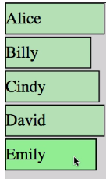
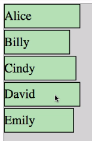
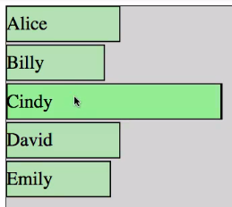

Now that we have these bars rendering correctly, let's see how we can add a little bit of interactivity to them. In regular HTML, you can add event listeners as attributes. If you wanted to run a function every time you clicked the `chart` div here, we could do this with the `onclick` attribute. This is saying that every time the `chart` div is clicked, we want to run a function called `foo`.

#### index.html
```html
<body>

  <div class="chart" onclick="foo()"></div>

  <script src="src/app.js"></script>
  <script>
  var foo = () => console.log('hello');
</body>

```

Let's go ahead and create that function real quick. If we save that and go over here and open our inspector and then click on our div, we can see that we get the "hello" message traced out to our console. That's how things work in vanilla HTML and JavaScript, but let's look at how to add event listeners in D3.



We can close our inspector here, and then go ahead and put our example back to the way that it was. If we switch back to our `app.js` file here, we're going to go down here. We're going to put these on our collection of `rect` items. We'll continue chaining the code as usual. Instead of the `style` or the `attr` method, this time we're going to use the `on` method.

The first argument to the `on` method is the event name which is essentially the same thing as our HTML attributes but without the on prefix. To create a click handler, we can do `on('click')`, and then provide a function. 

#### app.js
```javascript
bar.append('rect')
    .style('width', d => d.score)
    .attr('class', 'bar')
    .on('click', () => console.log('hi'));
```

If we save that and then reopen our console here, when we click on our bars, we get the "hi" text. 



We can see that the syntax is very similar to the regular event listeners but slightly updated.

Let's change this `click` handler to a `mouseover` handler. Instead of just logging out a message, we're actually going to update the element. We're going to change this to a regular function. Right now, we don't need any of the arguments, so we'll just leave that empty.

```javascript
bar.append('rect')
    .style('width', d => d.score)
    .attr('class', 'bar')
    .on('mouseover', function () {

    });
```

What I want to show first is that the `this` context in this function is in fact the DOM element being moused over which is why we had to get rid of the arrow function because an arrow function will inherit its `this` context from wherever its defined. If we simply log out `this`, go back here, reopen our console, when we roll over this item, you can see that that actual DOM element is logged out to the console.

```javascript
bar.append('rect')
    .style('width', d => d.score)
    .attr('class', 'bar')
    .on('mouseover', function () {
      console.log(this);
    });
```

If we roll over this one, we get that one and so forth. 



Since these are the raw DOM elements, if we want to use D3's functionality for updating them, we actually need to wrap the `this` reference in a call to `d3.select`. 

```javascript
bar.append('rect')
    .style('width', d => d.score)
    .attr('class', 'bar')
    .on('mouseover', function () {
      d3.select(this)
    });
```

We've now turned the raw DOM element into a D3 selection and can use our various methods like `style` and `attr` as we've seen before.

For example's sake, let's turn our bars blue when we roll over them. Once we've selected the element with `d3.select`, we'll then set the `fill` `style` to be `lightblue` on mouse over. 

```javascript
bar.append('rect')
    .style('width', d => d.score)
    .attr('class', 'bar')
    .on('mouseover', function () {
      d3.select(this).style('fill', 'lightblue');
    });
```

If we save that and go back here, we can now close this and we can see that when we roll over these, they do in fact turn blue.



There's an obvious problem though because they're not turning back to green. That's because we haven't written any code to make that happen. Let's go back here. We'll copy this whole section here, get rid of that extra semicolon.

We need to write a `mouseout` handler and tell it what to do when the mouse leaves the item. We'll go back here and just update this and tell it to set it back to `lightgreen` when we mouse out. 

```javascript
bar.append('rect')
    .style('width', d => d.score)
    .attr('class', 'bar')
    .on('mouseover', function () {
      d3.select(this).style('fill', 'lightblue');
    })
    .on('mouseout', function () {
      d3.select(this).style('fill', 'lightgreen');
    })
```

We save that. Roll over, it turns to blue. Roll out, it turns back to green. You can see that works for all of our items here very nicely.

This isn't the most maintainable code because we're setting individual style properties in our handlers here, which probably isn't a great idea. Let's go over here. We can create a `.barOn` style. We'll just set our `fill` here. 

#### index.html
```html
<style>
  .barOn{
    fill: lightblue;
  }
</style>
```

Now that we have a style that has the fill set, we can use that here and go back and use our `classed` method that we've seen previously.

`classed` `barOn` is `true` when we roll over, and it's going to be `false` when we roll out. 

#### app.js
```javascript
bar.append('rect')
    .style('width', d => d.score)
    .attr('class', 'bar')
    .on('mouseover', function () {
      d3.select(this).classed('barOn', true);
    })
    .on('mouseout', function () {
      d3.select(this).classed('barOn', false);
    })
```

Now if we go over here we get the same behavior, but we've now pushed the different styling to CSS where it belongs. Our JavaScript code is simply toggling which classes are applied. This is admittedly still a really contrived example.

If you were paying attention, you may have thought there's an easier way to do this. If we actually comment out this code and go back here and just change this to bar with a `hover` pseudo-class, we get the same exact behavior. 

#### index.html
```html
<style>
  .bar:hover{
    fill: lightblue;
  }
</style>
```

So the example that we created is not entirely practical, but it does do a good job of showing the various ways to react to these different events.

Something that you can't exactly do with regular CSS is to modify the items in the collection that are not being rolled over so as to better highlight the active item. To see what I mean by that, let's go ahead and look at the different arguments in these functions.

We've already covered the first two arguments which are `d` and `i` standing for the data and the index, but there's actually a third argument which is the collection of DOM elements in the current selection. I'm going to name it `elements`. We can get rid of that for now. Get rid of that.

```javascript
bar.append('rect')
    .style('width', d => d.score)
    .attr('class', 'bar')
    .on('mouseover', function (d, i, elements) {
      console.log(elements)
    })
    .on('mouseout', function () {
    
    })
```

If we go ahead and log out `elements` so we can see what it is, when we roll over here, we see we in fact get this array of these five `rect` shapes. 



Again, these are plain DOM elements, so we can't really do anything to them without wrapping them in a call to `d3.select`.

However, since this is multiple elements, we need to use `d3.selectAll`. If we say `d3.selectAll(elements)`, that will give us the selection that allows us to affect everything in this selection, so all of our `rects`.

If we want to highlight the active item by fading back the non-active items, then maybe we want to set the `fill-opacity` style to `0.5`. 

```javascript
bar.append('rect')
    .style('width', d => d.score)
    .attr('class', 'bar')
    .on('mouseover', function (d, i, elements) {
      d3.selectAll(elements)
        .style('fill-opacity', 0.5);
    })
    .on('mouseout', function () {
    
    })
```
If we save that, you can see that when we roll over here, all these turn a little bit transparent but that includes the one that we're rolling over which isn't exactly what we want. We need to find some way to make it so that this code does not affect the item that's being rolled over.

To do that, we're going to use a method that we haven't used before on D3 selections called `filter`. If we move this to a new line and stick a new line in between here, we can say `.filter`. What filter accepts is a string that's essentially a query selector. Any elements that pass that query selector will be included in the resulting selection.

We're actually going to say `not` and then wrap that around `hover`. 

```javascript
bar.append('rect')
    .style('width', d => d.score)
    .attr('class', 'bar')
    .on('mouseover', function (d, i, elements) {
      d3.selectAll(elements)
        .filter(':not(:hover)')
        .style('fill-opacity', 0.5);
    })
    .on('mouseout', function () {
    
    })

```
What our code now says is select all of these elements, all of our rects, and then filter that and find only the items that are not being hovered over. Finally, set the fill opacity to those items to 0.5.

Filter is a method that runs on an existing selection and returns a new selection. For now if we save this and come over here, and we roll over, we see we do in fact have just one item highlighted and everything else has faded back. 



If we move to the next item though, you can see everything is set to 0.5.



That's because when we rolled onto the second item, our handler ran again and set all of the items that were not currently being moused over to an opacity of 0.5. Between those two interactions, all of the items have been faded back, but they had never been brought back up to full opacity. What we need to do is handled the `mouseout` event and set all of their opacities back to one.

We'll copy our code down here. We can get rid of our `filter` call because we want it to apply to everything. Then we'll just update the value here to one. If we go try this again.

```javascript
bar.append('rect')
    .style('width', d => d.score)
    .attr('class', 'bar')
    .on('mouseover', function (d, i, elements) {
      d3.selectAll(elements)
        .filter(':not(:hover)')
        .style('fill-opacity', 0.5);
    })
    .on('mouseout', function () {
     d3.selectAll(elements)
        .style('fill-opacity', 1);
    })

```

Oh, before we try that again, we actually need to update our arguments here. Since we're using `elements`, we need to make sure that that gets included in our function here. 

```javascript
bar.append('rect')
    .style('width', d => d.score)
    .attr('class', 'bar')
    .on('mouseover', function (d, i, elements) {
      d3.selectAll(elements)
        .filter(':not(:hover)')
        .style('fill-opacity', 0.5);
    })
    .on('mouseout', function (d, i, elements) {
     d3.selectAll(elements)
        .style('fill-opacity', 1);
    })
```

Now if we try this, we can see that hovering an item keeps it at full opacity. Anything not being hovered over is faded back. Then when we roll out of everything, all of them are back to full opacity.

Lastly, just to make things a little more interesting and make the active item stand out a little bit more, we're going to go ahead and set a `transform` on the actively hovered item. We're going to say `d3.select(this)`, which is the item being hovered over that our `mouseover` handler is attached to, then we're going to set its `transform` `style`, and call `scaleX` with a factor of two.

We'll go ahead and copy this down to our `mouseout` so that it gets scaled back to one. 

```javascript
bar.append('rect')
    .style('width', d => d.score)
    .attr('class', 'bar')
    .on('mouseover', function (d, i, elements) {
      d3.select(this).style('transform', 'scaleX(2)')
      d3.selectAll(elements)
        .filter(':not(:hover)')
        .style('fill-opacity', 0.5);
    })
    .on('mouseout', function (d, i, elements) {
      d3.select(this).style('transform', 'scaleX(1)')
      d3.selectAll(elements)
        .style('fill-opacity', 1);
    })
```

Now if we come over here, our active item gets scaled out horizontally and everything else is back to normal.

