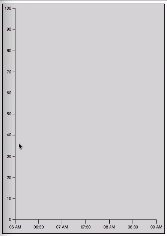
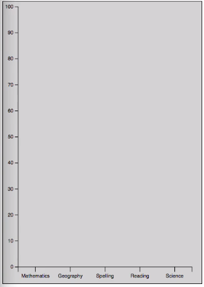
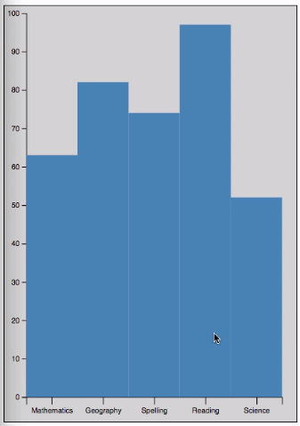
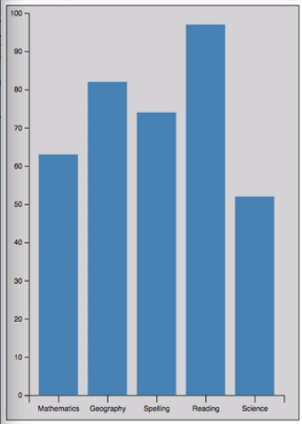
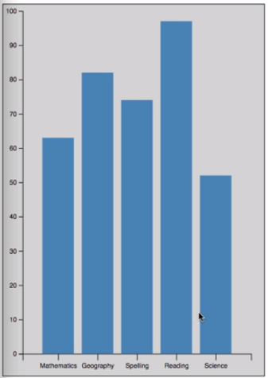
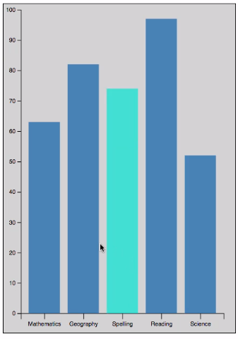
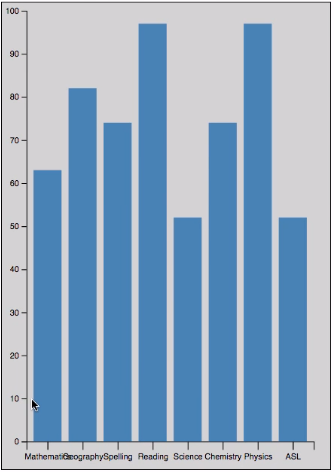
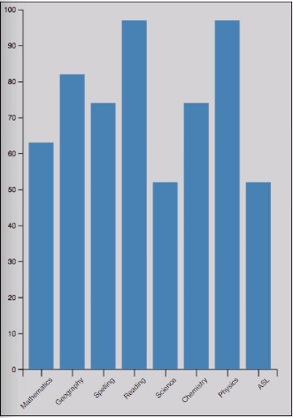

Now that we have basic elements like axes and margins in place, let's create something a little more real like a column chart. The first thing we're going to do is get rid of our placeholder rectangle here. If we save that, we've just got a nice blank chart with our axes.

#### app.js

```javascript
var svg = d3.select('.chart')
  .append('svg')
    .attr('width', width + margin.left + margin.right)
    .attr('height', height + margin.top + margin.bottom)
    .call(responsivefy)
  .append('g')
    .attr('transform', 'translate(' + margin.left + ', ' + margin.top + ')');
```


In order to create a real-ish chart, we need some data. I'm going to paste in some data here. You can see it's just an array named `data` of simple objects that each have a `score` property and a `subject` property. 

```javascript
var data = [
  {score: 63, subject: 'Mathematics'},
  {score: 82, subject: 'Geography'},
  {score: 74, subject: 'Spelling'},
  {score: 97, subject: 'Reading'},
  {score: 52, subject: 'Science'}
];
```
Once we have our `data`, we're going to come down here.

We need to modify our `xScale` because when you're creating bar charts or column charts in D3, there's a special kind of scale that you need to use which is a band scale. We're going to call `d3.scaleBand()` to create that kind of scale.

The `domain` for a band scale is a little bit different. In a band scale, your `domain` needs to hold all of the values that are going to be plotted on that corresponding axis or all of the values that could be plotted. In our case, we want to use our `subjects`. We're just going to map our array of objects to an array of `subject` names.

We'll just say `data.map`. Use a nice little arrow function here, and return the `subject` property.

```javascript
var xScale = d3.scaleBand()
  .padding(0.2)
  .domain(data.map(d => d.subject))
  .range([0, width]);
```

Now that we have that in place, we can come down here and do our data join. We're going to say `svg.selectAll`. We're going to use a `rect` element this time, an SVG rectangle. Then we're going to join it to our `data`. We're going to say our `enter` selection which is again where we have data but no dom element.

Any time we come across that scenario, we want you to `append` a new `rect` shape. That's our data join. That's going to create our rectangles.

```javascript
svg.selectAll('rect')
  .data(data)
  .enter()
  .append('rect')
```

But in order to make them visible, we need to set their `x`, `y` `width` and `height` properties. For the `x` property, we're just going to use our `xScale` and pass in our subject since that's what we want plotted along the X axis.

```javascript
svg.selectAll('rect')
  .data(data)
  .enter()
  .append('rect')
  .attr('x', d => xScale(d.subject))
```

For the `y` attribute, we're just going to use our `yScale`, but of course this time, we're interested in the `score` property since that's our vertical element. 

```javascript
svg.selectAll('rect')
  .data(data)
  .enter()
  .append('rect')
  .attr('x', d => xScale(d.subject))
  .attr('y', d => yScale(d.score))
```
For the `width` attribute, we're also going to use something unique to band scales which is this `bandwidth` method, which is essentially an internal calculated value that will set the `width` of the bands.

```javascript
svg.selectAll('rect')
  .data(data)
  .enter()
  .append('rect')
  .attr('x', d => xScale(d.subject))
  .attr('y', d => yScale(d.score))
  .attr('width', d => xScale.bandwidth())
```

Lastly, we need to set our `height`. In this one, we're again going to use our arrow function. We forgot the arrow function here. We're just going to do that. For our `height`, we need to take our `height` and then subtract our `yScale` value for the `score`. Our `y` is just going to use the `yScale` value. Our `height` is going to be the `height` minus the yScale.

```javascript
svg.selectAll('rect')
  .data(data)
  .enter()
  .append('rect')
  .attr('x', d => xScale(d.subject))
  .attr('y', d => yScale(d.score))
  .attr('width', d => xScale.bandwidth())
  .attr('height', d => height - yScale(d.score));
```

The reason we're doing it like that, if we look up here at our yScale, you'll see that our `range` puts the `height` first and then `0`, which inverts our scale which is what allows us to have the maximum value here at the top and the minimum value here at the bottom. 

```javascript
var yScale = d3.scaleLinear()
  .domain([0, 100])
  .range([height, 0]);
```
Since that's the opposite of the way coordinates work in SVG, we need to flip those values.

In SVG, a `y` value of `0` is going to be at the top of the page here. As you go down the page, the `y` value increases. We've swapped those to create an inverted scale. When we're setting the `y` property, we're essentially just setting where that bar is going to start being drawn. It's going to be drawn using that property minus the `height`, so it goes from wherever it starts down to the bottom.

Now that everything is in place, we can save our code. 



We do in fact get our X axis here, but we forgot to set the `fill` style on our rectangles which you need in order for it to show up. We're just going to set a `steelblue` fill.

```javascript
svg.selectAll('rect')
  .data(data)
  .enter()
  .append('rect')
  .attr('x', d => xScale(d.subject))
  .attr('y', d => yScale(d.score))
  .attr('width', d => xScale.bandwidth())
  .attr('height', d => height - yScale(d.score))
  .style('fill', 'steelband')
```
If we save this, we can see we do have our bars here.



Things are a little bit crowded. In order to fix that, we're going to come up here and use another method that is unique to band scales at least in this context. That is we're going to set the `padding`. We're going to set it initially to `0.2`. You'll see that gives us a nice little amount of padding.

```javascript
var xScale = d3.scaleBand()
  .padding(0.2)
  .domain(data.map(d => d.subject))
  .range([0, width]);
```



The values that are accepted by padding run from 0 to 1. 0 is what we got by default. That's no padding. If we were to set 0.5, that's going to give us a padding that is equal to the band width itself. Anything above 0.5 is going to make the bands actually smaller than the gaps, which is probably not what you want. I generally go with something like 0.2, makes things nice and comfortable.

One thing to note is you can actually control the inner padding and the outer padding separately. If you were to set outer padding to say 05, that gives you a nice amount of space on the sides here, but you still get that narrow gap in the middle.

```javascript
var xScale = d3.scaleBand()
  .paddingInner(0.2)
  .paddingOuter(0.5)
  .domain(data.map(d => d.subject))
  .range([0, width]);
```



Lastly, there is also an `align` property that tells it how to distribute the whole set of items. If we were to set the...We forgot to set that back to regular padding. If we've got a padding here of 0.2 and set `align` to 0, it's going to have everything all the way left. If we were to change it to 1, it's going to be all the way right.

```javascript
var xScale = d3.scaleBand()
  .padding(0.2)
  .align(1)
  .domain(data.map(d => d.subject))
  .range([0, width]);
```

Generally, you're not going to use that you just want it centered.

That's a pretty nice little column chart here. We could even go and if we want to give a style for our `rect` here, maybe we want to set the `fill` in the CSS here. Then we can create a hover style so that we get a little more interesting colors here. We'll set the `fill` to `turquoise` on `hover`.

#### index.html
```html
<style>
    .chart {
      background: lightgray;
      border: 1px solid black;
    }
    rect {
      fill: steelblue;
    }
    rect:hover {
      fill: turquoise;
    }
  </style>
```

If we save this and come over here, it's not going to react until we remove this hard coded fill. Save that. Come over here. Now we can rollover these, and we do in fact get that color change.



What I want to show is if we add data to our source array here, so we've added three more `subjects` here with their `scores`. 

```javascript
var data = [
  {score: 63, subject: 'Mathematics'},
  {score: 82, subject: 'Geography'},
  {score: 74, subject: 'Spelling'},
  {score: 97, subject: 'Reading'},
  {score: 52, subject: 'Science'},
  {score: 74, subject: 'Chemistry'},
  {score: 97, subject: 'Physics'},
  {score: 52, subject: 'ASL'}
];
```

If we save that, you can see that the band sizes are in fact updated, so everything still fits. Everything gets recalculated which is nice.



But our labels have started to run into each other down here which is something that'll happen when you have a lot of items. What we're going to do, we're going to give ourselves some extra room on the bottom here. If we save that, we get a nice little amount of space there.

If we come down here, this call to `.call` where we pass in the `xAxis`, that's what's actually creating the SVG elements that make up our `xAxis`. If want to effect the labels in there which are text elements, we can simply say `.selectAll('text')`.

```javascript
svg
  .append('g')
    .attr('transform', `translate(0, ${height})`)
  .call(xAxis)
  .selectAll('text')
```

We're going to set a `style` called `text-anchor` to `end`. Then we're going to set the `transform` attribute to `-45` degrees of rotation.

```javascript
svg
  .append('g')
    .attr('transform', `translate(0, ${height})`)
  .call(xAxis)
  .selectAll('text')
  .style('text-anchor', 'end')
  .attr('transform', 'rotate(-45)');
```



If we save that, now our labels are in fact rotated. They no longer run into each other or overlap. The alignment isn't perfect. You'll need to play with that based on your styles and things, but you do at least get labels that are readable.

We've still got our `responsivefy` call in here from before in our initial creation of the SVG. We should be able to come over here and resize this, and our chart does in fact update to be scaled.