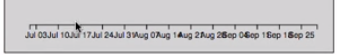
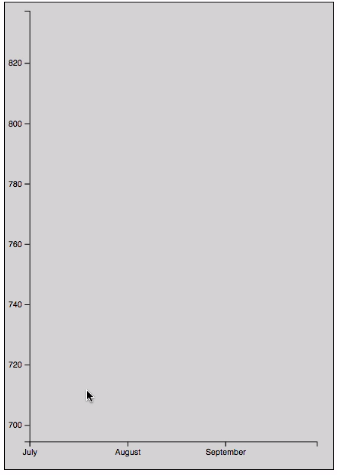
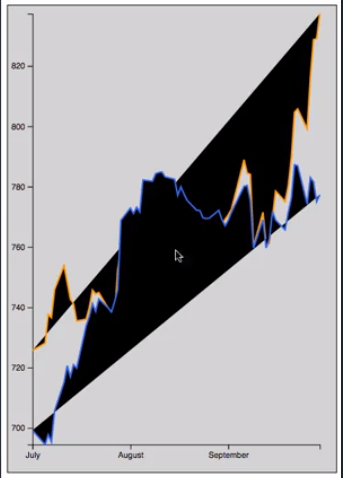
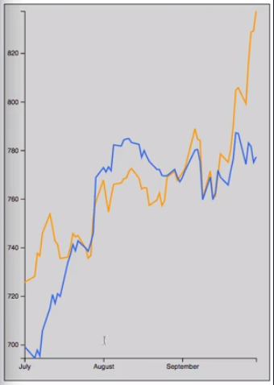
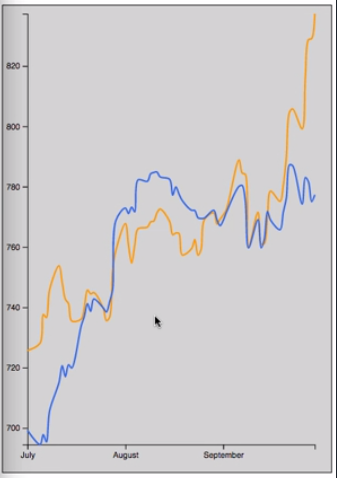

For this example, we're going to be plotting stock data. We have a `data.json` file where we've got an array of objects where each object has a `ticker` property and a `values` array. That `values` array has objects in it with a `close` property and a `date` property. The `date` that the stock closed at whatever price.

#### data.json
```javascript
[
  {
    "ticker": "AMZN",
    "values": [
      {
        "date": "2016/09/30",
        "close": 837.31
      },
      {
        "date": "2016/09/29",
        "close": 829.05
      },
      .......
```

We've got Amazon here, and we also have Google. Our data runs from September 30th of 2016 to July 1st of 2016. If we come over here to our app code, we can see that we've got the shell set up here. We've got to call it a `d3.json` to load that file.

#### app.js
```javascript
var margin = { top: 10, right: 20, bottom: 30, left: 30 };
var width = 400 - margin.left - margin.right;
var height = 565 - margin.top - margin.bottom;

var svg = d3.select('.chart')
  .append('svg')
    .attr('width', width + margin.left + margin.right)
    .attr('height', height + margin.top + margin.bottom)
    .call(responsivefy)
  .append('g')
    .attr('transform', `translate(${margin.left}, ${margin.top})`);

d3.json('./data.json', function (err, data) {
})
```

Now we can go ahead and just get into the business of creating our chart from that data. The first thing we're going to do is create a function that will parse the date strings that we have. We're dealing with four-digit year/two-digit month/two-digit day. We can create a parsing function for that using the `d3.timeParse` method.

`Y/m/d` is the format that maps to the data that we have in our JSON file. 

```javascript
var parseTime = d3.timeParse('%Y/%m/%d');
```

Now we have a function called `parseTime` that we'll be able to use to parse our data. Now that we have that set up, we can iterate over our data and make sure that everything is converted to the right format that we need. First, we'll iterate over the base array and get each `company` object out.

We'll iterate over each of the `values` objects for the `company`. We'll use our `parseTime` function to parse the date. Then we're just going to make sure that `close` is actually a number. We'll do that here as well.

```javascript
data.forEach(company => {
    company.values.forEach(d => {
      d.date = parseTime(d.date);
      d.close = +d.close;
    });
});
```

Now that our data's parsed, we can go ahead and create our scales. Since we're going to be plotting the dates along the X axis, we're going to create a time scale with `d3.scaleTime`.

For our `domain`, we need to do a little bit of work here to dig in and get these values from the second level down. We're going to call `d3.min` and then pass in the `data` array, but once we get each of those `company` objects out, we need to do an additional call to `d3.min` and pass in that array of `values` and tell it to look at the `date` property on each of these objects.

```javascript
var xScale = d3.scaleTime()
    .domain([
      d3.min(data, co => d3.min(co.values, d => d.date)),
```

The second number in our `domain` is going to be the same exact logic, but we're going to find the max value instead of the min. 

```javascript
var xScale = d3.scaleTime()
    .domain([
      d3.min(data, co => d3.min(co.values, d => d.date)),
      d3.max(data, co => d3.max(co.values, d => d.date))
    ])
```

There's our `domain`. We'll set our `range` to be from `0` to the `width` of our chart.

```javascript
var xScale = d3.scaleTime()
    .domain([
      d3.min(data, co => d3.min(co.values, d => d.date)),
      d3.max(data, co => d3.max(co.values, d => d.date))
    ])
    .range([0, width]);
```

Now that our `xScale` is created, we can go ahead and call `svg.append('g')`. You always want to have a fresh graphics container for your axis. 

We'll call the `attr` method to set the `transform` attribute and give that a call to `translate`, to move it down by the `height` of our chart so that our X axis is at the bottom. 

```javascript
svg
  .append('g')
    .attr('transform', `translate(0, ${height})`)
```
Finally, we'll do `.call` and pass in `d3.axisBottom` and then pass in our `xScale` to that.

```javascript
svg
  .append('g')
    .attr('transform', `translate(0, ${height})`)
  .call(d3.axisBottom(xScale));
```

We're creating a bottom oriented X axis using our `xScale` and setting it at the bottom of the chart.

If we save this, we see that we do in fact have a X axis that runs roughly from the beginning of July, it looks like July 3rd is the first date there, to September 25th. 



You can see we have a little bit of overlap. Maybe we want to add some directives here on how many ticks that the scale should have. Let's try doing let's say 10 ticks. 

```javascript
svg
  .append('g')
    .attr('transform', `translate(0, ${height})`)
  .call(d3.axisBottom(xScale).ticks(10));
```
That's still too many.

Maybe five? OK. Not a lot of precision in our X axis, but that's OK for now. We're not really going to be worried about specific date things lining up.

We can move on to our `yScale`. Our `yScale` is just going to be a linear scale. We'll just say `yScale` equals `d3.scaleLinear()`. 

```javascript
var yScale = d3.scaleLinear()
```
We need to do the same work that we did for our xScale in order to find the minimum, the maximum values. I'm just going to grab this code from up here, paste it down here.

This time the difference is instead of looking at the `date` property on these, we're going to be looking at the `close` property. We'll just update these. Then the rest of that code can actually stay the same.

```javascript
 var yScale = d3.scaleLinear()
    .domain([
      d3.min(data, co => d3.min(co.values, d => d.close)),
      d3.max(data, co => d3.max(co.values, d => d.close))
    ])
```

For our `range`, we're again going to set our `height` as the beginning value and `0` as the second so that we have that inverted relationship so that on our chart, larger values are shown closer to the top of the page which actually maps to smaller Y values in an SVG context.

```javascript
var yScale = d3.scaleLinear()
    .domain([
      d3.min(data, co => d3.min(co.values, d => d.close)),
      d3.max(data, co => d3.max(co.values, d => d.close))
    ])
    .range([height, 0]);
```

With the scale created, we can again do essentially the same thing we did before where we call `svg.append`, create a fresh graphics container. This time we don't even need to translate it since it's going to at the top left. We'll just say `.call`. Then we'll call `d3.axisLeft` to create a left oriented axis. We'll pass in our yScale.

```javascript
svg
  .append('g')
  .call(d3.axisLeft(yScale));
```

If we save that, we can see that now we have our Y axis in place which runs from a little bit less than 700 to say maybe 850, 860, something like that.



Now that we have parsed our data and pulled the values out that we need to create our axis, let's look at how we actually create the lines for our line chart. We're going to come down here. We're going to create a variable named `line`. We're going to set that by calling `d3.line`. Then the line generator function that we're creating here, we have to tell it how to get its `x` and `y` properties.

```javascript
var line = d3.line()
```

The first thing we're going to do is call the `.x` method. In this case, it's going to of course pass in our datums. We're just going to return the `xScale`'s translated value for the `date` property. You can probably guess how the y's going to work. That's going to be the exact same way except we're going to call our `yScale` and use the `close` property.

```javascript
var line = d3.line()
  .x(d => xScale(d.date))
  .y(d => yScale(d.close))
  .curve(d3.curveCatmullRom.alpha(0.5));
```
We have our line generator created, but we need to see how we actually add that visually to the chart. We're first going to say `svg.selectAll`. We're going to use a CSS class selector here so everything with the class of `line`, we're going to do our `data` join and give it the whole `data` array.

```javascript
svg
  .selectAll('.line')
  .data(data)
```

Again tell it what to do with our `enter` selection which is we want it to append a `path` element. We're going to give those `path` elements that `line` class that we used before.

```javascript
svg
  .selectAll('.line')
  .data(data)
  .enter()
  .append('path')
  .attr('class', 'line')
```
Now that the objects are being created, we need to tell it how to actually draw the line. To do that, we use the `d` attribute. For the `d` attribute, we're going to have a callback function here. We're going to use that `line` function that we created above, and we're going to pass it our `values` array.

```javascript
svg
  .selectAll('.line')
  .data(data)
  .enter()
  .append('path')
  .attr('class', 'line')
  .attr('d', d => line(d.values))
```

We created the `line` up here, told it which property to use for its `x` property and which to use for `y`, and so here, we're just passing in that `values` array which is filled with these objects that have the `date` and `closed` properties on them.

The code that we have so far tells D3 how to draw these lines and which values to use. Now we just need to add a couple of styles so that everything shows up properly. The first style that we're going to set is the `stroke` style. I'm actually going to paste in some code here which has a couple of colors already defined in it.

```javascript
svg
  .selectAll('.line')
  .data(data)
  .enter()
  .append('path')
  .attr('class', 'line')
  .attr('d', d => line(d.values))
  .style('stroke', (d, i) => ['#FF9900', '#3369E8'][i])
```

This is essentially Amazon orange, and this is Google blue. We're telling it when you plot the first set, use this color. When you plot the second line, use this color because we're just using that index property there of I.

We're also going to set the `stroke-width` because by default it's one which is kind of thin and can get a little bit anti-aliased and look a little bit bad. 

```javascript
svg
  .selectAll('.line')
  .data(data)
  .enter()
  .append('path')
  .attr('class', 'line')
  .attr('d', d => line(d.values))
  .style('stroke', (d, i) => ['#FF9900', '#3369E8'][i])
  .style('stroke-width', 2)
```

That's it. If we save this now, we should get a line chart.



In fact, we do, but it looks a little bit crazy because these path objects are actually being filled. What we need to do is come back here and set the `fill` to `none`. 

```javascript
svg
  .selectAll('.line')
  .data(data)
  .enter()
  .append('path')
  .attr('class', 'line')
  .attr('d', d => line(d.values))
  .style('stroke', (d, i) => ['#FF9900', '#3369E8'][i])
  .style('stroke-width', 2)
  .style('fill', 'none');
```
Once we do that, we have our actual line chart here.



We can see that Amazon has jumped ahead of Google and is much higher now. But we can see how everything worked out from the beginning of July to the end of September.

Things are a little bit jagged here. If we wanted to add a little bit of a curve to the lines just to make it look a little bit better, we can call a `.curve` method here. There's essentially just a bunch of curves built into D3 that you can use in various ways.

This time, we're going to use a `Catmullrom` curve which I will not claim to understand exactly how it works or what that means. But we're just going to set it to `0.5` alpha. That's going to give us a nice rounded curve between all these different points.

```javascript
var line = d3.line()
  .x(d => xScale(d.date))
  .y(d => yScale(d.close))
  .curve(d3.curveCatmullRom.alpha(0.5));
```


There we essentially have a working multi-series line chart. Like pretty much every other chart we've created, we loaded in some data. We did some basic parsing to make sure that values that get loaded from JSON are generally just going to be strings, so we convert things to numbers where we need to. We convert dates where we need to.

We run through that data and create our scales and our axis. To actually create a line chart, it really just comes down to these couple of lines here. We used `d3.line`, tell it how to get all of its properties, and when it comes time to create the elements, we just create a path for each one of our lines and then set its `d` attribute using that line function that we defined up above.