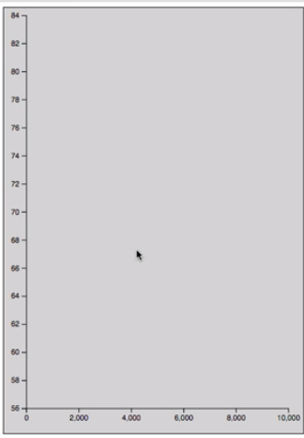
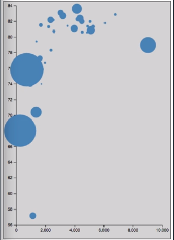
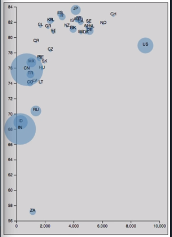

As our starting point here, we have a nice blank chart with margins and axes set up, both of the axes running from zero to 100 with a simple linear scale. I've pulled in some sample data for this example.

We've got an array of objects, and each object has a `country` name and code as well as the `population`, life `expectancy`, and average health care `cost` for that nation. We're going to plot these items on our chart using the `population`, `expectancy`, and `cost` properties.

#### data.json

```javascript
[
  {
    "country": "United States",
    "population": 323050000,
    "expectancy": 78.94,
    "cost": 9024.21,
    "code": "US"
  },
  {
    "country": "Switzerland",
    "population": 8306200,
    "expectancy": 82.85,
    "cost": 6786.57,
    "code": "CH"
  },
  ......
```

We come back over here to our code. The first thing we need to do is load in our sample data. We'll do that using the `d3.json` method and we'll tell it to load in our `data.json` file, which is in the same directory that we're working in right now.

#### app.js
```javascript
d3.json('./data.json', function (err, data) {
})
```

Go down here and grab our scales, so we can put them inside of our data loading callback. For our `yScale`, we're actually going to use the life `expectancy` property here. What we can do is come back here and instead of just having the hard coded `domain` of `0` to `100`, let's get the extent of our data's `expectancy` property.

We'll say `d3.extent`, pass in our `data`, and then the accessor function is going to return that `expectancy` property. 

```javascript
d3.json('./data.json', function (err, data) {
  var yScale = d3.scaleLinear()
    .domain(d3.extent(data, d => d.expectancy))
    .range([height, 0])
    .nice();
})
```

We'll copy this and move down here to our xScale and we're going to say `d.cost` in this one, because we're going to use the health care `cost` as our `xAxis` variable.

```javascript
 var xScale = d3.scaleLinear()
    .domain(d3.extent(data, d => d.cost))
    .range([0, width])
    .nice();
```

If we save this we should get an update of our axes here, which we do. 



We've got zero to 10,000 on our X axis and 56 to 84 on our Y axis. You'll also notice that I've added these `.nice` method calls to our scales in order to make the axes end on more round numbers than they may otherwise, based on just the data.

Now we've got our `xScale` and our `yScale` set up. In this case for our scatter plot, we're going to be using circles. We actually need to create a new scale which we'll use for the radius of our circles. I'm just going to call this one `rScale`.

This time we're going to a square root scale, so `d3.scaleSqrt()`. We're using that because when you're using circles, in order to scale the area of the circle proportionally while setting the radius, you need to use the square root scale otherwise you get sort of out of whack proportions.

```javascript
var rScale = d3.scaleSqrt()
```

In this case we're going to say our `domain` is going to start at `0` and then we are going to use the `d3.max` method to get the maximum `population`, which is what we're going to use to set our radius on. The `range` of our `rScale` is just going to be zero to whatever we want the maximum radius of our circles to be. We'll say `40` right now.

```javascript
var rScale = d3.scaleSqrt()
    .domain([0, d3.max(d => d.population)])
    .range([0, 40]);
```

Now that we've got all of our scales set up, we can actually go about creating our circles. If we say `svg.selectAll('circle')`, so SVG circle elements is what we're going to use here. We're going to set our `data` here and do our data join. Let's move this down.

```javascript
svg
  .selectAll('circle')
  .data(data)
```

Within our `enter` selection, we want to `append` a new circle. 

```javascript
svg
  .selectAll('circle')
  .data(data)
  .enter()
  .append('circle')
```
SVG circle elements have specialized properties which are `cx` and `cy` rather than just regular `x` and `y`. That stands for Center X and Center Y, so it's drawn using the center point and then grows out from there.

Remember, we set our `xScale` to use the `cost` property and the `yScale` to use the expectancy property, so those are the values that will pass to our scales in order to set these attributes.

```javascript
svg
  .selectAll('circle')
  .data(data)
  .enter()
  .append('circle')
  .attr('cx', d => xScale(d.cost))
  .attr('cy', d => yScale(d.expectancy))
```

The last thing we need to set the `r` attribute for the radius, and for that we will use our new `rScale`. We'll say `rScale(d.population)`. Let's give it a `fill` `style` so we can make sure we see it. We'll use `steelblue` again.

```javascript
svg
  .selectAll('circle')
  .data(data)
  .enter()
  .append('circle')
  .attr('cx', d => xScale(d.cost))
  .attr('cy', d => yScale(d.expectancy))
  .attr('r', d => rScale(d.population))
  .style('fill', 'steelblue');
```

Save that and it doesn't render. Ah, that's because our `rScale` here, we forgot to pass in the `data`. 

```javascript
var rScale = d3.scaleSqrt()
    .domain([0, d3.max(DATA, d => d.population)])
    .range([0, 40]);
```
If we save that, now we get a nice scatter plot with some big circles, some small circles. 



Let's actually add a little bit of opacity to these circles so that we can see where they overlap. 

```javascript
svg
  .selectAll('circle')
  .data(data)
  .enter()
  .append('circle')
  .attr('cx', d => xScale(d.cost))
  .attr('cy', d => yScale(d.expectancy))
  .attr('r', d => rScale(d.population))
  .style('fill-opacity', 0.5);
  .style('fill', 'steelblue');
```

There we go, now we can see where the circles overlap each other.

That's a basic scatter plot. We have now communicated three dimensions of data here. We've got the `cost` along the X axis, the life `expectancy` along the Y axis, and the `population` of the country based on the size of the circle.

It's a little hard to tell what is what around here because there are no labels. To do that, we could do a couple of things. One option would be to plot a bunch of text items in the same position as the circles, and lay them over top.

If you want to animate things, that can get a little tricky and things like roll overs. It's actually better if you group them with an SVG graphics container. Let's see how we do that.

The first thing we're going to do is change it so we're not creating circles here, we're creating graphics containers. We don't really want to do this and say that we want it to select all of the graphics containers because our axis and other things on the chart potentially are graphics containers, and we don't want them selected.

We're actually going to use a CSS class as our selector criteria here. We're going to call it `ball`. In order to make sure that we have the appropriate CSS class applied, when we create our graphics down here, we'll go ahead and set `class` to `ball` here.

Let's give ourselves a little bit of space here and we're going to actually assign this to a variable called `circles`. 

```javascript
var circles = svg
  .selectAll('.ball')
  .data(data)
  .enter()
  .append('g')
  .attr('class', 'ball')
  .attr('cx', d => xScale(d.cost))
  .attr('cy', d => yScale(d.expectancy))
  .attr('r', d => rScale(d.population))
  .style('fill-opacity', 0.5);
  .style('fill', 'steelblue');
```

What we're doing here is we're creating a bunch of graphics containers with the CSS class of `ball` and we're assigning that selection to a variable named `circles`.

In order to position these graphics containers where we want them, we need to use the `transform` attribute. The `transform` attribute is going to need to call the `translate` function. We're actually going to say `d`, pass that in, and we're going to return a call to `translate`.

We're going to grab these values from down here. The first value that gets passed to `translate` is our `xScale` calculated value, the second one is our `yScale`. Now we've got those there. We close this off.

```javascript
var circles = svg
    .selectAll('.ball')
    .data(data)
    .enter()
    .append('g')
    .attr('class', 'ball')
    .attr('transform', d => {
      return `translate(${xScale(d.cost)}, ${yScale(d.expectancy)})`;
    });
```

Now if we say `circles.append('circle')`, so remember, `circles` is our selection of `g` elements. We're going to append a new `circle` to each one of them. Since we set the position on the `g` element itself, we can actually set the `cx` and `cy` to `0`.

We'll still set our radius here using our `rScale`, but if we save this we should have the same exact output, but we don't. Something is wrong here. That is because I misspelled transform. Let's fix that and there we go.

```javascript
 circles
    .append('circle')
    .attr('cx', 0)
    .attr('cy', 0)
    .attr('r', d => rScale(d.population))
    .style('fill-opacity', 0.5)
    .style('fill', 'steelblue');
```

We're back to where we were before, but now we actually have `circle` elements within graphics containers. Now that we have that in place, we can go ahead and create our labels. We'll again say `circles.append`, and this time we'll append a `text` element.

We're going to set a `style` on these called `text-anchor` and we're going to set that to `middle` because we want the text to be center aligned. Let's fix that.

```javascript
 circles
    .append('text')
    .style('text-anchor', 'middle')
```

Then if we set the `fill` style so that we can actually see these things -- we'll set them to `black` for now. The last thing we need to do is actually set the `text` itself. We use another `text` here and we'll say `text` is `d.code`, and so now we have our labels here in the middle of our circles.

```javascript
  circles
    .append('text')
    .style('text-anchor', 'middle')
    .style('fill', 'black')
    .text(d => d.code);
```


You can see they're a little bit off. We can actually set the `y` attribute here, maybe like four pixels down. There we go.

```javascript
  circles
    .append('text')
    .style('text-anchor', 'middle')
    .style('fill', 'black')
    .attr('y', 4)
    .text(d => d.code);
```

Now if we actually go in and inspect our markup here, we can see that we have apparent graphics container here. We've got a bunch of graphics containers. They've each got the `ball` CSS class. If look inside there, we've see our `circle` and our `text` element, so everything is grouped together nicely, easy to animate, easy to interact with.

There you go. You've got a labeled scatter plot all based on real data.