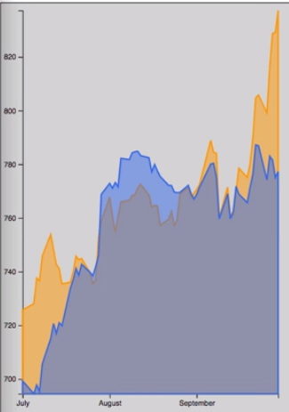

For this example we're going to be plotting stock data. We have a `data.json` file where we've got an array of objects where each object has a `ticker` property and a `values` array. That `values` array has objects in it with a `close` property and a `date` property -- the `date` that the stock closed at whatever `price`.

#### data.json
```javascript
[
  {
    "ticker": "AMZN",
    "values": [
      {
        "date": "2016/09/30",
        "close": 837.31
      },
      {
        "date": "2016/09/29",
        "close": 829.05
      },
      .......
```

We've got Amazon here, and we also have Google. Our data runs from September 30th of 2016 to July 1st of 2016. If we come over here to our app code, we can see that we've got the shell set up here. We've got to call it a `d3.json` to load that file.

#### app.js
```javascript
var margin = { top: 10, right: 20, bottom: 30, left: 30 };
var width = 400 - margin.left - margin.right;
var height = 565 - margin.top - margin.bottom;

var svg = d3.select('.chart')
  .append('svg')
    .attr('width', width + margin.left + margin.right)
    .attr('height', height + margin.top + margin.bottom)
    .call(responsivefy)
  .append('g')
    .attr('transform', `translate(${margin.left}, ${margin.top})`);

d3.json('./data.json', function (err, data) {
})
```

The first thing we're going to do is create a function that will parse the date strings that we have. We're dealing with four-digit year/two-digit month/two-digit day. We can create a parsing function for that using the `d3.timeParse` method.

`Y/m/d` is the format that maps to the data that we have in our JSON file. 

```javascript
var parseTime = d3.timeParse('%Y/%m/%d');
```

Now that we have that set up, we can iterate over our data and make sure that everything is converted to the right format that we need.

First we'll iterate over the base array and get each company object out. Then we'll iterate over each of the value objects for the company and we'll use our `parseTime` function to parse the date and then we're just going to make sure that close is actually a number, so we'll do that here as well.

```javascript
data.forEach(company => {
    company.values.forEach(d => {
      d.date = parseTime(d.date);
      d.close = +d.close;
    });
});
```

Now that our data's parsed, we can go ahead and create our scales. Since we're going to be plotting the dates along the X axis, we're going to create a time scale with `d3.scaleTime`.

For our `domain`, we need to do a little bit of work here to dig in and get these values from the second level down. We're going to call `d3.min` and then pass in the `data` array, but once we get each of those `company` objects out, we need to do an additional call to `d3.min` and pass in that array of `values` and tell it to look at the `date` property on each of these objects.

```javascript
var xScale = d3.scaleTime()
    .domain([
      d3.min(data, co => d3.min(co.values, d => d.date)),
```

The second number in our `domain` is going to be the same exact logic, but we're going to find the max value instead of the min. 

```javascript
var xScale = d3.scaleTime()
    .domain([
      d3.min(data, co => d3.min(co.values, d => d.date)),
      d3.max(data, co => d3.max(co.values, d => d.date))
    ])
```

There's our `domain`. We'll set our `range` to be from `0` to the `width` of our chart.

```javascript
var xScale = d3.scaleTime()
    .domain([
      d3.min(data, co => d3.min(co.values, d => d.date)),
      d3.max(data, co => d3.max(co.values, d => d.date))
    ])
    .range([0, width]);
```

Now that our `xScale` is created, we can go ahead and call `svg.append('g')`.

You always want to have a fresh graphics container for your axis.

We'll call the `attr` method to set the `transform` attribute and give that a call to `translate`, to move it down by the `height` of our chart so that our X axis is at the bottom. 

```javascript
svg
  .append('g')
    .attr('transform', `translate(0, ${height})`)
```
Finally, we'll do `.call` and pass in `d3.axisBottom` and then pass in our `xScale` to that.

```javascript
svg
  .append('g')
    .attr('transform', `translate(0, ${height})`)
  .call(d3.axisBottom(xScale));
```

We're creating a bottom oriented X axis using our `xScale` and setting it at the bottom of the chart.

If we save this, we see that we do in fact have a X axis that runs roughly from the beginning of July, it looks like July 3rd is the first date there, to September 25th. 


You can see we have a little bit of overlap, so maybe we want to add some directives here on how many tics that the scale should have. Let's try doing let's say 10 ticks. 

```javascript
svg
  .append('g')
    .attr('transform', `translate(0, ${height})`)
  .call(d3.axisBottom(xScale).ticks(10));
```
That's still too many.

Maybe five? OK. Not a lot of precision in our X axis, but that's OK for now. We're not really going to be worried about specific date things lining up.

We can move on to our `yScale`. Our `yScale` is just going to be a linear scale. We'll just say `yScale` equals `d3.scaleLinear()`. 

```javascript
var yScale = d3.scaleLinear()
```
We need to do the same work that we did for our xScale in order to find the minimum, the maximum values. I'm just going to grab this code from up here, paste it down here.

This time the difference is instead of looking at the `date` property on these, we're going to be looking at the `close` property. We'll just update these. Then the rest of that code can actually stay the same.

```javascript
 var yScale = d3.scaleLinear()
    .domain([
      d3.min(data, co => d3.min(co.values, d => d.close)),
      d3.max(data, co => d3.max(co.values, d => d.close))
    ])
```

For our `range`, we're again going to set our `height` as the beginning value and `0` as the second so that we have that inverted relationship so that on our chart, larger values are shown closer to the top of the page which actually maps to smaller Y values in an SVG context.

```javascript
var yScale = d3.scaleLinear()
    .domain([
      d3.min(data, co => d3.min(co.values, d => d.close)),
      d3.max(data, co => d3.max(co.values, d => d.close))
    ])
    .range([height, 0]);
```

With the scale created, we can again do essentially the same thing we did before where we call `svg.append`, create a fresh graphics container. This time we don't even need to translate it since it's going to at the top left. We'll just say `.call`. Then we'll call `d3.axisLeft` to create a left oriented axis. We'll pass in our yScale.

```javascript
svg
  .append('g')
  .call(d3.axisLeft(yScale));
```

If we save that, we can see that now we have our Y axis in place which runs from a little bit less than 700 to say maybe 850, 860, something like that.


Now that we have parsed our data and pulled the values out that we need to create our axis, let's look at how we actually create our area chart shapes.

The first thing we're going to do is create what's called an area generator. To do that, we'll call `d3.area` and then we're going to tell it how to find the `x` position. That's going to use a standard callback like we have seen plenty of times before. We're just going to use our `xScale` and pass it the `date` property.

```javascript
var area = d3.area()
  .x(d => xScale(d.date))
```

Next, and where things get a little bit different from what we've seen before, we need to set the `y0` property. When you're creating areas, what you're actually doing is telling it where to put the bottom of the shape and the top of the shape. The `y0` property is going to tell it where to draw that bottom of the shape.

For this we don't actually need anything from our data itself. We're just going to get the minimum value of our `yScale`. We're going to call our `yScale`, but instead of passing in a value from our `data` object, we're going to pass in the minimum value from our `yScale` by saying `yScale.domain` and then the first item from that array.

```javascript
var area = d3.area()
  .x(d => xScale(d.date))
  .y0(yScale(yScale.domain()[0]))
```

The `y1` property is how we set the top position. For this one we're going to do another standard data callback and then we're going to pass the `d.close` property to our `yScale`. Now we have defined our area generator in this property called `area`, which is actually a function.

```javascript
var area = d3.area()
  .x(d => xScale(d.date))
  .y0(yScale(yScale.domain()[0]))
  .y1(d => yScale(d.close))
```

Now if we come down and do just a standard `data` join we'll see how to use this. We can just say `svg.selectAll`. This time we'll use a CSS selector and call it `.area`, because we're going to be creating `path` objects, and we can't select all the paths because our axis use paths as well.

```javascript
svg
  .selectAll('.area')
```

Once we've selected all of the items within `area` class, we will say `.data`, pass in our `data` array, and then tell it we want to work on our `enter` selection. For our `enter` selection, we want to append a `path` for everything in that `enter` selection. We can go ahead and give it that `area` class, just so we've got everything configured properly there.

```javascript
 svg
  .selectAll('.area')
  .data(data)
  .enter()
  .append('path')
  .attr('class', 'area')
```

Now we can set the `d` attribute. The `d` attribute is how `path` objects have their shapes and positions defined. In this case, we're going to have our regular data callback, but this time we're going to call our `area` generator and pass in `d.values`.

```javascript
svg
  .selectAll('.area')
  .data(data)
  .enter()
  .append('path')
  .attr('class', 'area')
  .attr('d', d => area(d.values))
```

Remember, the `values` array is our array of objects with `date` and `close` properties on it, and that's what we're going to pass to our `area` generator. Our `area` generator is then going to use these callbacks that we defined here to pull those `date` and `close` properties off.

That takes care of everything that we need to define the elements. But we do need to set a couple of styles so that we can see everything.

We're going to set the `stroke` style first and we'll set that actually to some predefined colors that I found, which are essentially Amazon orange and Google blue, and we're just going to use the index of our lines here. The first line that gets drawn will be the Amazon line. The second will be Google. Not super-robust code there, but for these demonstration purposes it's simple and straightforward.

```javascript
svg
  .selectAll('.area')
  .data(data)
  .enter()
  .append('path')
  .attr('class', 'area')
  .attr('d', d => area(d.values))
  .style('stroke', (d, i) => ['#FF9900', '#3369E8'][i])
```

We're also going to set the `stroke-width` to `2` just so we get a little bit thicker of a line than we normally would. We're going to set the `fill` style using those same colors that we used for the stroke.

Lastly we will set the `fill-opacity` so that we can see through these shapes a little bit since they're going to be stacked on top of each other. We'll just set that to `0.5`.

```javascript
svg
  .selectAll('.area')
  .data(data)
  .enter()
  .append('path')
  .attr('class', 'area')
  .attr('d', d => area(d.values))
  .style('stroke', (d, i) => ['#FF9900', '#3369E8'][i])
  .style('stroke-width', 2)
  .style('fill', (d, i) => ['#FF9900', '#3369E8'][i])
  .style('fill-opacity', 0.5);
```

Now if we save this, we get our shapes. We can see our orange shape here. This is our Amazon stock price, which ends up way up here. Google's down here. But we've got our nice shapes there on top of one another.



We can go back here and add a little bit of a curve to our area generator by using the `.curve` property there, and then we're just going to use the `d3.curveCatmullRom` property, which is just one of the types of curves that's built into d3. Then we're going to call it `.alpha`, pass it a `0.5`. That'll just give us a nice, smooth curve between all of our data points here.

```javascript
var area = d3.area()
  .x(d => xScale(d.date))
  .y0(yScale(yScale.domain()[0]))
  .y1(d => yScale(d.close))
  .curve(d3.curveCatmullRom.alpha(0.5));
```


This is just a standard chart like we normally see where we're loading in some data. We are doing a little bit of data processing that we haven't always seen before. But then we're just using the data that's loaded to create our `x` and `y` scales and axis.

The area chart itself really just comes down to creating this `area` generator, where we tell it how to find its x position, its top y and bottom y positions, and then instead of drawing regular shapes like we've seen before, we're actually going to create path shapes and set the `d` attribute based on that `area` generator.