Now that we've made room for our axes, let's see how we actually create them and add them to our chart.

The first thing we're going to do is come down here. We need to create a scale. We'll start with a linear scale since that's the most straightforward type. We're just going to give it a `domain` of `0` to `100` and a `range` of `height` to `0` 

#### app.js
```javascript
var yScale = d3.scaleLinear()
  .domain([0, 100])
  .range([height, 0]);
```

The reason we're doing that in reverse is because the `y` dimension runs from top to bottom in SVG. So we want our minimum value at the bottom of the chart and our maximum value at the top.

Now that we've created the scale, we can create the axis itself. I'm going to say `var yAxis=d3.axisLeft` and then pass in our scale. 

```javascript
var yAxis = d3.axisLeft(yScale);
```
Now we've created the scale and we've created the axis, but we still need to add the axis to the chart.

The way we're going to do that is using the `call` method that we've seen previously. We're just going to add this directly to the `svg` by saying `svg.call` and then passing in the axis instance. 

```javascript
svg.call(yAxis);
```
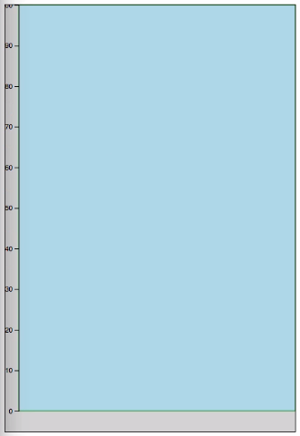

There we can see our axis actually shows up.

It's a little cramped, so let's give a little bit more `margin` here. We'll give a `top` margin so we don't get cut off in that direction. Then we'll double the `left` margin, so we've got plenty of room here.

```javascript
var margin = { top: 10, right: 0, bottom: 30, left: 40 };
```

Now we can see that `100` is at the top of our chart, `0` is at the bottom just like we expected. These labels are generated based on your `domain`. If we change that to `500`, you can see that we do get that updated. 

```javascript
var yScale = d3.scaleLinear()
  .domain([0, 500])
  .range([height, 0]);
```

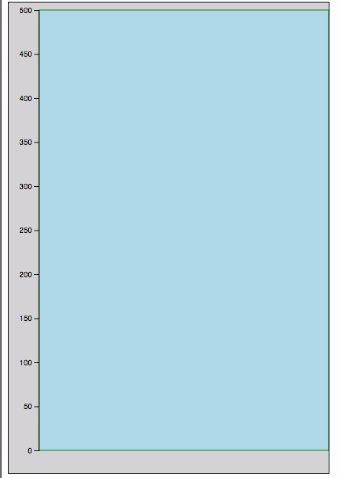

Now we've got to tick every `50` units. You can imagine what happens if you go to 5,000. It's going to update things on its own.

What D3 does is it looks at the `domain` and it creates what it thinks is a reasonable number of ticks for the area and the `domain`. If you have needs different from what it creates by default though, there are a couple of ways that you can specify how you want it to behave differently.

If we were to say `.ticks(5)` here at the end of our call when we create the axis and passed in five, it'll change how many ticks it creates. 

```javascript
var yAxis = d3.axisLeft(yScale).ticks(5);
```

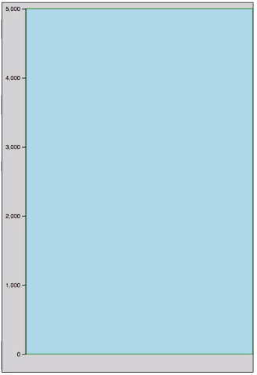

You'll notice that there are actually six ticks here if you're counting the minimum and the maximum. That's because ticks is just a suggestion. D3 is still going to use its best judgment on how to place and format these ticks.

You can also provide an optional formatting string for the ticks. There's a ton of different options, and it can get really complex. We'll look at a couple just to see basically how it works.

If you pass a `%` sign, you can see that these now get presented as percentages, but they're crazy big percentages. 

```javascript
var yAxis = d3.axisLeft(yScale).ticks(5, '%');
```
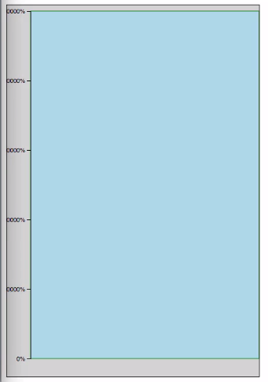

That's because if you have percentage formatting, it's expected that your `domain` has been normalized to run from zero to one. 

```javascript
var yScale = d3.scaleLinear()
  .domain([0, 1])
  .range([height, 0]);
```
If we save that, now we get 100 as our maximum down to 0 as our minimum.

We can also do things like specifying how many decimals we want. If we keep our `domain` as `0` to `1` here and specify that we always want decimals, we can change that from two to one and just get one decimal. 

```javascript
var yAxis = d3.axisLeft(yScale).ticks(5, '.1s');
```
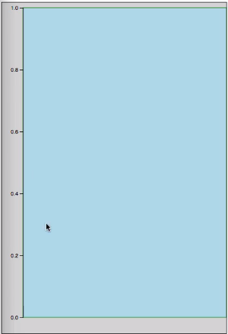

You really have a lot of control using these different formatting values. Like I said, there's a ton of options. You'll need to do a little bit of looking through the documentation on exactly how to do what you want.

The last thing I want to show is that if you have a really large `domain` so that `1E6` is one million here. Our `domain` is running from 0 to one million. 

If we change this to an `s`, we'll actually get these big M notation where we've got .6 M and that sort of thing. 

```javascript
var yScale = d3.scaleLinear()
  .domain([0, 1e6])
  .range([height, 0]);

var yAxis = d3.axisLeft(yScale).ticks(5, 's');  
```
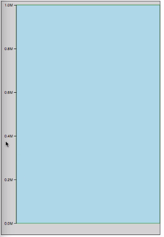

If we get rid of that formatting, it's just going to show those raw values. Let's make room for it here. Then you've got 200,000, 400,000, that kind of thing. Let's switch this back. We'll go back to 100 here. There we go.

The last thing I want to show regarding this is that if you do need to actually control the exact items that you have ticks for, you can specify that by calling `tickValues`. In this case, instead of suggesting to D3 what you want to be shown on the axis, you can give it the exact values. Maybe we want `8`, `19`, `43`, and `77` on our axis. There we get those exact values.

```javascript
var yAxis = d3.axisLeft(yScale).tickValues([8, 19, 43, 77]);  
```
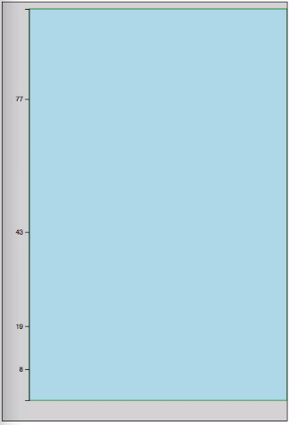

I don't know why you would choose those values, but sometimes you want that finer grain of control. `tickValues` is what's going to provide it.

That's our Y axis again using a linear scale. But one of the other places D3's axis methods are really handy is when you're dealing with dates and times. I'm going to put this back to the default and save that. Then we're going to create a time scale.

We're going to come down here. We're going to say `var xScale = d3.scaleTime()`. Since this is a time scale, our `domain` needs to hold date objects. For now we'll just do January 1st to February 1st of this year. Then our `range` is going to be `0` to our `width`.

```javascript
var xScale = d3.scaleTime()
  .domain([new Date(2016, 0, 0, 1), new Date(2016, 0, 1, 1)])
  .range([0, width]);
```

Now that we have our scale, we can create our axis. We're going to say `var xAxis=d3.axisBottom` this time and pass in our `xScale`. This scale is going to be oriented so that the labels are on the bottom.

```javascript
var xAxis = d3.axisBottom(xScale)
```

Now we can say `svg.call(xAxis)`, save that, and things are a little screwy. 

```javascript
svg.call(xAxis);
```
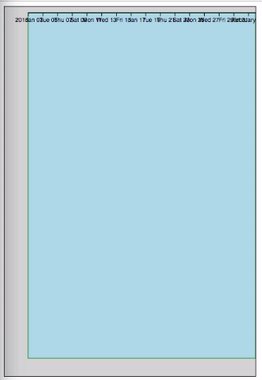

In fact, you can see that our labels are in fact on the bottom here, but it's at the top of our chart. To fix this, we actually need to use another graphics container and move this down to the bottom. We're going to say `svg.append('g')`. Then we'll `transform` that down to the bottom using an ES6 template stream.

```javascript
svg
  .append('g')
    .attr('transform', `translate(0, ${height})`)
  .call(xAxis);
```
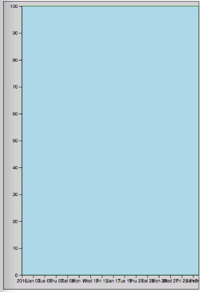

Now things are in the right position, but obviously it's a little crowded here. Let's use our `ticks` again to say that we just need about five labels. 

```javascript
var xAxis = d3.axisBottom(xScale).ticks(5)
```
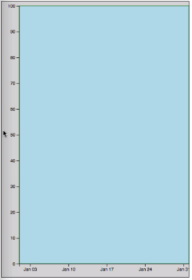

There we go. That looks better. We'll give ourselves a little more room here to avoid that cutoff. Now you can see that we have date labels here that are more or less evenly spaced out. We have January 3rd, 10th, 17th, 24th, and 31st. Every seven days, we've got a tick and a label.

If we were to adjust this so that our `domain` actually only runs from January 1st at midnight to January 2nd, you can see that it again updates intelligently. It uses 2016 for the beginning of the year there, and then we have 6:00 AM, 12:00 PM, and so on. It will again intelligently update based on these date intervals.

```javascript
var xScale = d3.scaleTime()
  .domain([new Date(2016, 0, 0, 1), new Date(2016, 0, 0, 2)])
  .range([0, width]);
```
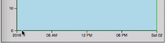

Let's show a domain even smaller, January 1st 6:00 AM to January 1st at 12:00 PM. There we've got intervals of one hour. 

```javascript
var xScale = d3.scaleTime()
  .domain([new Date(2016, 0, 0, 1, 6), new Date(2016, 0, 0, 1, 12)])
  .range([0, width]);
```

When you're dealing with time scales, you can pass in these different time intervals into `ticks` instead of just a number. We can say `d3.timeMinute.every(45)`.

```javascript
var xAxis = d3.axisBottom(xScale).ticks(d3.timeMinute.every(45));
```

That's a little crowded. Let's make this a shorter range. Let's make it a three hour window here, from 6:00 AM to 9:00 AM. We want to tick every 45 minutes. In fact we get 6:00 AM, 6:45 AM, 7:00 AM, 7:45 and so on. There's still a little bit of D3's own choices in there, the fact that it's doing every hour on the hour, but we do have a tick for every 45 minutes after the hour.

```javascript
var xScale = d3.scaleTime()
  .domain([new Date(2016, 0, 0, 1, 6), new Date(2016, 0, 0, 1, 9)])
  .range([0, width]);
```

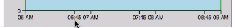

You can probably imagine that there's nearly infinite ways to customize this and tweak it, but that's all we'll look at now in terms of creating the labels.

I'm going to go ahead and turn this back to just a simple interval and look at a couple last things for how to alter the presentation of these axes. I'm going to increase our bottom margin here a bit to give us a little more room to work with.

The first thing I want to show is, for our bottom axis here, we've got our `ticks` specified. We can actually also specify the tick size. If we say `tickSize` is `20`, it's going to give us longer ticks here so that we can actually control that.

```javascript
var xAxis = d3.axisBottom(xScale)
  .ticks(5)
  .tickSize(20);
```
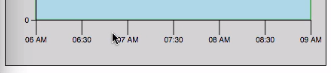

If you want even finer grain control, you can separately specify the inner and outer tick sizes. Maybe we want our inner ticks to be `10` and our outer ticks to be `20`. 

```javascript
var xAxis = d3.axisBottom(xScale)
  .ticks(5)
  .tickSizeInner(10)
  .tickSizeOuter(20)
```
Now we see...Well, it's sort of hard to see there.

To show that it actually does work, we can do `tickPadding` which is another option that we have here and set that to `15`. You can see the tick padding is based on the smallest tick size. 

```javascript
var xAxis = d3.axisBottom(xScale)
  .ticks(5)
  .tickSizeInner(10)
  .tickSizeOuter(20)
  .tickPadding(15)
```
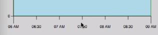

Everything is now aligned here on labels, but we've got these longer ticks on the outside.

Those are our different ways of modifying how the ticks and labels are arranged on the chart...