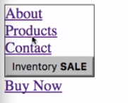
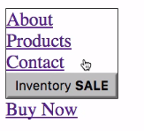
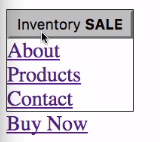
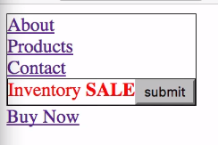
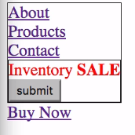

We've now seen how to modify an existing document, but let's look at how we can actually create new elements from our D3 code as well. We've got our `div` here with a class of `title`. 

#### index.html
```html
<div class="title">
    <a href="#">About</a>
    <a href="#">Products</a>
    <a href="#">Contact</a>
</div>
```

I'm going to change this first line here to `d3.select('.title')`, and then we can get rid of this. We're not worried about that anymore, and we can get rid of this.

What I'm actually going to do here is, I'm going to `append` a new `button`. I'm saying select the `div`, `append` a new `button`. Now this `html` method call is going to be affecting this button that we create.

#### app.js
```javascript
d3.select('.title')
    .append('button')
    .html('Inventory <b>SALE</b>')
```

If we save this, we can see that our `Products` link goes back to normal. We now have a button whose inner HTML is `Inventory`, and then a bold `SALE`. 



This is pretty simple. One thing to note here is that this method of `append` and the other methods we're going to look at here, are actually changing the selection.

`d3.select('.title')` here is going to return a selection that is this whole `div` that's inside of our border. 



Once we say `.append`, that's going to return a new selection. Any statements that come after this line are going to affect that new selection.

There's actually a convention in the D3 world where anything that creates a new selection is generally indented two spaces, and anything that operates on an existing selection is indented four spaces. If we're going to follow that, we would indent this.

```javascript
d3.select('.title')
  .append('button')
    .html('Inventory <b>SALE</b>')
```

In this case, it's not going to provide a whole lot of benefit. If we were creating multiple items in the same statement, then it becomes useful in seeing where you're changing the objects that are actually being operated on.

In addition to appending, you can actually insert elements. If we change this to `insert`, it's not going to look any different. 

```javascript
d3.select('.title')
  .insert('button')
    .html('Inventory <b>SALE</b>')
```

By default, it's going to put it at the end. There's a second argument to insert, which is a before selector.

If we were to say `a:first-child` here, we're telling it we want you to insert this `button` before the first child. 

```javascript
d3.select('.title')
  .insert('button', 'a:first-child')
    .html('Inventory <b>SALE</b>')
```



We can see here that it does, in fact, get added to the beginning. We could change this to an `nth-child` thing, where we say `nth-child(2)`, and we put in the second position there, or we put it before the second child.

That's how `insert` works. It allows you to specify where you want something created. The other thing to note is just that this first argument to `insert`, or the argument to `append`, can be any element name. It's essentially like you're calling document.createElement, and passing in that type.

We could say `div`, and it's just going to create another `div` here. 

```javascript
d3.select('.title')
  .insert('div', 'a:nth-child(2)')
    .html('Inventory <b>SALE</b>')
```

You get the idea. You can also remove elements from the DOM with D3. We could say `d3.select`, and remember this last link that we have here outside of our `div` has a class of `action`.

We could say `d3.select('.action').remove()` , and it will actually remove that link from the page. Whatever selection you have created here, if you then call `remove`, it's actually going to remove that from the document.

```javascript
d3.select('.action').remove()
```

To show an example of this convention here that we talked about, let's do this. We'll change this back to `append`, so that we've only got one argument here to worry about. We're saying `select` that `title` `div`, `append` a new `div`, set its HTML to `Inventory SALE`.

We can also set a `style` on it. We'll just say style `color`, `red`. 

```javascript
d3.select('.title')
  .append('div')
    .style('color','red')
    .html('Inventory <b>SALE</b>')
```

There, it's moved down to the end, since we changed it back to append. We're setting the `style`, setting the `html`, and now we're going to unindent one level because we're going to create another item here.

This time, we'll go back to creating a `button`. Maybe let's just say the `text` is `submit`. 

```javascript
d3.select('.title')
  .append('div')
    .style('color','red')
    .html('Inventory <b>SALE</b>')
  .append('button')
    .text('submit')
```


There, we get a `button` added. It's on the same line there, since it's an in-line object. We can actually say `.style('display', 'block')`
```javascript
d3.select('.title')
  .append('div')
    .style('color','red')
    .html('Inventory <b>SALE</b>')
  .append('button')
    .style('display','block')
    .text('submit')
```


Now we've got that on its own line there. You can see here, when you have multiple things being created in a single statement, it becomes useful to be able to easily tell, "OK, we're creating a new selection here because it's only indented two." Then these lines are affecting that selection.

Here, we're back to a two-space indent. That means we're creating a new selection by appending this `button`. Then these two lines are going to affect that selection. It just makes the code a little bit easier to understand. It's good to know, because you'll see a lot of examples that use this convention.