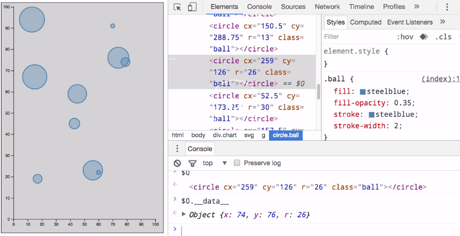
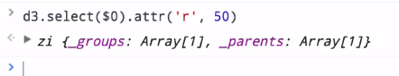
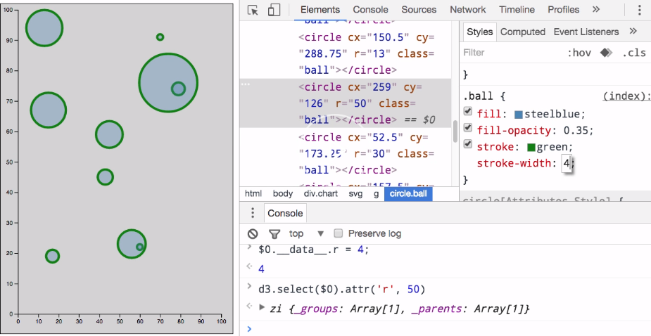
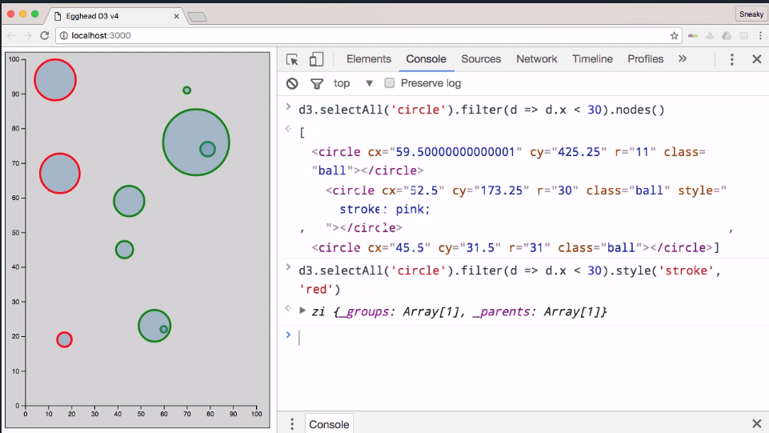

Since d3 visualizations are created using standard web technologies, you can use things like dev tools in Chrome to debug them quite easily.

The first thing I want to look at is if we inspect one of these elements in here, we've got the special `$0` variable, which points to the dom element that we selected. Now, if we say `$0` and then look up this `__data__` property, we can actually see the data that's being rendered by that circle.



That's something that d3 does when you create these elements. It puts the associated `data` object in that property so that you can inspect it just like this.

Now, you can't change a property in that object and expect the visualization to update because there's not any sort of two-way binding. But it can be helpful to see what values are being used to render.

Now, you can modify one of those attributes directly if you would like to. Assuming you have d3 globally available, you could say `d3.select($0)` and then set an attribute directly like that. 



When we run that, we get a bigger circle here because we're directly setting that `radius` attribute.

You can see that all of these circles have this CSS class named `ball` applied to it. We could, of course, change properties here and update our entire visualization there to see how different styles may affect things.



You could also, of course, just modify a single element if you wanted to see, maybe, you were trying to figure out what different rollover styles or things like that may be available. You could do it directly on an element like that.

You could even do something like filter down to just the elements in a certain part of the chart. If we were to say `d3.selectAll("circle")` that's going to give us all of the circles and then we can actually filter it down. Our `filter` function here is going to receive the data objects.

We'll `filter` anything with an `x` property less than `30` and then spit out those nodes. 

#### browser console
```javascript
d3.selectAll('circle').filter(d => d.x < 30).nodes()
```

Now, we can see that we actually do have those dom elements there.

If you were to remove that `nodes` call there, you could actually go and set different styles on here or do whatever to these things. You could set a `stroke` style to be `red`. There you go. You've styled all of those elements.



You can see how there's different ways to play around with the elements in the browser. Sometimes, that can be a quicker feedback loop than actually editing your code, reloading the browser, and that sort of thing.