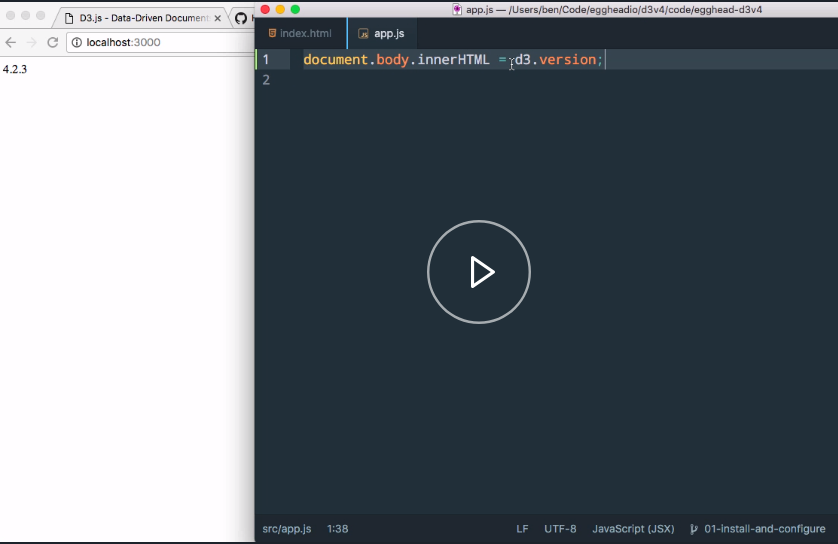

The [D3 website](https://d3js.org/) itself is a fantastic resource when learning the technology. It has literally hundreds of examples that you can look at the source for, and experiment with. It has really, really comprehensive documentation, and of course, it has basic installation instructions, which is what we're interested in here.

As you would expect, you can simply include a basic script tag that loads the library from the D3 website, or you can download a ZIP, if you'd rather have it locally. 

```javascript
<script src="https://d3js.org/d3.v5.min.js"></script>
```

If we look at the [installing](https://github.com/d3/d3/wiki#installing) section of the wiki, we can see that they offer a minimized version and a regular version, as you would expect.

They also allow you to simply include the different microlibraries of D3. In version four, D3 was rewritten to be just a collection of these tiny modules. You can include just the pieces you need when it comes time to really save on file size, and things like that.

You do have to be aware that, if you're using these microlibraries, you have to know what each piece depends on, and make sure you load those things in order. You either need to be careful about that, or use a tool like [Rollup](http://bl.ocks.org/mbostock/bb09af4c39c79cffcde4) to create a custom bundle that will analyze your code, and create a bundle that has exactly what you need, and nothing more.

For our purposes, we're just going to use the version that is included on the D3 website. It makes our examples nice and portable. Then we're going to have a script tag in our body that will include our own custom code.

That's just in our `app.js` file within our source directory. Right now, that `app.js` file is just empty. 

#### index.html
```html
<!DOCTYPE html>
<html lang="en">
<head>
  <meta charset="UTF-8">
  <title>Egghead D3 v4</title>
  <script src="//d3js.org/d3.v4.min.js"></script>
</head>
<body>
  <script src="src/app.js"></script>
</body>
</html>
```

Now in order to give ourselves a nice, productive dev environment, we're going to install browser-sync from npm.

```javascript
npm i -D browser-sync
```

Through the magic of editing, we'll have that run really quick. Beware that that can sometimes take quite a long time to install. Now that we have that in place, we'll have a dev server that will reload on changes, and we can really iterate quickly.

In order to make things completely straightforward, I've created an npm script in `start` that just starts up `browser-sync`. It starts a server, tells it to watch our `index.html` file and our source directory. That allows us to simply come to our terminal and say `npm start`. It'll start up everything we need, and it'll actually even open the browser for us.

#### package.json
```javascript
  "scripts": {
    "start": "browser-sync start -s -f index.html src --no-ui --no-notify"
  },
```
Right now, our browser's empty, because we haven't done anything. Let's come over here, and we'll just write some text to our `document.body`.

We'll just write in the `d3.version` that's loaded. 

#### app.js
```javascript
document.body.innerHTML = d3.version
```

The version of D3 that we're loading from the website creates a global variable called `d3` that has the entire library available to us. If we rearrange our windows here a little bit so we can actually see, we do, in fact, get that version number printed out to our browser.



It's a little small, so let's maybe wrap it in some header tags. 

```javascript
document.body.innerHTML = `<h1>${d3.version}</h1>`;
```
Now we can see that, nice and big, we've got our version number there. You can see that it's updating when we change things. Maybe we want to add a `Hello from`.

```javascript
document.body.innerHTML = `Hello from <h1>${d3.version}</h1>`;
```

There we go. It updates. As soon as we save our code, our browser's going to reload so that we can our changes immediately.