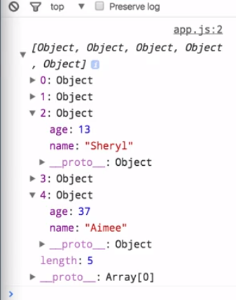
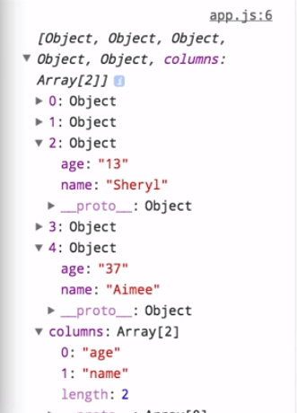
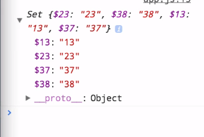

D3 has a lot of useful methods for dealing with data, but first of all you need to get the data. Now, in a real application you're probably going to be loading data as part of your application framework. D3 does have methods to load data itself in the case that you do need it. I've got some sample data here in three different formats.

We've got `data.json`, which is just an array of five simple objects that each have a `name` and an `age` property. We also have the same data in CSV format, and the same data again in TSV format, or tab-separated values. What we're going to look at is just the methods for loading that data in D3.

#### data.json
```javascript
[
  {
    "age": 23,
    "name": "Welch"
  },
  {
    "age": 38,
    "name": "Villarreal"
  },
  {
    "age": 13,
    "name": "Sheryl"
  },
  {
    "age": 37,
    "name": "Marshall"
  },
  {
    "age": 37,
    "name": "Aimee"
  }
]
```

#### data.csv
```javascript
age,name
23,Welch
38,Villarreal
13,Sheryl
37,Marshall
37,Aimee
```

#### data.tsv
```javascript
age	name
23	Welch
38	Villarreal
13	Sheryl
37	Marshall
37  Aimee
```

`d3.json()` is a method that you can call, passing in the URL to the data file that you want to load and then providing a callback which will then receive the load and then parse the data. If we now call this and load our json file you can see we get an array with five items in it, which are just the objects that we looked at before.

#### app.js
```javascript
d3.json('data/data.json', function (data) {
    console.log(data)
})
```



If we comment this out, we can do the same basic thing but use the `d3.csv()` method and load in the CSV file. In this case we get back an array-like object. We've got this `columns` property here, which is just the different column names that we have, so `age` and `name`. Then besides that object, we've got all of our actual data objects.

```javascript
d3.json('data/data.csv', function (data) {
    console.log(data)
})
```


If we change the `csv` to `tsv`, we get the same exact subject here. But obviously, most of the time you're going to be working with json data, so we'll just move right back to that call.

I mentioned some of the methods that D3 makes available for working with your data. The first one we'll look at is just `d3.min()` In this case, we're going to pass it our `data` array as well as a callback function that will return the `age` property off of each object.

```javascript
d3.json('data/data.json', function (data) {
    var min = d3.min(data, function (d){
        return d.age;
    })
});

console.log(min); // output 13
```

If our data was just a plain array of numbers, we wouldn't need to pass in this access or function at all. We could simply pass the data and be done. If we run this and then log out the value, we'll see that it spits out `13`, which is in fact the minimum age that was found in our `data`.

Not unexpectedly, there's a `d3.max()` corollary, which will do the same thing but return the maximum value. 

```javascript
d3.json('data/data.json', function (data) {
    var max = d3.max(data, function (d){
        return d.age;
    })
});

console.log(max); // output 38
```

Then finally, if you want to find both the minimum and the maximum, you can use `d3.extent()` and that will return a two-element array where you've got the minimum element first and then the maximum element.

```javascript
d3.json('data/data.json', function (data) {
    var extent = d3.extent(data, function (d){
        return d.age;
    })
});

console.log(extent); // output [13, 38]
```


If this sort of array looks familiar it's because we used it in our scales. What we can actually do now is we can create a linear scale and pass that `extent` that we've calculated from our data as the `domain`. Then we'll use a `range` of `0` to `600` again, just like before, so maybe our chart is going to be 600 pixels wide.

```javascript
 var scale = d3.scaleLinear()
    .domain(extent)
    .range([0, 600]);
  console.log(scale(24));  // output 264
```

Now if we log out, passing some random value, say `24`, to our `scale`, we get `264`. We know that if the value of `24` is in our data, that's going to map to a pixel value of `264`. We can change that to `37`, which we know is 1 shy of our maximum of `38` and we get `576`. You can see it's mapping everything properly based on the actual data we're working with.

Speaking of that `37`, you can see here that we have two of those, and sometimes that's fine and other times you need to deal with that fact. 

#### data.json - extract
```javascript
 {
    "age": 37,
    "name": "Marshall"
  },
  {
    "age": 37,
    "name": "Aimee"
  }
```

In the case that you want to get a unique set of values from your data, you can use the `d3.set()` method. This again, uses the same function signature, where we pass it the `data` itself and then we accessor function where we'll return the `age`.

#### app.js
```javascript
var ages = d3.set(data, function (d) {
    return d.age;
});

console.log(ages);
```

What is then returned is this set object. 



You can see here we've got some sort of strange property names here, and what we actually really want is just the values, so we're going to call `.values` on that. 

```javascript
console.log(ages.values()); // output ["23", "38", "13", "37"]
```

Now you can see we have an array that holds the unique values from the data that was loaded. You could end up using this as part of a quantized scale, an ordinal scale, or however you need to.