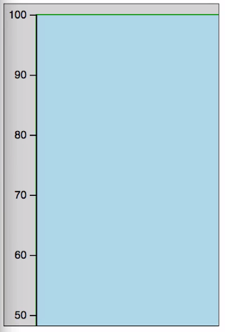
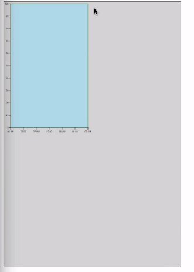
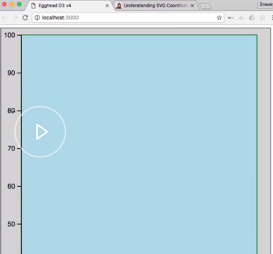

We now have a nice little chart with X and Y axes, but it's drawn at a specific set of dimensions. For this lesson, I've changed these dimensions to be `400` by `600` just to make some math a little bit easier.

There are a number of ways that you can make D3 charts responsive, but the best and probably most common is to use the `viewBox` attribute of `svg`, which essentially just takes advantage of the vector nature, and scales your graphics accordingly.

Before we get into the actual syntax changes, I want to look at an example article that makes some really good points, and spells things out really well. This article is [Understanding SVG Coordinate Systems](https://www.sarasoueidan.com/blog/svg-coordinate-systems/) by Sara Soueidan, and it's really, really good. I definitely suggest you check it out.

The first part we're going to look at is the section on the viewport. It tells us that the viewport is the viewing area where the SVG will be visible. This is important to remember. It says, "You can think of the viewport as a window through which you can see the scene."

If we come down here, and it specifically tells us you specify the size of the viewport using the width and height attributes on the outermost SVG element. We've done that already. We're creating our SVG, and setting its `width` and `height` attributes here. We've got this part covered.

#### app.js
```javascript
var margin = { top: 10, right: 20, bottom: 30, left: 30 };
var width = 400 - margin.left - margin.right;
var height = 600 - margin.top - margin.bottom;
```

What we're interested in to make things responsive, though, is what's called the viewBox. We can see here that Sara says she thinks of the viewBox as the real coordinate system, because it's the coordinate system used to draw the SVG onto the canvas.

You can see here that the viewBox uses a space-separated list of values which represent the minimum X and Y, and then the width and the height. If we just want to see how this works in our own code, let's go in here.

I'm first going to create a couple of variables just to save on space here in our screencast. Here, I'm creating `fullWidth` and `fullHeight` variables that will hold the actual full size of our SVG. We're setting the `width` and `height` attributes of our SVG to include the margins, since that is part of our SVG. It's just used to make room for our axes.

```javascript
var fullWidth = width + margin.left + margin.right;
var fullHeight = height + margin.top + margin.bottom;
```

Let's go ahead and create a `viewBox` attribute here. We'll use another template string to set its value, where our X and Y are `0 0` since we want it to start at the top left. Then we're just going to use our `fullWidth` and `fullHeight` so that our `viewBox` is set to 400 and 600.

```javascript
var svg = d3.select('.chart')
  .append('svg')
    .attr('width', width + margin.left + margin.right)
    .attr('height', height + margin.top + margin.bottom)
    .attr('viewBox', `0 0 ${fullWidth} ${fullHeight}`)
```

If we save this, nothing looks different. It's exactly the same as it was before.

However, if we were to, say, cut these values in half -- so half of our width and half of our height -- and now we save this, we see that our chart is actually too big for the visible area here, which is a little bit weird, because we've told it the `viewBox` should be half the size of our existing SVG, not twice as big.

```javascript
var svg = d3.select('.chart')
  .append('svg')
    .attr('width', width + margin.left + margin.right)
    .attr('height', height + margin.top + margin.bottom)
    .attr('viewBox', `0 0 ${fullWidth / 2} ${fullHeight / 2}`)
```


What's going on? For this, we'll go back to Sara's article here. We can see that she has a great little explanation of what actually happens. In her case, her SVG was 800 by 600, and 400 by 300 was half of the amount.

In our case, we've got 400 by 600, but we're still using half-size values for the `viewBox`. It tells us that it specifies that a region of the canvas spanning from 0,0 to 400 by 300 -- or in our case, 200 by 300 -- is going to be used.

The SVG graphics are drawn in the entire area available. The SVG is then going to be cropped according to that region. Then that region is going to be scaled up to fill the entire viewport, which again, remember, the viewport are the SVG's `width` and `height` attributes.

What's happening here is our chart was being drawn to essentially fill this gray area. The `viewBox` is then drawn to half of that area, pinned at the top left. Essentially, this top quarter. It's cropping that, and then that top quarter is getting scaled up.

That's why, when we cut the `viewBox` down in half, we end up with a graphic that's two times as big. If we were to make the `viewBox` twice as large as our area, we'll get a small graphic. In this case, the graphic was drawn to fill this whole gray area.

```javascript
var svg = d3.select('.chart')
  .append('svg')
    .attr('width', width + margin.left + margin.right)
    .attr('height', height + margin.top + margin.bottom)
    .attr('viewBox', `0 0 ${fullWidth * 2} ${fullHeight * 2}`)
```


Then an area twice the size of this gray area was essentially snapshot, and then scaled down to fix. When the whole thing was scaled down to fit this gray area, our chart ended up as just this top left corner.

This is all somewhat convoluted, and thankfully, you're not going to really deal with setting `viewBox` values manually most of the time. I'm going to go ahead and set this back to the way we were before, and get rid of these.

We're back to our standard chart here that is `400` by `600` pixels wide, or at least our SVG element is. We're going to go ahead and add a function to our code here called `responsivefy`. This function was actually written by a guy named Brendan Sudol.

```javascript
function responsivefy(svg) {
  // get container + svg aspect ratio
  var container = d3.select(svg.node().parentNode),
      width = parseInt(svg.style("width")),
      height = parseInt(svg.style("height")),
      aspect = width / height;

  // add viewBox and preserveAspectRatio properties,
  // and call resize so that svg resizes on inital page load
  svg.attr("viewBox", "0 0 " + width + " " + height)
      .attr("preserveAspectRatio", "xMinYMid")
      .call(resize);

  // to register multiple listeners for same event type,
  // you need to add namespace, i.e., 'click.foo'
  // necessary if you call invoke this function for multiple svgs
  // api docs: https://github.com/mbostock/d3/wiki/Selections#on
  d3.select(window).on("resize." + container.attr("id"), resize);

  // get width of container and resize svg to fit it
  function resize() {
      var targetWidth = parseInt(container.style("width"));
      svg.attr("width", targetWidth);
      svg.attr("height", Math.round(targetWidth / aspect));
  }
}
```

I'll have a link to the [original source](https://brendansudol.com/writing/responsive-d3) post in the readme. Let's take a look at what this actually does. `responsivefy` accepts an `svg` argument here. This is actually an `svg` selection. If we were to do `d3.select(svg)` and pass that in, that's what this is going to be expecting.

It takes that `svg`, and it calls the `node` method, which again, remember, returns the raw DOM node. Then it finds the `parentNode` of that. In our case, we're drawing our SVG within this `div` with a `class` of `chart`. This would be the parent node.

This function is going to save the reference to that parent element in this variable named `container`. It's going to measure the `svg` element itself. It's going to get the `width` and the `height` of the `svg` element however it has been drawn. Then it's going to calculate the aspect ratio.

```javascript
 var container = d3.select(svg.node().parentNode),
      width = parseInt(svg.style("width")),
      height = parseInt(svg.style("height")),
      aspect = width / height;
```

It will create the `viewBox` attribute, and set its dimensions to be the `width` and the `height` as well. When it's initially rendered, the SVG's width and height attributes will match exactly the `width` and `height` values within the `viewBox` attribute.

```javascript
 svg.attr("viewBox", "0 0 " + width + " " + height)
      .attr("preserveAspectRatio", "xMinYMid")
      .call(resize);
```

We can ignore this preserve aspect ratio line for now. That's just instructions on how the `svg` should be scaled when things aren't necessarily matched in terms of aspect ratio. Once it has set that `viewBox` attribute on the `svg`, it's going to call a function called `resize`.

What `resize` does is it will then get the `width` of the parent container. It measures the parent container, and finds out how wide it is. It updates the `width` attribute of our `svg` to match the `width` of its parent container.

```javascript
function resize() {
    var targetWidth = parseInt(container.style("width"));
    svg.attr("width", targetWidth);
    svg.attr("height", Math.round(targetWidth / aspect));
}
```
It's essentially just telling the `svg`, "You need to be as wide as whatever element you are inside of." It'll then update the `height` attribute of the `svg` using that target `width`, and the aspect ratio that it calculated earlier.

Here, it's also setting up a `resize` listener so that any time the actual browser window gets resized, this resize function will again get called.

```javascript
 d3.select(window).on("resize." + container.attr("id"), resize);
```

To see this in action, we're going to go back up here to our `svg` selection, which is what we have in context here.

If we just add a call to `responsivefy`, that's actually going to get called and passed our `svg` selection. Now we're also going to go here, and we're going to remove the hard-coded width and height for our div.

```javascript
var svg = d3.select('.chart')
  .append('svg')
    .attr('width', width + margin.left + margin.right)
    .attr('height', height + margin.top + margin.bottom)
    .call(responsivefy)
  .append('g')
    .attr('transform', 'translate(' + margin.left + ', ' + margin.top + ')');
```

That's going to cause our div to fill the available horizontal space in our browser. That's just how divs behave. If we come back here, and we save this, we can see that our chart actually gets scaled as we resize our window.



Again, if we go and look at what's happening, according to this `responsivefy` method, whenever the browser window gets resized, it's going to call this function. It's going to go find the `width` of the parent container, and set the `svg`'s `width` attribute to the same `width` as that container.

It's then going to set the `svg`'s `height` attribute using that same `width` and the aspect ratio it initially calculated.

If we go over here, make our browser window a little bit bigger, and open up our inspector, if we find our `svg` tag in here...Here's our `svg` tag. If we watch while we resize, you can see that the `width` and `height` attributes are actually being updated as we get resized. Our `viewBox` is staying `400` by `600`, but our `svg` `width` and `height` are being changed to match the parent container.

When you set this initial `width` and `height`, what you're now essentially doing is just setting the aspect ratio that your chart should always follow. Your `svg` element gets created with these `width` and `height` variables, but then `responsivefy` is called immediately.

```javascript
//initial width + height
var width = 400 - margin.left - margin.right;
var height = 600 - margin.top - margin.bottom;
```

Those `width` and `height` attributes get updated according to the logic we looked at before. The only thing that really remains after the initial render is the ratio between your `width` and your `height`. As we make it wider here, you can see it's getting taller, because it's maintaining that same aspect ratio.