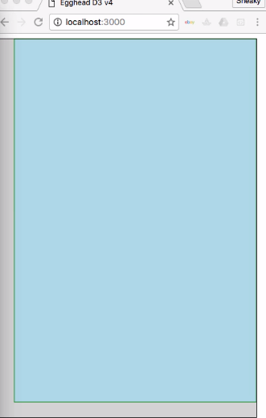
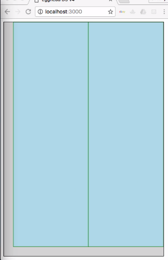

Most charts use axis to label and provide context to the data that they're displaying, and while D3 provides APIs for creating these axis, it relies on a simple convention to make room for these axis. In this lesson, we'll take a look at the margin convention, which is used widely within the D3 community.

I've simplified our example here, so we just have the chart style, and I've updated the sizing so that it fits in this window perfectly without any scaling. There are no items within the chart div to begin with, and our JavaScript file has been completely cleared out.

#### index.html
```html
<!DOCTYPE html>
<html lang="en">
<head>
  <meta charset="UTF-8">
  <title>Egghead D3 v4</title>
  <script src="//d3js.org/d3.v4.min.js"></script>
  <style>
    .chart {
      background: lightgray;
      border: 1px solid black;
      width: 425px;
      height: 625px;
    }
  </style>
</head>
<body>

  <div class="chart"></div>

  <script src="src/app.js"></script>
</body>
</html>
```

To keep things as simple as possible, we're going to fill this space with one single `rect`. The first thing we'll do is create a root `svg` element. We'll give it dimensions that match the size of our container `div`, and then we'll create a `rect` with the same dimensions as well. We'll give our `rect` a simple `fill` and `stroke`, so that we can see exactly where it lies.

#### app.js
```javascript
var svg = d3.select('.chart')
  .append('svg')
    .attr('width', 425)
    .attr('height', 625)
  
svg.append('rect')
  .attr('width', 425)
  .attr('height', 625)
  .style('fill', 'lightblue')
  .style('stroke', 'green');
```

Now we have an `svg` element that fills the space of our div and a `rect` that fill the space of the `svg`. Now we can go ahead and create our margins.

In the D3 margin convention, you create an object named `margin` and give it properties of `top`, `right`, `bottom`, and `left`. We'll set everything to `0` to begin with so that we can see the effects as we update things.

```javascript
var margin = { top: 0, right: 0, bottom: 0, left: 0 };
```

Next, we're going to create variables to hold our `width` and our `height`. Our `width` variable will hold the value of our original width minus the horizontal properties of our `margin` object, so `margin.left` and `margin.right`.

```javascript
var width = 425 - margin.left - margin.right;
```

Similarly, our `height` will be our original `height` minus the `top` and `bottom` properties of our `margin` object. 

```javascript
var height = 625 - margin.top - margin.bottom;
```

We'll then adjust the values that we apply to the `svg` tag by using the `width` and `height` variables, but adding back in the margins that we removed previously.

```javascript
var svg = d3.select('.chart')
  .append('svg')
    .attr('width', width + margin.left + margin.right)
    .attr('height', height + margin.top + margin.bottom)
```

This means that the `svg` elements, `width` and `height` attributes, will match the numbers that we provided above before the `margin` properties are subtracted. In order to use these margins, however, we need to create a new element that will house the rest of our visualization. We're going to append a graphics container by calling `append('g')`, and then we'll move that container according to the properties defined in our `margin`.

To do this, we'll set the `transform` attribute of our graphics container. We're going to use an ES6 template string and call the `translate` method, passing in the `margin.left` and `margin.top` properties.

```javascript
var svg = d3.select('.chart')
  .append('svg')
    .attr('width', width + margin.left + margin.right)
    .attr('height', height + margin.top + margin.bottom)
  .append('g')
    .attr('transform', `translate(${margin.left}, ${margin.top})`);
```
Next, we can update our code that actually populates the chart, and set the `width` and `height` of our `rect` element to the `width` and `height` variables that we have calculated above. 

```javascript
svg.append('rect')
  .attr('width', width)
  .attr('height', height)
  .style('fill', 'lightblue')
  .style('stroke', 'green');
```
Our chart doesn't look any different yet, and that's because all of our `margin` properties are set to `0`.

Let's go ahead and change that, and set the `bottom` and `left` `margin` properties to `25`. 

```javascript
var margin = { top: 0, right: 0, bottom: 25, left: 25 };
```



Now we can see our rectangle is, in fact, moved over and up by 25 pixels. To understand what's going on here, the `width` variable is actually going to be holding `400` as its value, because we've set it to `425` and then subtracted the `left` and `right` properties, where the `left` is `25` right now, and the `right` is `0`.

Similarly, `height` is going to hold a value of `600`, because we've started with `625` and subtracted the `25` from our `bottom` margin.

When we create the root `svg` tag, we add those margin properties back in so that they hold the values of those numbers at the beginning. If we go inspect our page, we can see that our `width` and `height` properties are, in fact, set to `425` and `625`.

Where the benefit comes in is that everything after this initial element creation can simply use the `width` and `height` properties and ignore all of the margins completely. To show that this is flexible and works for multiple elements, we'll go ahead and copy our `rect` and create another one, and we'll set each of them to be half the `width`.

We'll move the second one over, and now we can see that we have two rectangles side by side, both respecting the margins. 

```javascript
svg.append('rect')
  .attr('width', width / 2)
  .attr('height', height)
  .style('fill', 'lightblue')
  .style('stroke', 'green');

svg.append('rect')
  .attr('x', width / 2)
  .attr('width', width / 2)
  .attr('height', height)
  .style('fill', 'lightblue')
  .style('stroke', 'green');
```


If we were to add in a `top` and a `right` margin, you can see that those values are still respected as well.

```javascript
var margin = { top: 10, right: 20, bottom: 25, left: 25 };
```
To recap, we created our `margin` object with `top`, `right`, `bottom`, and `left` properties. We then created `width` and `height` variables that take those `margin` properties into account. We constructed our `svg` element and set its `width` and `height` to the full numeric values by adding the `margin` properties back in.

We then created a graphics container and moved it according to the `left` and `top` margins, so that all graphics created after that were already starting from the proper point.

One thing to note here is that this `svg` variable is actually going to be holding the selection that corresponds to this graphic element, so while not a technically accurate variable name, it does provide us with a simplified reference for the rest of our code.

Once everything's created and configured properly, we can go ahead and add shapes to our chart as normal, concerning ourselves only with the `width` and `height` variables and ignoring margins entirely.