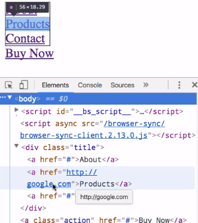
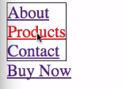
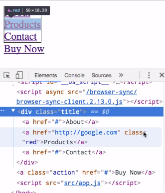
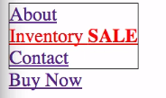

Now that we've seen how to select various elements, let's take a look at how we can actually modify a document. Here we have code that selects our second link on the page, which is the `Products` link. 

#### app.js
```javascript
var secondLink = d3.selectAll('a:nth-child(2)');
console.log(secondLink.nodes())
```

But if we look at the actual markup, we can see that it's just a blank link. It doesn't actually lead anywhere.

#### index.html
```html
<a href="#">Products</a>
```

What we could do is we can go here and say, `secondlink.attr`, which is short for attribute, and say `href` and give it a destination. 

#### app.js
```javascript
var secondLink = d3.selectAll('a:nth-child(2)');
secondLink.attr('href', 'http://google.com');
console.log(secondLink.nodes())
```
Now, if we save this and go inspect our document here, we can see that our second link does in fact lead to `google.com`. 



What we've done is called the `attribute` method, told it which `attribute` we want to access and then given it a value. If you just pass one argument to this method, it will actually return that value.

Let's do this here and then we'll put one of these before we selected it. 

```javascript
var secondLink = d3.selectAll('a:nth-child(2)');
console.log(secondLink.attr('href')) // output #
secondLink.attr('href', 'http://google.com');
console.log(secondLink.attr('href')) // output google.com
```

If we save that, that will run again and we can see that initially there's no destination. Then finally we give it a destination by calling that. That pattern will be used in various places throughout D3, where calling a method with a single argument is essentially a getter, and calling it with a second argument is essentially a setter.

One other thing to note is that you're generally not going to see things separated like this. If you were just setting an attribute like this you generally wouldn't create a selection and then set that attribute on a subsequent line. You're usually going to see it like this, where it's actually chained so that you just have `d3.selectAll`, the selection criteria, and then that chained command.

```javascript
d3.selectAll('a:nth-child(2)')
    .attr('href', 'http://google.com');
```

D3 has a similar method called `style`, which is used for setting and getting style properties. If we have our same selection here we can then say `.style` and we'll tell it that we want to set the `color` style to `red`. If we save that, we now have a red link.

```javascript
d3.selectAll('a:nth-child(2)')
    .style('color', 'red');
```


Similarly, we can again chain these commands like this, and that's how you're usually going to see it. All in one statement here we're saying, select the second link. Set its `href` attribute to this, and then set its `style` `color` to `red`.

```javascript
d3.selectAll('a:nth-child(2)')
    .attr('href', 'http://google.com')
    .style('color', 'red');
```

You will use the `style` method from time to time, but it's generally going to be advisable and more maintainable to use CSS classes. Rather than setting the color to red inline here, let's go back to our document and create a red class. We'll just say color is red here.

#### index.html
```html
<style>
    .red { color: red; }
</style>
```

If we save that and go back to our JavaScript we can then say `classed` `red` is `true`. 

#### app.js
```javascript
d3.selectAll('a:nth-child(2)')
    .attr('href', 'http://google.com')
    .classed('red', true);
```

Now if we go here we can see it's still red. But just to make sure, if we look at that link we can see that we do have that class of red on that link. 



The `style` method and the `classed` method are two different ways of setting CSS-related properties.

Another method available on selections is the `text` method. If we decided that instead of `Products` we wanted to call this `Inventory`, we could then say, `.text` and pass it the string `inventory`. 

```javascript
d3.selectAll('a:nth-child(2)')
    .attr('href', 'http://google.com')
    .classed('red', true)
    .text('Inventory');
```
That is going to change the actual text there.

That's just going to be plain text and if we wanted to set some HTML text we could actually use an `.html` method where we say, I don't know, maybe there's a big sale going on, so we want to add a bold `SALE` at the end of this. 

```javascript
d3.selectAll('a:nth-child(2)')
    .attr('href', 'http://google.com')
    .classed('red', true)
    .html('Inventory <b>Sale</b>');
```

If we save that, we then get that bold text at the end by using the `html` method.

