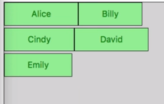
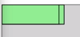
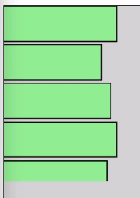

I've simplified our example here a little bit and removed the pre-existing elements from the DOM. 

#### index.html
```html
<div class="chart"></div>
```

We're really just dealing with the `enter()` selection now. Our code creates and appends a `div` for each data item. We set its `text` to the `name` property and then we've got some lines down here that are basically just styling the items, setting `color`, `background`, `border`, and that sort of thing.

#### app.js
```javascript
d3.select('.chart')
  .selectAll('div')
  .data(scores)
  .enter()
    .append('div')
    .text(function (d) {
      return d.name;
    })
    .style('width', d => d.score + 'px')
    .style('height', '50px')
    .style('background', 'lightgreen')
    .style('border', '1px solid black')
```

To clean this up a bit, I'm going to move some of these stylistic properties to an actual CSS class and then we'll just apply that. We can create our `bar` class here, and then instead of setting all of these style properties individually here, we will just go ahead and use the `attr` method and set `class` to `bar`.

#### index.html
```html
<style>
    .chart {
      background: lightgray;
      border: 1px solid black;
      min-width: 200px;
      min-height: 350px;
    }
    .bar {
      height: 30px;
      margin-bottom: 3px;
      color: green;
      background: lightgreen;
      border: 1px solid black;
    }
</style>
```
#### app.js
```javascript
d3.select('.chart')
  .selectAll('div')
  .data(scores)
  .enter()
    .append('div')
    .text(function (d) {
      return d.name;
    })
    .style('width', d => d.score + 'px')
    .attr('class','bar');
```

Now, of course in the past we saw a different method of assigning a CSS class, which was using the `classed` method, where you pass in the class name and then true if you want to set the class and false if you want to remove it.

I tend to stick with the `attr` method when simply assigning a class and only use the `classed` method if it's something that I'm going to have to turn on or off based on some sort of conditional logic.

We're creating these DIVs here, which are of course just normal DOM elements, and we could change this to be some other sort of DOM-type like `button`, and we basically get the same layout. We've just got inline elements now instead of block-level elements.

```javascript
d3.select('.chart')
  .selectAll('button')
  .data(scores)
  .enter()
    .append('button')
    .text(function (d) {
      return d.name;
    })
    .style('width', d => d.score + 'px')
    .attr('class','bar');
```



You can create normal DOM elements with D3 and you can also even draw to Canvas using D3, but that's a more advanced technique that you're generally only going to use in times when you need really high performance.

What you're most commonly going to see, though, is the creation of SVG elements with D3. For a simple introduction to what that looks like, the first thing we need to do is to actually create an `svg` container tag. We're going to do that as the parent for our whole visualization here. We're going to append an `svg` to the chart DIV that is what we're drawing the whole thing into.

```javascript
d3.select('.chart')
  .append('svg')
  .selectAll('button')
  .data(scores)
  .enter()
    .append('button')
    .text(function (d) {
      return d.name;
    })
    .style('width', d => d.score + 'px')
    .attr('class','bar');
```

Once we've created that root `svg` tag, we can then change our `button` here to be `rect` elements, which is of course short for, "rectangle," and one of the basic elements of an SVG. SVG stands for scalable vector graphics, and that scalable part is a big part of why it's appealing, especially for visualizations.

```javascript
d3.select('.chart')
  .append('svg')
  .selectAll('rect')
  .data(scores)
  .enter()
    .append('rect')
    .text(function (d) {
      return d.name;
    })
    .style('width', d => d.score + 'px')
    .attr('class','bar');
```
Since it's a vector output and not a raster output, that means that things can be scaled without losing visual fidelity or becoming pixelated.

Once we change this to `rect`, you're going to see that instead of those buttons, we now just have what looks like a black rectangle in the top left corner. 


Part of the reason for this is that `rect` elements have different style property names than DOM elements like DIVs and buttons.

The first example of this is that SVG shapes use `fill` to set their background color, rather than a property called `background`. Similarly, instead of referring to a `border`, their property is called `stroke`.

`stroke` is only about specifying the `color`. You can't do a combined property the way you do borders in CSS. Instead, you can use the `stroke-width` property and set that to a value to specify how thick of a border you want.

#### index.html
```html
<style>
.bar {
      height: 30px;
      color: green;
      fill: lightgreen;
      stroke: black;
      stroke-width: 1;
    }
</style>
```

Now that we've updated these styles, you can see that we don't actually just have a single rectangle. It's just that everything is on top of each other. That is because SVG elements don't do that sort of automatic document flow that you get from DOM elements. In SVG, you have to give everything an explicit position.



We can go ahead and get rid of our `bottom-margin` style here, because that's not going to do anything for us anyway. Since we don't have that automatic layout, we're going to have to do it ourselves. We know that our bars have a `height` of `30px`. We're going to come over here and each time we `append` a `rect`, we're going to set its `y` `attr`.

We're going to do this with a function and in this case our function is going to have two arguments, `d`, which is our data object, as we've seen previously, and the second argument here is going to be `i`, which is short for "index."

This is another standard and convention that you'll see all over D3, where these functions have `d` as the first argument, representing the data, and `i` as the second argument, representing the index.

In this case we're just going to multiply the index times `33`. 

#### app.js
```javascript
d3.select('.chart')
  .append('svg')
  .selectAll('rect')
  .data(scores)
  .enter()
    .append('rect')
    .attr('y', (d, i) => i * 33)
    .text(function (d) {
      return d.name;
    })
    .style('width', d => d.score + 'px')
    .attr('class','bar');
```

For our first rect, where `i` is zero, it'll be zero. For the first one it'll be 33, 66, and on and on. Now you can see that our rectangles are in fact vertically positioned to avoid any overlap. Let's go back and change the `stroke-width` to one just to simplify things, and there we go.



We'll go ahead and move this `width` property up and you may have noticed that our `y` attribute doesn't need a `px` suffix and so neither does our `width`. When you're working with SVG, everything is assumed to be pixels. You may also notice that the bottom of the last rectangle here is cut off, and that is because it's running outside of the size of the SVG, because the SVG just has a default size at the moment.

```javascript
d3.select('.chart')
  .append('svg')
  .selectAll('rect')
  .data(scores)
  .enter()
    .append('rect')
    .attr('y', (d, i) => i * 33)
    .style('width', d => d.score)
    .text(function (d) {
      return d.name;
    })
    .attr('class','bar');
```

Instead, we'll make sure that we have enough room by going up here and setting the `width` and `height` attributes on our SVG to make sure that they're big enough to hold all of our content.

```javascript
d3.select('.chart')
  .append('svg')
    .attr('width', 225)
    .attr('height', 300)
  .selectAll('rect')
  .data(scores)
  .enter()
    .append('rect')
    .attr('y', (d, i) => i * 33)
    .style('width', d => d.score)
    .text(function (d) {
      return d.name;
    })
    .attr('class','bar');
```