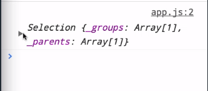
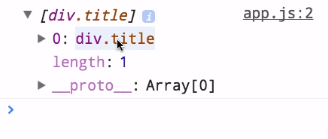
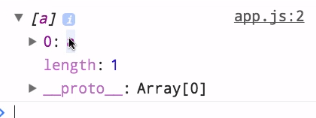
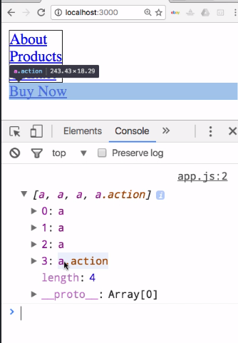
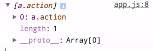

Along with scales, selections are probably the most fundamental concept that you need to master in D3. For this example, we've created a very simple HTML page where we've got three links here inside of a div, and then one link on its own.

#### index.html
```html
<div class="title">
    <a href="#">About</a>
    <a href="#">Products</a>
    <a href="#">Contact</a>
</div>
```

You can see that structure here. We've got this `div` with a class of `title`, with three links inside of it, and then our last link here by itself. We're still including our `app.js` files, so let's go over there and write some code.

The first thing we'll do is create a variable to hold our selection. We'll say that `var link=d3.select('div')`. If we log that out, we'll see that we have this selection object with a `groups` array and a `parents` array. That's all internal structure that D3 creates in its selection objects, but not really what we're interested in.

#### app.js
```javascript
var link = d3.select('div');
console.log(link);
```


If we want to see the elements that were selected, we can use this `.nodes()` method, and that will give us the actual DOM elements. You can see here, if we roll over this, we're actually referring to that element. We've selected that div with this code.

```javascript
var link = d3.select('div');
console.log(link.nodes());
```


If we were to change this to `d3.select('a')`, you'll see that we get back the first link there. 

```javascript
var link = d3.select('a');
console.log(link.nodes());
```


What if we want to select more than one element, if we want to select multiple links? In that case, we can change this from `d3.select()` to `d3.selectAll()`.

If you've used document.querySelector() or document.querySelectorAll(), you'll notice the parallels here in that if you want to select multiple items, you need to use the `selectAll` method. Now we can see that we have selected all of the link items on this whole page, including the ones outside of that div.



What if we're only interested in the links inside of that div? In addition to `select` and `selectAll` being methods on the D3 object itself, those selection objects that we saw returned initially have `select` and `selectAll` methods themselves.

We've got this `link` variable which is a `d3.selection`, and we're going to change this back so that it's just selecting that div. 

```javascript
var link = d3.select('div');
console.log(link.nodes());
```

You can see `link` is now just that div, so we should probably rename that. Let's rename it `div`. Then, if we want to just select the items within that `div`, we can use the `selection.select` or `selectAll` methods.

Let's say

```javascript
var divlinks=div.selectall('a');
console.log(divlinks.nodes());
```
If we then log out the `nodes` of that selection, you can see that we now just have the three links that are inside of that `div`. 

`d3.select()` and `d3.selectAll()` are going to do a global selection on the whole document.

`select()` and `selectAll()` called on an existing selection are only going to select descendants of that selection. For the sake of completeness, I should also mention that you can, of course, use the CSS syntax for selecting all the links inside the `div` by simply doing `d3.selectAll()`, and then passing `div a`.

```javascript
console.log(d3.selectAll('div a'));
```

You're telling it "all of the a items within that div," strictly in CSS, and then if we log out those nodes, we can see that they are, in fact, the same exact nodes that we had before. We only skipped over that syntax because we wanted to learn that we can also call `select()` and `selectAll()` on existing selections.

It's also worth noting that we're selecting by element type in both of these examples, but you can use any selector string that you would pass to the selector API that's used by document.query selector.

If we remember here, we've got a `title` class on our `div` and an `action` class on this `link` that's down here by itself, so if we were to say `d3.select(.action)`, that is going to return anything that has a class of `action` on it.

```javascript
var actionLink = d3.select('.action')
console.log(actionLink.nodes())
```
Let's spit out the nodes here. You can see now that we've just selected that link based on the class. 



It's also worth noting, you can use some of the various other CSS selectors like first child, nth child, and that sort of thing, like we see here.

```javascript
var secondLink = d3.selectAll('a:nth-child(2)')
```

Whoops. Let's update that logging. Now this selection is just that second link there. Lastly, if you have an existing group of nodes, say from a document.query selector call or something else, you can actually pass that to these selection methods rather than a string.

We can use something like the `document.links` node list that's built into the browser and pass that, and then turn that native list of nodes into an actual D3 selection that we can then work with.

```javascript
var allLinks = d3.selectAll(document.links);
console.log(allLinks.nodes());
```

D3 selections also have a `size` method that allow you to see how many elements are in there. 

```javascript
var allLinks = d3.selectAll(document.links);
console.log(allLinks.size); // output 4
```

We can see that this one does have four links, and we know that that's everything on our page.