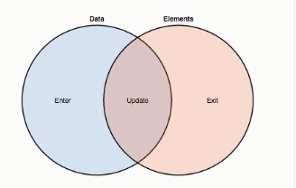
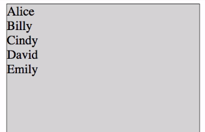
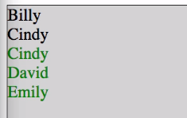
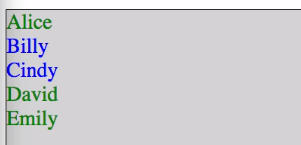
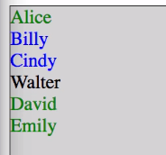
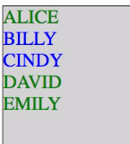
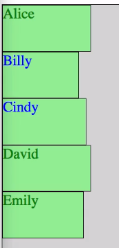

The name D3 is actually a shorthand for Data-Driven Documents, so let's look at how we integrate data into our visualizations.

I've updated our HTML file here for this example, and you'll notice that all we have in our `body` is an empty `div` here with the class of `chart`, and then our script tag is still being included. I've got a basic style up here to size and color our `chart` container. You see that here in the page.

#### index.html

```html
<style>
    .chart {
      background: lightgray;
      border: 1px solid black;
      min-width: 200px;
      min-height: 350px;
    }
  </style>
<body>

  <div class="chart"></div>

  <script src="src/app.js"></script>
</body>
```

If we look at our `app.js` file, you can see that I've got a simple five-element array here of five simple objects that have a `name` and a `score` property. We've got these names that start with `A, B, C, D, E`, just so we have some implicit ordering there and a basic score that we'll assume is on a scale of 100.

#### app.js
```javascript
var scores = [
  { name: 'Alice', score: 96 },
  { name: 'Billy', score: 83 },
  { name: 'Cindy', score: 91 },
  { name: 'David', score: 96 },
  { name: 'Emily', score: 88 }
];
```

The first thing we need to do to integrate our data is we need to start with a selection. We're going to say `d3.select('.chart')`, since we're using that CSS class as our selector query, and then we're going to do `select.all(div)` to select all of the divs within that chart.

```javascript
d3.select('.chart')
  .selectAll('div')
```

You know from looking at this file that there are no divs within the `chart` div, but we'll get to that. Now that we have a selection representing all the divs inside of our container, we can then say `.data`, and pass in our `scores` array.

```javascript
d3.select('.chart')
  .selectAll('div')
  .data(scores) 
```

What we've now done is create a data join, and before we go too much further, I want to look at a graphic that Mike Bostock, the creator of D3, has put together to explain data joins.



You can see here, a simple Venn diagram, where the first circle represents our data, and the second circle represents our DOM elements. You can see here, this first section, where we've got data, but no DOM elements, is what's referred to as the `Enter` selection.

Where we have both data and elements is referred to as the `Update` selection, and where we only have elements but no data is our `Exit` selection. If we switch back to our page here and think about what we've done, we have told D3 to select all of the divs within the `chart` div, and then merge the data with that selection.

Since there were no divs in there that means that we don't have any elements, and we only have data.

What we have resulting from this data join is five elements in the `Enter` selection, which is just data and no elements, and an empty `Update` selection, and an empty `Exit` selection. By default, a data join like this returns the `Update` selection, so let's go ahead and assign this to a variable called `update`.

```javascript
var update = d3.select('.chart')
  .selectAll('div')
  .data(json)
```

To access the `Enter` selection, we'll use the `.enter` method on the `update` selection. Now that we have this `Enter` selection, we need to actually create the elements, since we're just dealing with data and no elements here.

We're going to say `update.enter().append('div')`, and this will tell D3 we want to create an append a div for everything in our data that doesn't already have a DOM element.

```javascript
update.enter()
  .append('div')
```

Now that we've created and append at a `div`, we need to populate it with something, so let's go ahead and set its `text`. We'll do that by calling the `text` method and giving it a function, and that function is going to receive each data element as its first argument, which we'll call `d`. That's a convention in D3 that you'll see all the time.

`d` represents the data element, and so then we're just going to return the `name` property from that data object. 

```javascript
update.enter()
  .append('div')
  .text(function (d) {
    return d.name;
  })
```

If we save that, we can see that we do now have all of those divs created and populated with the name.



If we go inspect this, we can see that we do, in fact, have divs that have been created and added to the parent `chart` div. We can also `style` these divs, so let's go ahead and `color` them `green` just to represent that they're being created by this data join.

```javascript
update.enter()
  .append('div')
  .text(function (d) {
    return d.name;
  })
  .style('color', 'green')
```

Before we move on, I want to talk about this `Update` selection a little bit. The reason it's called the `Update` selection, because this is for when you already have elements on the page, and some of the data corresponds to those items.

This is generally going to happen when the data is updated, rather than rendered for the first time, so if you have data that's changing over time, you're not going to recreate the entire chart and build everything from scratch. Some of your elements are just going to be getting updated.

To see this in action, we'll go over to our `chart` here, and create a couple of divs. We're going to say, "Billy and Cindy are already on the page." 

#### index.html
```html
<div class="chart">
    <div>Billy</div>
    <div>Cindy</div>
</div>
```


You'll notice that this results in some weirdness in our output, but that just means that we need to update our code to handle this properly.

When you call the `data` method to do your data join, there's an optional second parameter which is known as the `key` function. The `key` function is used for mapping data items to DOM elements.

In our case, we need to map the `name` property to the inner text of the `div`, so we're going to pass this function that, again, accepts a parameter named `d`, representing the data item, and we're going to check and make sure that that item exists.

If it does, we'll return the `name`. If it does not, we've already got an element. We're going to return the `innerText`. D3 will use this to merge these things together and know what's already existing and what is not.

```javascript
var update = d3.select('.chart')
  .selectAll('div')
  .data(scores, function (d) {
    return d ? d.name : this.innerText;
  })
```

You'll notice that we're actually using this to access the DOM element itself. In a lot of places in D3, when you've got these functions that are being used to set data, the `this` context will be set to the DOM element.

Just for the sake of clarity, let's `style` the items that are already here that are not being created and we'll turn their `color` `blue`. 

```javascript
var update = d3.select('.chart')
  .selectAll('div')
  .data(scores, function (d) {
    return d ? d.name : this.innerText;
  })
  .style('color', 'blue');
```



Now we can see that `Billy` and `Cindy` are being updated by our code, and `Alice`, `David`, and `Emily` are being created by our code.

The last part of that graphic that we saw was the `Exit` selection, which represents items that are already on the DOM, but don't have any corresponding data. To demonstrate that, we'll go ahead and make a new `div` here by default, we'll put `Walter` in there.

#### index.html
```html
<div class="chart">
    <div>Billy</div>
    <div>Cindy</div>
    <div>Walter</div>
</div>
```


We now see that `Walter` is on the page. He's in a random spot because we're not handling that at all. What we need to do now is go over here, and again, we access the `Exit` selection as a method on the `update` selection. We'll say `update.exit()`. In this case, we just want to remove it.

#### app.js
```javascript
update.exit().remove();
```


If we save that, we can now see that `Walter`, in fact, gets removed from the page. 

The last thing I want to look at is something that's actually changed in version four of D3, and that's how you write code to affect all of the items that are still on the chart, so both the `Update` selection and the `Enter` selection.

What we're going to do is we'll create a variable to hold this `enter` selection, and we'll call it `enter`. 

```javascript
var enter = update.enter()
  .append('div')
  .text(function (d) {
    return d.name;
  })
  .style('color', 'green')
```

Now we have this variable, `update`, which is holding our `Update` selection, and `enter`, which is holding our `Enter` selection.

Now if we go down here and we say `update.merge` and pass in `enter`, just to make sure we've got the right selection here, we can say `style` `text-transform` is `uppercase`, we can see that all of those things are affected.

```javascript
update.merge(enter)
  .style('text-tramsform', 'uppercase')
```



We've got our blue items from our `update` selection, and our green items from our `enter` selection, and we're then affecting both of them by merging those two selections together. What we actually want to do, though, is give these items some dimension.

We'll say `height` is `50px`, and then we'll give them a `border` and some `background-color`. 

```javascript
update.merge(enter)
  .style('height', '50px')
  .style('background', 'lightgreen')
  .style('border', '1px solid black')
```
I skipped over the `width`, because I wanted to return to that. We're going to say `style` `width`. In this case, we're going to use the data again, but this time to size it.

We'll return the `score` property off of our data object, tack on the `px` suffix, and now if we save it, you can see we get these sized boxes based on the data. 

```javascript
update.merge(enter)
  .style('width', d => d.score + 'px')
  .style('height', '50px')
  .style('background', 'lightgreen')
  .style('border', '1px solid black')
```


`Alice` and `David` have the largest scores. You can see their boxes are the widest. `Billy` had the lowest score, so his is the smallest. Now we're creating a data visualization.