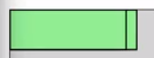
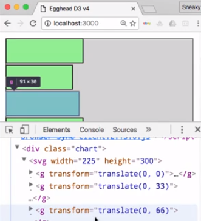
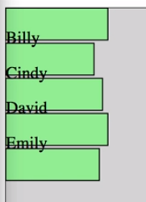
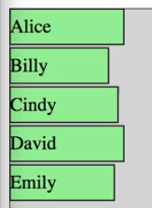
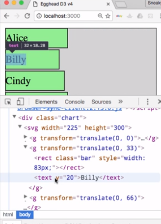

Now we have recreated most of our dom based visualization, but our text still isn't working here. We're not displaying the names. That's because you can't simply put some text inside of a `rect` tag in an SVG and have it be displayed. You actually need to use a specific `text` tag.

In order to group things properly however, we're going to have to learn a new SVG element which is the `g` element which stands for graphic. You'll see `g` elements very commonly in D3. They're generally just used as a basic container to hold other shapes, so similar to a `div` in regular dom elements.

What we're going to do is create a variable named `bar` and then update our code so that we're creating these g elements. `bar` will actually hold the selection of `g` element containers. We can cut that off here because the rest of this code applies to our rect elements which we now need to recreate.

#### app.js
```javascript
var bar = d3.select('.chart')
  .append('svg')
    .attr('width', 225)
    .attr('height', 300)
  .selectAll('g')
  .data(scores)
  .enter()
    .append('g')
    .attr('y', (d, i) =>  i * 33 );
```

This time, we're going to `append` them to `bar` which means we're appending them to those `g` elements. 

```javascript
bar.append('rect')
    .style('width', d => d.score)
    .text(function (d) {
      return d.name;
    })
```


Now we're back to these overlapping rectangles, and that's because `g` elements don't have regular x, y properties like other SVG shapes do.

When you're dealing with graphics containers, you actually have to `transform` the element to the position that you want it. Instead of setting the y, we're going to set the `transform` property. Instead of returning a simple number, we actually need to return a call to the `translate` method which takes a comma separated list of x and y dimensions.

We're just going to give it `translate` zero and then our calculated `y` position. 

```javascript
var bar = d3.select('.chart')
  .append('svg')
    .attr('width', 225)
    .attr('height', 300)
  .selectAll('g')
  .data(scores)
  .enter()
    .append('g')
    .attr('transform', (d, i) => 'translate(0, ' + i * 33 + ')');
```

If we go inspect these elements here, you can see that we do in fact have a transform attribute with this translate value dynamically assigned to it.



Now our SVG tag has a collection of child graphics containers. Each one of those graphics containers contains our `rect` element. The text is still being put inside of the `rect` element, and it's still not working. What we actually need to do is use this same `bar` variable, and we need to append a `text` element to that graphic.

Once we've created the `text` element, then we can set the `text` property. 

```javascript
bar.append('text')
  .text(function (d) {
    return d.name;
  });
```

Now the text actually displays within our rectangles. 



You can see though that we've got some alignment issues. We're going to need to modify the `y` position of our text element. Setting it to `0` doesn't actually help. What you can see if you look closely is that setting the `y` to `0` is actually making it so that the bottom of the text is set to the `0` position.

```javascript
bar.append('text')
  .attr('y', 0)
  .text(function (d) {
    return d.name;
  });
```

That's of course not what we want. Let's just choose an arbitrary value here of `20`. That's going to put the bottom of the text `20` pixels from the top of the rectangle. There we go. 



We have successfully recreated our example all in SVG. This is admittedly much more complicated for this simple example, but there are lots and lots of benefits as you get into more advanced visualizations to using SVG.

To recap, we selected our `chart` target div. Then we appended an `svg` which we explicitly sized to the dimensions that we wanted. We then used our regular data join methodology to create a collection of `g` elements, one for each item in our data array. Then we used this new attribute called `transform`, which is just a CSS transform to position the `g` elements where we want them.

Once we have those graphics containers created, we use the variable that's holding the selection of those containers. We append a rectangle and a `text` element to each one of them. We set the `width` of the rectangle, we assign a CSS class, and then finally, we position and draw the text.

If we take one more look here in the inspector, we can see that we have our `g` element with both a child `rect` element and a child `text` element. That's where our `text` actually lives. 



Now we've got this more involved, more multi-layered structure, but in the end, it's much more powerful and flexible.