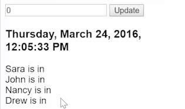

Now let's add some people to our application. We'll set up a `people` reducer. Over time, you'll get very familiar with this syntax. We have a `state` and a `type` and a `payload`. Then you `switch` based on that `type`. You'll always want to have a `default` that's going to `return state` if the type didn't match anything. Just going to format this real quick.

####reducers.ts
```javascript
export const people = (state, {type, payload})=> {
    switch(type) {

        default:
            return state;
    }
};
```

Let's go ahead and set up a `default` for our previous reducer. We have a `default` instead of falling through to returning the `state`. It doesn't really change anything, makes it more consistent that way. All of your reducers will start with this template of a function that has a `state` and an action.

Then you `switch` on the action `type`, and by `default`, it returns a `state`. Then you'll set up all of these different types to switch on. The default for my `people` `state` is going to be an array. I'm going to pull that out right above `people` and call it `defaultPeople`.

Then our people are going to have a `name`, start with `Sarah`, and a `time`. We'll start with an empty `time`. I'll duplicate these. Give us four people -- `John`, `Nancy`, and `Drew`. 

```javascript
const defaultPeople = [
    {name: "Sara", time: ""},
    {name: "John", time: ""},
    {name: "Nancy", time: ""},
    {name: "Drew", time: ""},
]
```

Now the default for this `state` can be our `defaultPeople`.

```javascript
export const people = (state = defaultPeople, ...)
...
```

To access this reducer, we come into our `main.ts` file. We `import` `people` from the `./reducers`. We pass it into our `provideStore` object. 

####main.ts
```javascript
import {clock, people} from './reducers';
bootstrap(App, [
    provideStore({clock, people})
])
...
```

Then in our `app.ts` file, our `store` now has access to the people's reducer. If we call `people` and `this.people = store.select(people)`.

####app.ts
```javascript
...
people;

constructor(store:Store) {
    this.time = store.select('clock');
    this.people = store.select('people');
...
}
...
```

We'll have a `<div>` that does an `ngFor="#person of people"`. This is coming from the store, so this is asynchronous. Make sure to add that `async` pipe or it's not going to work. Then we'll see `{{person.name}} is in {{person.time}}`.

```html
@Component ...

    <div *ngFor="person of people | async">
        {{person.name}} is in {{person.time}}
    </div>
...
```

Let's save. I'll refresh here. You can see now we have Sarah is in blank. John is in blank. That's because all of our reducers have times that are empty.


