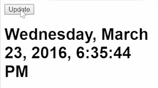
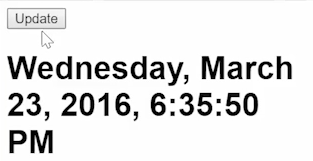

To add a button to control our clock, I'll go ahead and create a `<button>` tag. I'll just say, `Update`. Typically, what you do in Angular 2 is say, `click` and then just give that a handler `onClick`. 

####app.ts
```html
@Component({
    selector: 'app',
    template: ` 
    <button (click)="onClick()">Update</button>
    `
})
```

In the `export class`, you'd create that `onClick` handler.

```javascript
export class App {
    onClick(){

    }
    ...
}     
```

Or from the other side, typically, what you do in RxJS is you'd say, in the `constructor`, `Observable.fromEvent`. Find the element, and then pass in the event name you want to listen to.

```javascript
constructor(){
    Observable.fromEvent(, 'click')
}
```
We have these two different conflicting approaches where we want to find an event, or we want to handle a click. The way we're going to solve this for now is I'm going to delete this event handler, `onClick()`. I'm going to delete this from event, `Observable.fromEvent(, 'click')`.

What I'm going to do is create something called a `Subject`, which I'll call `click`. This will be a `new Subject()`. 

```javascript
export class App {
    click$ = new Subject();
}
...
```
I need to `import` `subject`. 

```javascript
import {Subject} from "rxjs/Subject";
```

What this `Subject` will allow me to do is call `next` every time I click.

```html
<button (click)="onClick$.next()">Update</button>
```

What `next()` is going to do is push the stream forward one tick. If I take out all of this `clock` stuff, 

```javascript
clock = Observalbe
    .interval(1000)
    .map(()=> new Date());
```

which was just going every second before. Now I say `this.clock` is `this.click$`. I'm going to `.map` those clicks to a `new Date`. 

```javascript
export class App {
    click$ = new Subject();

    clock;

    constructor(){
        this.clock = this.click$.map(()=> new Date());
    }
}
```

Hit save. I refresh over here. I'll click update. You can see we get our clock frozen in time at 44 seconds. 



I'll click update again. You can see that six seconds have passed.

