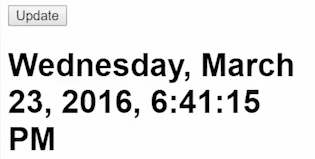

For my time machine I do want my `Observable.interval()` always running. I do want it to update every second, `(1000)`. But I also want the clicks to be able to update it. From other observable lessons we've learned that `Observable.merge()` is what we use when we want one stream or another stream to update the same thing.

####appts
```javascript
constructor() {
    Observable.merge()

    Observable.interval(1000);
    ...
}
```

We can say `Observable.merge`, which can take these two observables. We'll say `this.click$`, because a subject is a type of observable, and we'll say `Observable.interval`. Let me get rid of that semicolon, either one of these can go ahead and `.map` to a `new Date`. Then I can take my `this.clock` and assign it to that stream of merge.

```javascript
constructor() {
    this.click = Observable.merge(
        this.click$,
        Observable.interval(1000)
    ).map(()=> new Date());
    
    this.click$map(()=> new Date());
}
```

What I'm going to do here just to show this off is change this interval to five seconds so that now when I refresh here, you see that I forgot to `import` `merge`. 

```javascript
import 'rxjs/add/observable/merge';
```

You'll forget to import these a lot, so just expect these to pop up every now and again. I'll say import/merge. Let's save again. I'll refresh. Now you'll see this clock. Nothing happens, nothing happens, nothing happens, but after five seconds it'll show up. 



Now it's just sitting there, but I can click `Update` to make it update. Then after five seconds it automatically updates itself.

We have those two streams working for us. Whenever I click or whenever five seconds passes my clock will now update.